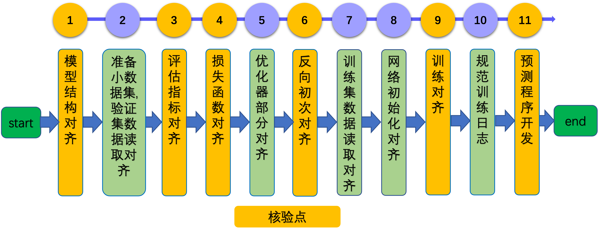

# 论文复现指南-CV方向

> 本文为针对 `CV` 方向的复现指南
> 如果希望查阅 `NLP` 方向的复现指南，可以参考：[NLP方向论文复现指南](./ArticleReproduction_NLP.md)
>
> 如果希望查阅 `推荐` 方向的复现指南，可以参考：[推荐方向论文复现指南](./ArticleReproduction_REC.md)

## 目录

- [1. 总览](#1)
    - [1.1 背景](#1.1)
    - [1.2 前序工作](#1.2)
- [2. 整体框图](#2)
    - [2.1 流程概览](#2.1)
    - [2.2 reprod_log whl包](#2.2)

- [3. 论文复现理论知识及实战](#3)
    - [3.1 模型结构对齐](#3.1)
    - [3.2 准备小数据集，验证集数据读取对齐](#3.2)
    - [3.3 评估指标对齐](#3.3)
    - [3.4 损失函数对齐](#3.4)
    - [3.5 优化器部分对齐](#3.5)
    - [3.6 反向对齐](#3.6)
    - [3.7 训练集数据读取对齐](#3.7)
    - [3.8 网络初始化对齐](#3.8)
    - [3.9 模型训练对齐](#3.9)
    - [3.10 规范训练日志](#3.10)
    - [3.11 预测程序开发](#3.11)
    - [3.12 单机多卡训练](#3.12)

- [4. 通用问题FAQ](#4)
    - [4.1 显存泄露](#4.1)
    - [4.2 内存泄露](#4.2)
    - [4.3 dataloader 加载数据时间长](#4.3)
    - [4.4 单机多卡报错信息不明确](#4.4)
    - [4.5 通用API使用问题](#4.5)

<a name="1"></a>
## 1. 总览

<a name="1.1"></a>
### 1.1 背景

* 以深度学习为核心的人工智能技术仍在高速发展，通过论文复现，开发者可以获得：
    * 学习成长：自我能力提升
    * 技术积累：对科研或工作有所帮助和启发
    * 社区荣誉：成果被开发者广泛使用

<a name="1.2"></a>
### 1.2 前序工作

基于本指南复现论文过程中，建议开发者准备以下内容：

* 数据准备：
    1. 下载好训练/验证数据集：用于模型训练与评估。
    2. 了解该模型输入输出格式：以Mobilenet V3图像分类任务为例，通过阅读论文与参考代码，了解到模型输入为`[batch_size, 3, 224, 244]`的tensor，类型为`float32`或者`float16`，label为`[batch, ]`的label，类型为`int64`。
    3. 准备fake input data以及label：通过运行生成fake data的参考代码：[mobilenetv3_prod/Step1-5/utilities.py](https://github.com/PaddlePaddle/models/blob/release%2F2.2/tutorials/mobilenetv3_prod/Step1-5/utilities.py)，生成和模型输入shape、type等保持一致的伪数据，并保存在本地，用于后续模型前反向对齐。这样的方式能帮助我们将模型结构对齐和数据对齐解耦，更为方便地排查问题。
* 运行参考代码：在特定设备(CPU/GPU)上，跑通**参考代码**的预测过程(前向)以及至少2轮(iteration)迭代过程，用于生成和复现代码进行对比的结果。
* 代码格式：
    * 将复现代码和参考代码分为两个文件夹管理、并在同级目录下书写测试代码用于生成测试结果、 测试结果保留在result文件夹下。
    * 在核验通过之后，需要删除打卡日志和参考代码，形成最终的干净的复现代码。代码的目录结构可以参考[mobilenetv3_prod/Step1-5](https://github.com/PaddlePaddle/models/tree/release/2.2/tutorials/mobilenetv3_prod/Step1-5)，我们后续的指南也将基于这部分代码进行说明。

<a name="2"></a>
## 2. 整体框图

<a name="2.1"></a>
### 2.1 流程概览

面对一篇计算机视觉论文，复现该论文的整体流程如下图所示：

<div align="center">

</div>

总共包含11个步骤。为了高效复现论文，设置了6个核验点。如上图中黄色框所示。后续章节会详细介绍上述步骤和核验点，具体内容安排如下：

* 第3章：介绍11个复现步骤的理论知识、实战以及核验流程、并对应说明常见问题。常见问题中找不到答案的，欢迎找对应方向RD咨询或者在[这里](https://github.com/PaddlePaddle/Paddle/issues/new/choose)提ISSUE进行讨论。
* 第4章：对论文复现中的通用问题进行解答。

<a name="2.2"></a>

### 2.2 reprod_log whl包
为了减少数据对比中标准不一致、人工对比过程繁杂的问题，我们建立了数据对比日志工具reprod_log。

#### 2.2.1 reprod_log工具简介
`reprod_log`是用于论文复现赛中辅助自查和核验工具。查看它的[源代码](../reprod_log/)能对它有个更全面理解。我们常用的功能如下：

* 存取指定节点的输入输出tensor；
* 基于文件的tensor读写；
* 2个字典的对比验证；
* 对比结果的输出与记录；

更多API与使用方法可以参考：[reprod_log API使用说明](../reprod_log/README.md)。

#### 2.2.2 reprod_log使用demo

下面基于[示例代码](https://github.com/littletomatodonkey/AlexNet-Prod/tree/master/pipeline/reprod_log_demo)，给出如何使用该工具。

文件夹中包含`write_log.py`和`check_log_diff.py`文件，其中`write_log.py`中给出了`ReprodLogger`类的使用方法，`check_log_diff.py`给出了`ReprodDiffHelper`类的使用方法，依次运行两个python文件，使用下面的方式运行代码。

```shell
# 进入文件夹
cd pipeline/reprod_log_demo
# 随机生成矩阵，写入文件中
python3.7 write_log.py
# 进行文件对比，输出日志
python3.7 check_log_diff.py
```

最终会输出以下内容

```
2021-09-28 01:07:44,832 - reprod_log.utils - INFO - demo_test_1:
2021-09-28 01:07:44,832 - reprod_log.utils - INFO -     mean diff: check passed: True, value: 0.0
2021-09-28 01:07:44,832 - reprod_log.utils - INFO - demo_test_2:
2021-09-28 01:07:44,832 - reprod_log.utils - INFO -     mean diff: check passed: False, value: 0.3336232304573059
2021-09-28 01:07:44,832 - reprod_log.utils - INFO - diff check failed
```

可以看出：对于key为`demo_test_1`的矩阵，由于diff为0，小于设置的阈值`1e-6`，核验成功；对于key为`demo_test_2`的矩阵，由于diff为0.33，大于设置的阈值`1e-6`，核验失败。

#### 2.2.3 reprod_log在论文复现中应用

在论文复现中，基于reprod_log的结果记录模块，产出下面若干文件
```
result
├── log
├── data_paddle.npy
├── data_ref.npy
├── forward_paddle.npy
├── forward_ref.npy    # 与forward_paddle.npy作为一并核查的文件对
├── metric_paddle.npy
├── metric_ref.npy     # 与metric_paddle.npy作为一并核查的文件对
├── loss_paddle.npy
├── loss_ref.npy       # 与loss_paddle.npy作为一并核查的文件对
├── losses_paddle.npy
├── losses_ref.npy   # 与losses_paddle.npy作为一并核查的文件对
```

基于reprod_log的`ReprodDiffHelper`模块，产出下面5个日志文件。

```
log
├── data_diff.log     # data_paddle.npy与data_torch.npy生成的diff结果文件
├── forward_diff.log     # forward_paddle.npy与forward_torch.npy生成的diff结果文件
├── metric_diff.log      # metric_paddle.npy与metric_torch.npy生成的diff结果文件
├── loss_diff.log          # loss_paddle.npy与loss_torch.npy生成的diff结果文件
├── backward_diff.log    # losses_paddle.npy与losses_torch.npy生成的diff结果文件
```

上述文件的生成代码可以参考我们的[mobilenetv3_prod/Step1-5](https://github.com/PaddlePaddle/models/tree/release/2.2/tutorials/mobilenetv3_prod/Step1-5)进行开发，其中包含了基于 reprod_log 的前5个核验点对齐核验示例，以及使用说明README.md文档。在核验时需要提供[mobilenetv3_prod/Step1-5/result/log](https://github.com/PaddlePaddle/models/tree/release/2.2/tutorials/mobilenetv3_prod/Step1-5/result/log)下所有文件（不需要提供产生这些文件的可运行程序）以及完整的模型训练评估程序和日志。

<a name="3"></a>
## 3. 论文复现理论知识及实战

<a name="3.1"></a>
### 3.1 模型结构对齐

对齐模型结构时，一般有3个主要步骤：

* 网络结构代码转换；
* 权重转换；
* 模型组网正确性验证；

下面详细介绍这3个部分。

#### 3.1.1 网络结构代码转换

**【基本流程】**

由于PyTorch的API和PaddlePaddle的API非常相似，可以参考[PyTorch-PaddlePaddle API映射表](https://www.paddlepaddle.org.cn/documentation/docs/zh/guides/08_api_mapping/pytorch_api_mapping_cn.html)，组网部分代码直接进行手动转换即可。

**【注意事项】**

如果遇到PaddlePaddle没有的API，可以尝试用多种API来组合，也可以给PaddlePaddle团队提[ISSUE](https://github.com/PaddlePaddle/Paddle/issues)，获得支持。

**【实战】**

MobilnetV3网络结构的PyTorch实现: [mobilenetv3_prod/Step1-5/mobilenetv3_ref/torchvision/models/mobilenet_v3_torch.py](https://github.com/PaddlePaddle/models/blob/release%2F2.2/tutorials/mobilenetv3_prod/Step1-5/mobilenetv3_ref/torchvision/models/mobilenet_v3_torch.py)

对应转换后的PaddlePaddle实现: [mobilenetv3_prod/Step1-5/mobilenetv3_paddle/paddlevision/models/mobilenet_v3_paddle.py](https://github.com/PaddlePaddle/models/blob/release%2F2.2/tutorials/mobilenetv3_prod/Step1-5/mobilenetv3_paddle/paddlevision/models/mobilenet_v3_paddle.py)

**【FAQ】**

- 遇到 paddle 不支持的API怎么办？

    1. 进一步参考[API映射表](https://www.paddlepaddle.org.cn/documentation/docs/zh/guides/08_api_mapping/pytorch_api_mapping_cn.html) ：由于PaddlePaddle与PyTorch对于不同名称的API，实现的功能可能是相同的，比如[paddle.optimizer.lr.StepDecay](https://www.paddlepaddle.org.cn/documentation/docs/zh/api/paddle/optimizer/lr/StepDecay_cn.html#stepdecay)与[torch.optim.lr_scheduler.StepLR](https://pytorch.org/docs/stable/generated/torch.optim.lr_scheduler.StepLR.html#torch.optim.lr_scheduler.StepLR) ，因此需要进一步确认当前的确API没有实现。
    2. 尝试使用替代实现进行复现：例如`torch.masked_fill`函数的功能目前可以使用`paddle.where`进行实现，可以参考[链接](https://www.paddlepaddle.org.cn/documentation/docs/zh/develop/faq/train_cn.html#paddletorch-masked-fillapi)。
    3. 尝试自己开发算子：我们非常欢迎开发者向我们贡献代码：）如果您不希望或者暂时没有时间开发新的算子，可以参照第 4 点向paddle提交issue。
    4. 在[这里](https://github.com/PaddlePaddle/Paddle/issues/new/choose)向paddle 提交issue：列出Paddle不支持的实现，开发人员会根据优先级进行开发。
    5. 得知API开发完成之后，安装编译环境：  
        * 进入 [Paddle 官网](https://www.paddlepaddle.org.cn/install/quick?docurl=/documentation/docs/zh/develop/install/pip/linux-pip.html)，选择develop版本，并根据自己的情况选择其他字段，根据生成的安装信息安装，当选择 Linux-pip-CUDA5.2字段后，就可以按照下面的信息安装。
          ```shell
          python -m pip install paddlepaddle-gpu==0.0.0.post102 -f https://www.paddlepaddle.org.cn/whl/linux/gpu/develop.html
          ```

        * 如果不确定自己安装的是否是最新版本，可以进入[这里](https://www.paddlepaddle.org.cn/whl/linux/gpu/develop.html)下载对应的包并查看时间戳。

- 有什么其他没有在映射表中的torch API是可以用paddle中API实现的呢？

    有的，例如：
     * `torch.masked_fill`函数的功能目前可以使用`paddle.where`进行实现，可以参考[链接](https://www.paddlepaddle.org.cn/documentation/docs/zh/develop/faq/train_cn.html#paddletorch-masked-fillapi)。
     * `pack_padded_sequence`和`pad_packed_sequence`这两个API目前PaddlePaddle中没有实现，可以直接在RNN或者LSTM的输入中传入`sequence_length`来实现等价的功能。

- 为什么`nn.AvgPool2D` 会存在不能对齐的问题？
    * [`paddle.nn.AvgPool2D`](https://www.paddlepaddle.org.cn/documentation/docs/zh/api/paddle/nn/AvgPool2D_cn.html#avgpool2d)需要将 `exclusive` 参数设为 `False` ，结果才能 PyTorch 的默认行为一致。

#### 3.1.2 权重转换

**【基本流程】**

组网代码转换完成之后，需要对模型权重进行转换。如果PyTorch repo中已经提供权重，那么可以直接下载并进行后续的转换；如果没有提供，则可以基于PyTorch代码，随机生成一个初始化权重(定义完model以后，使用`torch.save()` API保存模型权重)，然后进行权重转换。

**【注意事项】**

在权重转换的时候，需要注意`paddle.nn.Linear`以及`paddle.nn.BatchNorm2D`等API的权重保存格式和名称等与PyTorch稍有diff，具体内容可以参考本节的`FAQ`。

**【实战】**
将mobilenetv3-torch的[模型参数](https://download.pytorch.org/models/mobilenet_v3_small-047dcff4.pth)保存在本地之后，就可以通过下面的权重转换示例进行转换：

```python
import numpy as np
import torch
import paddle

def torch2paddle():
    torch_path = "./data/mobilenet_v3_small-047dcff4.pth"
    paddle_path = "./data/mv3_small_paddle.pdparams"
    torch_state_dict = torch.load(torch_path)
    fc_names = ["classifier"]
    paddle_state_dict = {}
    for k in torch_state_dict:
        if "num_batches_tracked" in k:
            continue
        v = torch_state_dict[k].detach().cpu().numpy()
        flag = [i in k for i in fc_names]
        if any(flag) and "weight" in k: # ignore bias
            new_shape = [1, 0] + list(range(2, v.ndim))
            print(f"name: {k}, ori shape: {v.shape}, new shape: {v.transpose(new_shape).shape}")
            v = v.transpose(new_shape)
        k = k.replace("running_var", "_variance")
        k = k.replace("running_mean", "_mean")
        # if k not in model_state_dict:
        if False:
            print(k)
        else:
            paddle_state_dict[k] = v
    paddle.save(paddle_state_dict, paddle_path)

if __name__ == "__main__":
    torch2paddle()
```

运行完成之后，会在当前目录生成`mv3_small_paddle.pdparams`文件，即为转换后的PaddlePaddle预训练模型。

**【FAQ】**

- 权重转换过程中，torch 和 Paddle 有什么参数存在不同点是需要注意么？

    有的，主要是这两个参数存在差异：
     1.  `nn.Linear` 层的weight参数：PaddlePaddle与PyTorch的参数存在互为转置的关系，因此在转换时需要进行转置，这可以参考上述的torch2paddle函数。有时还会遇到线性层被命名为conv的情况，但是我们依旧需要进行转置。
     2. `nn.BatchNorm2D` 参数：这个API在paddle中包含4个参数`weight`, `bias`, `_mean`, `_variance`，torch.nn.BatchNorm2d包含5个参数`weight`,  `bias`, `running_mean`, `running_var`, `num_batches_tracked`。 其中，`num_batches_tracked`在PaddlePaddle中没有用到，剩下4个的对应关系为
         * `weight` -> `weight`
         * `bias` -> `bias`
         * `_variance` -> `running_var`
         * `_mean` -> `running_mean`  


#### 3.1.3 模型组网正确性验证

**【基本流程】**
1. 定义PyTorch模型，加载权重，固定seed，基于numpy生成随机数，转换为PyTorch可以处理的tensor，送入网络，获取输出，使用reprod_log保存结果。
2. 定义PaddlePaddle模型，加载权重，固定seed，基于numpy生成随机数，转换为PaddlePaddle可以处理的tensor，送入网络，获取输出，使用reprod_log保存结果。
3. 使用reprod_log检查两个 tensor 的diff，小于阈值，即可完成自测。

**【注意事项】**

* 模型在前向对齐验证时，需要调用`model.eval()`方法，保证组网中的随机量被关闭，比如BatchNorm、Dropout等。
* 给定相同的输入数据，为保证可复现性，如果有随机数生成，固定相关的随机种子。
* 我们可以基于reprod logger 的比较结果判断对齐效果，一般误差在1e-5附近的话，可以认为前向没有问题。
* 如果最终输出结果diff较大，可以使用二分的方法进行排查，比如说ResNet50，包含1个stem、4个res-stage、global avg-pooling以及最后的fc层，那么完成模型组网和权重转换之后，如果模型输出没有对齐，可以尝试输出中间某一个res-stage的tensor进行对比，如果相同，则向后进行排查；如果不同，则继续向前进行排查，以此类推，直到找到导致没有对齐的操作。

**【实战】**

Mobilenetv3模型组网正确性验证可以参考[mobilenetv3_prod/Step1-5/01_test_forward.py](https://github.com/PaddlePaddle/models/blob/release%2F2.2/tutorials/mobilenetv3_prod/Step1-5/01_test_forward.py)。

**【核验】**

对于待复现的项目，前向对齐核验流程如下。

1. 准备输入：fake data
    * 方式1：使用参考代码的dataloader，生成一个batch的数据，保存下来，在前向对齐时，直接从文件中读入。
    * 方式2：固定随机数种子，生成numpy随机矩阵，转化tensor。
2. 获取并保存输出：
    * PaddlePaddle/PyTorch：dict，key为tensor的name（自定义），value为tensor的值。最后将dict保存到文件中。建议命名为`forward_paddle.npy`和`forward_pytorch.npy`。
3. 自测：使用reprod_log加载2个文件，使用report功能，记录结果到日志文件中，建议命名为`forward_diff_log.txt`，观察diff，二者diff小于特定的阈值即可。
4. 提交内容：新建文件夹，将`forward_paddle.npy`、`forward_pytorch.npy`与`forward_diff_log.txt`文件放在文件夹中，后续的输出结果和自查日志也放在该文件夹中，一并打包上传即可。
5. 注意：
    * PaddlePaddle与PyTorch保存的dict的key需要保持相同，否则report过程可能会提示key无法对应，从而导致report失败，之后的`【核验】`环节也是如此。
    * 如果是固定随机数种子，建议将fake data保存到dict中，方便check参考代码和PaddlePaddle的输入是否一致。

**【FAQ】**

- 在复杂的网络结构中，前向结果对不齐怎么办？

    * 可以按照模块排查问题，比如依次获取backbone、neck、head输出等，看下问题具体出现在哪个子模块，再进到子模块详细排查。

- PaddlePaddle 已经有了对于经典模型结构的实现，我还要重新实现一遍么？

    * 这里建议自己根据PyTorch代码重新实现一遍，一方面是对整体的模型结构更加熟悉，另一方面也保证模型结构和权重完全对齐。

<a name="3.2"></a>
### 3.2 准备小数据集，验证集数据读取对齐

**【基本流程】**

PaddlePaddle中数据集相关的API为`paddle.io.Dataset`，使用该接口可以完成数据集的单个样本读取。

复现完Dataset之后，可以使用`paddle.io.DataLoader`，构建Dataloader，对数据进行组batch、批处理，送进网络进行计算。

为后续的快速验证(训练/评估/预测)，建议准备一个小数据集（训练集和验证集各8~16张图像即可，压缩后数据大小建议在`20M`以内），放在`lite_data`文件夹下，如若使用imagenet，可以使用我们自带的[lite_data.tar](https://github.com/PaddlePaddle/models/blob/release%2F2.2/tutorials/mobilenetv3_prod/Step6/test_images/lite_data.tar)，并解压于Step1-5/lite_data下。

**【注意事项】**

对于一个数据集，一般有以下一些信息需要重点关注：

* 数据集名称、下载地址；
* 训练集/验证集/测试集图像数量、类别数量、分辨率等；
* 数据集标注格式、标注信息；
* 数据集通用的预处理方法；

论文中一般会提供数据集的名称以及基本信息。复现过程中，我们在下载完数据之后，建议先检查下是否和论文中描述一致，否则可能存在的问题有：

* 数据集年份不同，比如论文中使用了MS-COCO2014数据集，但是我们下载的是MS-COCO2017数据集，如果不对其进行检查，可能会导致我们最终训练的数据量等与论文中有diff
* 数据集使用方式不同，有些论文中，可能只是抽取了该数据集的子集进行方法验证，此时需要注意抽取方法，需要保证抽取出的子集完全相同。

构建数据集时，也会涉及到一些预处理方法，以CV领域为例，PaddlePaddle提供了一些现成的视觉类操作api，具体可以参考：[paddle.vision类API](https://www.paddlepaddle.org.cn/documentation/docs/zh/api/paddle/vision/Overview_cn.html)。对应地，PyTorch中的数据处理api可以参考：[torchvision.transforms类API](https://pytorch.org/vision/stable/transforms.html)。对于其中之一，可以找到另一个平台的实现。

此外，

* 有些自定义的数据处理方法，如果不涉及到深度学习框架的部分，可以直接复用。
* 对于特定任务中的数据预处理方法，比如说图像分类、检测、分割等，如果没有现成的API可以调用，可以参考官方模型套件中的一些实现方法，比如PaddleClas、PaddleDetection、PaddleSeg等。

**【实战】**

Mobilenet v3复现过程中，准备`ImageNet小数据集`的脚本可以参考[prepare.py](https://github.com/littletomatodonkey/AlexNet-Prod/blob/tipc/pipeline/Step2/prepare.py)。

Mobilenet v3 模型复现过程中，数据预处理和Dataset、Dataloader的检查可以参考[mobilenetv3_prod/Step1-5/02_test_data.py](https://github.com/PaddlePaddle/models/blob/release%2F2.2/tutorials/mobilenetv3_prod/Step1-5/02_test_data.py)。

使用方法可以参考[mobilenetv3_prod/Step1-5/README.md](https://github.com/PaddlePaddle/models/blob/release%2F2.2/tutorials/mobilenetv3_prod/Step1-5/README.md#4.2)。

**【FAQ】**

- 如果使用PaddlePaddle提供的数据集 API 如`paddle.vision.datasets.Cifar10`，不能实现数据增强完全对齐怎么办？

    这些数据集的实现都是经过广泛验证的，可以使用。因此只需要完成数据预处理和后处理进行排查就好。`数据集+数据处理`的部分可以通过评估指标对齐完成自查。

-  还有其他导致不能对齐的因素么？

    * 预处理方法顺序不一致：预处理的方法相同，顺序不同，比如先padding再做归一化与先做归一化再padding，得到的结果是不同的。
    * 没有关闭shuffle：在评估指标对齐时，需要固定batch size，关闭Dataloader的shuffle操作。

<a name="3.3"></a>
### 3.3 评估指标对齐

**【基本流程】**

PaddlePaddle提供了一系列Metric计算类，比如说`Accuracy`, `Auc`, `Precision`, `Recall`等，而PyTorch中，目前可以通过组合的方式实现metric计算，或者调用[torchmetrics](https://torchmetrics.readthedocs.io/en/latest/)，在论文复现的过程中，需要注意保证对于该模块，给定相同的输入，二者输出完全一致。具体流程如下：

1. 定义PyTorch模型，加载训练好的权重，获取评估结果，使用reprod_log保存结果。
2. 定义PaddlePaddle模型，加载训练好的权重（需要是从PyTorch转换得到），获取评估结果，使用reprod_log保存结果。
3. 使用reprod_log排查diff，小于阈值，即可完成自测。

**【注意事项】**

在评估指标对齐之前，需要注意保证对于该模块，给定相同的输入，二者输出完全一致。


**【实战】**

评估指标对齐检查方法可以参考文档：[mobilenetv3_prod/Step1-5/README.md](https://github.com/PaddlePaddle/models/blob/release%2F2.2/tutorials/mobilenetv3_prod/Step1-5/README.md#4.3)


**【核验】**

对于待复现的项目，评估指标对齐核验流程如下。

1. 输入：dataloader, model
2. 输出：
    * PaddlePaddle/PyTorch：dict，key为tensor的name（自定义），value为具体评估指标的值。最后将dict使用reprod_log保存到各自的文件中，建议命名为`metric_paddle.npy`和`metric_pytorch.npy`。
    * 自测：使用reprod_log加载2个文件，使用report功能，记录结果到日志文件中，建议命名为`metric_diff_log.txt`，观察diff，二者diff小于特定的阈值即可。
3. 提交内容：将`metric_paddle.npy`、`metric_pytorch.npy`与`metric_diff_log.txt`文件备份到`result`和`result/log`新建的文件夹中，后续的输出结果和自查日志也对应放在文件夹中，一并打包上传即可。
4. 注意：
    * 这部分需要使用真实数据
    * 需要检查论文是否只是抽取了验证集/测试集中的部分文件，如果是的话，则需要保证PaddlePaddle和参考代码中dataset使用的数据集一致。

**【FAQ】**
- 有哪些会导致评估出现精度偏差呢？
    1. 使用dataloader参数没有保持一致：例如需要检查复现代码与参考代码在`paddle.io.DataLoader` 的 ``drop_last`` 参数上是否保持一致 (文档[链接](https://www.paddlepaddle.org.cn/documentation/docs/zh/api/paddle/io/DataLoader_cn.html#dataloader)，如果不一致，最后不够batch-size的数据可能不会参与评估，导致评估结果会有diff。
    2. 转换到不同设备上运行代码：在识别或者检索过程中，为了加速评估过程，往往会将评估函数由CPU实现改为GPU实现，由此会带来评估函数输出的不一致。这是由于sort函数对于相同值的排序结果不同带来的。在复现的过程中，如果可以接受轻微的指标不稳定，可以使用PaddlePaddle的sort函数，如果对于指标非常敏感，同时对速度性能要求很高，可以给PaddlePaddle提[ISSUE](https://github.com/PaddlePaddle/Paddle/issues/new/choose)，由研发人员高优开发。
    3. 评估参数和训练参数不一致：在检测任务中，评估流程往往和训练流程有一定差异，例如RPN阶段NMS的参数等，这里需要仔细检查评估时的超参数，不要将训练超参和评估超参弄混淆。
    4. 评估时数据过滤规则不一致：在OCR等任务中，需要注意评估过程也会对gt信息进行修正，比如大小写等，也会过滤掉一些样本，这里需要注意过滤规则，确保有效评估数据集一致。


<a name="3.4"></a>
### 3.4 损失函数对齐

**【基本流程】**

PaddlePaddle与PyTorch均提供了很多loss function，用于模型训练，具体的API映射表可以参考：[Loss类API映射列表](https://www.paddlepaddle.org.cn/documentation/docs/zh/guides/08_api_mapping/pytorch_api_mapping_cn.html#lossapi)。以CrossEntropyLoss为例，主要区别为：
* PaddlePaddle提供了对软标签、指定softmax计算纬度的支持。

如果论文中使用的loss function没有指定的API，则可以尝试通过组合API的方式，实现自定义的loss function。

具体流程如下：

1. 定义PyTorch模型，加载权重，加载fake data 和 fake label（或者固定seed，基于numpy生成随机数），转换为PyTorch可以处理的tensor，送入网络，获取loss结果，使用reprod_log保存结果。
2. 定义PaddlePaddle模型，加载fake data 和 fake label（或者固定seed，基于numpy生成随机数），转换为PaddlePaddle可以处理的tensor，送入网络，获取loss结果，使用reprod_log保存结果。
3. 使用reprod_log排查diff，小于阈值，即可完成自测。

**【注意事项】**

* 计算loss的时候，建议设置`model.eval()`，避免模型中随机量的问题。

**【实战】**

本部分可以参考[mobilenetv3_prod/Step1-5/04_test_loss.py](https://github.com/PaddlePaddle/models/blob/release%2F2.2/tutorials/mobilenetv3_prod/Step1-5/04_test_loss.py)。

**【核验】**

对于待复现的项目，损失函数对齐核验流程如下。

1. 输入：fake data & label
2. 输出：
    * PaddlePaddle/PyTorch：dict，key为tensor的name（自定义），value为具体评估指标的值。最后将dict使用reprod_log保存到各自的文件中，建议命名为`loss_paddle.npy`和`loss_pytorch.npy`。
3. 自测：使用reprod_log加载2个文件，使用report功能，记录结果到日志文件中，建议命名为`loss_diff_log.txt`，观察diff，二者diff小于特定的阈值即可。
4. 提交内容：将`loss_paddle.npy`、`loss_pytorch.npy`与`loss_diff_log.txt`文件备份到`3.1节核验环节`新建的文件夹中，后续的输出结果和自查日志也放在该文件夹中，一并打包上传即可。

**【FAQ】**
- 损失函数中需要使用索引，但是paddle不支持怎么办？

    * 可以使用[paddle.where](https://www.paddlepaddle.org.cn/documentation/docs/zh/api/paddle/where_cn.html#where) 代替。

- 为什么`nn.CrossEntropyLoss`出现不能对齐问题？

    * `paddle.nn.CrossEntropyLoss` 默认是在最后一维(axis=-1)计算损失函数，而 `torch.nn.CrossEntropyLoss` 是在axis=1的地方计算损失函数，因此如果输入的维度大于2，这里需要保证计算的维(axis)相同，否则可能会出错。

- 模型需要求二次梯度，但是`MaxPooling` 算子不支持怎么办？

    可以和Paddle官方开发同学反馈，进一步确认解决方案。

- 损失导致的内存泄露问题？

    在保存损失函数值的时候，注意要使用`paddle.no_grad`，或者仅仅保存转换成 numpy 的数组，避免损失没有析构导致内存泄漏问题。

    ```python
    # 错误示范
    loss = celoss(pred, label)
    avg_loss += loss
    # 正确示范1
    loss = celoss(pred, label)
    avg_loss += loss.numpy()
    # 正确示范2
    loss = celoss(pred, label)
    with paddle.no_grad()
        avg_loss += loss
    ```

<a name="3.5"></a>
### 3.5 优化部分对齐

优化部分可以简单分为优化器，学习率策略、正则化策略等几个部分。

**【基本流程】**

* 优化器：PaddlePaddle中的optimizer有`paddle.optimizer`等一系列实现，PyTorch中则有`torch.Optim`等一系列实现。

* 学习率策略：主要用于指定训练过程中的学习率变化曲线，这里可以将定义好的学习率策略，不断step，即可得到对应的学习率值，可以将学习率值保存在列表或者矩阵中，使用`reprod_log`工具判断二者是否对齐。

* L2正则化策略：在模型训练中，防止模型对训练数据过拟合，L1正则化可以用于得到稀疏化的权重矩阵，PaddlePaddle中有`paddle.regularizer.L1Decay`与`paddle.regularizer.L2Decay` API。PyTorch中，torch.optim集成的优化器只有L2正则化方法，直接在构建optimizer的时候，传入`weight_decay`参数即可。

**【注意事项】**

以SGD等优化器为例，PaddlePaddle与Pytorch的优化器区别主要如下：

* PaddlePaddle在优化器中增加了对梯度裁剪的支持，在训练GAN或者一些NLP、多模态任务中，这个用到的比较多。
* PaddlePaddle的SGD不支持动量更新、动量衰减和Nesterov动量，这里需要使用`paddle.optimizer.Momentum` API实现这些功能。

* PaddlePaddle中，需要首先构建学习率策略，再传入优化器对象中；对于PyTorch，如果希望使用更丰富的学习率策略，需要先构建优化器，再传入学习率策略类API。

* PaddlePaddle的optimizer中支持L1Decay/L2Decay。

**【实战】**

本部分对齐建议对照[PaddlePaddle优化器API文档](https://www.paddlepaddle.org.cn/documentation/docs/zh/api/paddle/optimizer/Overview_cn.html)、[PaddlePaddle正则化API文档](https://www.paddlepaddle.org.cn/documentation/docs/zh/api/paddle/regularizer/L2Decay_cn.html)与参考代码的优化器实现进行对齐，用之后的反向对齐统一验证该模块的正确性。另外在学习率中还可以参考学习率对齐代码[Step1-5/05_test_backward.py#L23](https://github.com/PaddlePaddle/models/blob/release%2F2.2/tutorials/mobilenetv3_prod/Step1-5/05_test_backward.py#L23)。

**【FAQ】**
- 怎么实现参数分组学习率策略？

    * Paddle目前支持在 `optimizer` 中通过设置 `params_groups` 的方式设置不同参数的更新方式，可以参考[代码示例](https://github.com/PaddlePaddle/Paddle/blob/develop/python/paddle/optimizer/optimizer.py#L107) 。

- 有没有什么其他影响优化不对齐的原因？
    * 有些模型训练时，会使用梯度累加策略，即累加到一定step数量之后才进行参数更新，这时在实现上需要注意对齐。
    * 在图像分类领域，大多数Vision Transformer模型都采用了AdamW优化器，并且会设置weight decay，同时部分参数设置为no weight decay，例如位置编码的参数通常设置为no weight decay，no weight decay参数设置不正确，最终会有明显的精度损失，需要特别注意。一般可以通过分析模型权重来发现该问题，分别计算官方模型和复现模型每层参数权重的平均值、方差，对每一层依次对比，有显著差异的层可能存在问题，因为在weight decay的作用下，参数权重数值会相对较小，而未正确设置no weight decay，则会造成该层参数权重数值异常偏小。设置no weight decay 可以参照[这里](https://github.com/PaddlePaddle/PaddleClas/blob/release%2F2.3/ppcls/arch/backbone/model_zoo/resnest.py#L72)。

- 有没有什么任务不需要进行优化对齐的呢？

    在某些任务中，比如说深度学习可视化、可解释性等任务中，一般只要求模型前向过程，不需要训练，此时优化器、学习率等用于模型训练的模块对于该类论文复现是不需要的。

- 使用了PaddlePaddle的`Adadelta`优化器不能对齐怎么办？

    该优化器与PyTorch实现目前稍有不同，但是不影响模型训练精度对齐，在做前反向对齐时，需要注意可以将该优化器替换为Adam等优化器（PaddlePaddle与参考代码均需要替换）；对齐完成之后，再使用`Adadelta`优化器进行训练对齐。

- PaddlePaddle的学习率策略对不齐怎么办？

    * PaddlePaddle 中参数的学习率受到优化器学习率和`ParamAttr`中设置的学习率影响，因此跟踪学习率需要将二者结合进行跟踪。
    * 有些网络的学习率策略比较细致，比如带warmup的学习率策略，这里需要保证起始学习率等参数都完全一致。

- 需要使用`torch.optim.lr_scheduler.MultiplicativeLR` API 怎么办？

    * `torch.optim.lr_scheduler.MultiplicativeLR` API目前PaddlePaddle中没有实现，可以使用`paddle.optimizer.lr.LambdaDecay`替换实现，参考代码：[链接](https://github.com/Paddle-Team-7/PixelCNN-Paddle/blob/607ef1d1ca6a489cecdcd2182d3acc5b2df7c779/src/pixel_cnn.py#L161)。


<a name="3.6"></a>
### 3.6 反向对齐

**【基本流程】**

此处可以通过numpy生成假的数据和label（推荐），也可以准备固定的真实数据。具体流程如下：

1. 检查两个代码的训练超参数全部一致，如优化器及其超参数、学习率、BatchNorm/LayerNorm中的eps等。
2. 将PaddlePaddle与PyTorch网络中涉及的所有随机操作全部关闭，如dropout、drop_path等，推荐将模型设置为eval模式（`model.eval()`）
3. 加载相同的weight dict（可以通过PyTorch来存储随机的权重），将准备好的数据分别传入网络并迭代，观察二者loss是否一致（此处batch-size要一致，如果使用多个真实数据，要保证传入网络的顺序一致）
4. 如果经过2轮以上，loss均可以对齐，则基本可以认为反向对齐。


**【注意事项】**

* 如果第一轮loss就没有对齐，则需要仔细排查一下模型前向部分。
* 如果第二轮开始，loss开始无法对齐，则首先需要排查下超参数的差异，没问题的话，在`loss.backward()`方法之后，使用`tensor.grad`获取梯度值，二分的方法查找diff，定位出PaddlePaddle与PyTorch梯度无法对齐的API或者操作，然后进一步验证并反馈。

梯度的打印方法示例代码如下所示，注释掉的内容即为打印网络中所有参数的梯度shape。

```python
    # 代码地址：https://github.com/littletomatodonkey/AlexNet-Prod/blob/63184b258eda650e7a8b7f2610b55f4337246630/pipeline/Step4/AlexNet_paddle/train.py#L93
    loss_list = []
    for idx in range(max_iter):
        image = paddle.to_tensor(fake_data)
        target = paddle.to_tensor(fake_label)

        output = model(image)
        loss = criterion(output, target)
        loss.backward()
        # for name, tensor in model.named_parameters():
        #     grad = tensor.grad
        #     print(name, tensor.grad.shape)
        #     break
        optimizer.step()
        optimizer.clear_grad()
        loss_list.append(loss)
```

**【实战】**

本部分可以参考文档：[mobilenetv3_prod/Step1-5/README.md](https://github.com/PaddlePaddle/models/blob/release%2F2.2/tutorials/mobilenetv3_prod/Step1-5/README.md#4.5)。

**【核验】**

对于待复现的项目，反向对齐核验流程如下。

1. 输入：fake data & label
2. 输出：
    * PaddlePaddle/PyTorch：dict，key为tensor的name（自定义），value为具体loss的值。最后将dict使用reprod_log保存到各自的文件中，建议命名为`losses_paddle.npy`和`losses_pytorch.npy`。
3. 自测：使用reprod_log加载2个文件，使用report功能，记录结果到日志文件中，建议命名为`losses_diff_log.txt`，观察diff，二者diff小于特定的阈值即可。
4. 提交内容：将`losses_paddle.npy`、`losses_pytorch.npy`与`losses_diff_log.txt`文件备份到`3.1节核验环节`新建的文件夹中，后续的输出结果和自查日志也放在该文件夹中，一并打包上传即可。
5. 注意：
    * loss需要保存至少2轮以上。
    * 在迭代的过程中，需要保证模型的batch size等超参数完全相同
    * 在迭代的过程中，需要设置`model.eval()`，使用固定的假数据，同时加载相同权重的预训练模型。

**【FAQ】**
- 怎么打印反向梯度？
    * Paddle打印反向和参数更新，可以参考[代码实例](https://github.com/jerrywgz/PaddleDetection/blob/debug_gfl/ppdet/modeling/backbones/resnet.py#L581)；
    * PyTorch打印反向和参数更新，可以参考[代码实例](https://github.com/jerrywgz/mmdetection/blob/debug_gfl/mmdet/models/backbones/resnet.py#L630)。

- 反向没有对齐怎么办？
    * 反向对齐时，如果第二轮开始，loss开始无法对齐，则首先需要排查下超参数的差异，没问题的话，在`loss.backward()`方法之后，使用`tensor.grad`获取梯度值，二分的方法查找diff，定位出PaddlePaddle与PyTorch梯度无法对齐的API或者操作，然后进一步验证。梯度打印方法可以参考上面的示例。


<a name="3.7"></a>
### 3.7 训练集数据读取对齐

**【基本流程】**

该部分内容与3.2节内容基本一致，参考PyTorch的代码，实现训练集数据读取与预处理模块即可。

**【注意事项】**

该部分内容，可以参考3.8节的自测方法，将输入的`fake data & label`替换为训练的dataloader，但是需要注意的是：
* 在使用train dataloader的时候，建议设置random seed，PyTorch设置seed的方法：

```python
#initialize random seed
torch.manual_seed(config.SEED)
torch.cuda.manual_seed_all(config.SEED)
np.random.seed(config.SEED)
random.seed(config.SEED)
```

PaddlePaddle 设置seed 的方法：

```python
paddle.seed(config.SEED)
np.random.seed(config.SEED)
random.seed(config.SEED)
```

**【实战】**

本部分对齐建议对照[PaddlePaddle vision高层API文档](https://www.paddlepaddle.org.cn/documentation/docs/zh/api/paddle/vision/Overview_cn.html)与参考代码的数据预处理实现进行对齐，用之后的训练对齐统一验证该模块的正确性。

**【FAQ】**
- 数据预处理时，找不到报错过于复杂怎么办？

    * 在前向过程中，如果数据预处理过程运行出错，请先将 `paddle.io.DataLoader`的 `num_workers` 参数设为0，然后根据单个进程下的报错日志定位出具体的bug。

- 数据读取无法对齐怎么办？

    * 数据读取需要注意图片读取方式是opencv还是PIL.Image，图片格式是RGB还是BGR，复现时，需要保证复现代码和参考代码完全一致。
    * 对于使用PaddlePaddle 内置数据集，比如`paddle.vision.datasets.Cifar10`等，可能无法完全与参考代码在数据顺序上保持一致，如果是全量数据使用，对结果不会有影响，如果是按照比例选取子集进行训练，则建议重新根据参考代码实现数据读取部分，保证子集完全一致。
    * 如果数据处理过程中涉及到随机数生成，建议固定seed (`np.random.seed(0)`, `random.seed(0)`)，查看复现代码和参考代码处理后的数据是否有diff。
    * 不同的图像预处理库，使用相同的插值方式可能会有diff，建议使用相同的库对图像进行resize。
    * 视频解码时，不同库解码出来的图像数据会有diff，注意区分解码库是opencv、decord还是pyAV，需要保证复现代码和参考代码完全一致。


<a name="3.8"></a>
### 3.8 网络初始化对齐

**【基本流程】**

* 下面给出了部分初始化API的映射表。

|PaddlePaddle API | PyTorch API |
|---|---|
| paddle.nn.initializer.KaimingNormal | torch.nn.init.kaiming_normal_ |
| paddle.nn.initializer.KaimingUniform | torch.nn.init.kaiming_uniform_ |
| paddle.nn.initializer.XavierNormal | torch.nn.init.xavier_normal_ |
| paddle.nn.initializer.XavierUniform | torch.nn.init.xavier_uniform_ |

**【注意事项】**

* 更多初始化API可以参考[PyTorch初始化API文档](https://pytorch.org/docs/stable/nn.init.html)以及[PaddlePaddle初始化API文档](https://www.paddlepaddle.org.cn/documentation/docs/zh/api/paddle/nn/Overview_cn.html#chushihuaxiangguan)。

**【实战】**

本部分对齐建议对照[PaddlePaddle 初始化API文档](https://www.paddlepaddle.org.cn/documentation/docs/zh/api/paddle/nn/Overview_cn.html#chushihuaxiangguan)与参考代码的初始化实现对齐。

**【FAQ】**
- 使用相同的分布初始化模型还是不能对齐怎么办？

    对于不同的深度学习框架，网络初始化在大多情况下，即使值的分布完全一致，也无法保证值完全一致，这里也是论文复现中不确定性比较大的地方。如果十分怀疑初始化导致的问题，建议将参考的初始化权重转成paddle模型，加载该初始化模型训练，看下收敛精度。

- 需要对齐`torch.nn.init.constant_()` 怎么办？

    Paddle中目前没有`torch.nn.init.constant_()`的方法，如果希望对参数赋值为常数，可以使用[paddle.nn.initializer.Constant](https://www.paddlepaddle.org.cn/documentation/docs/zh/api/paddle/nn/initializer/Constant_cn.html#constant)API；或者可以参考下面的实现。更加具体的解释可以参考：[链接](https://github.com/PaddlePaddle/Paddle/issues/37578)。

    ```python
    import paddle
    import paddle.nn as nn
    import numpy as np

    # Define the linear layer.
    m = paddle.nn.Linear(2, 4)
    print(m.bias)
    if isinstance(m, nn.Layer):
        print("set m.bias")
        m.bias.set_value(np.ones(shape=m.bias.shape, dtype="float32"))
        print(m.bias)
    ```

- 初始化是怎么影响不同类型的模型的？
    * CNN对于模型初始化相对来说没有那么敏感，在迭代轮数与数据集足够的情况下，最终精度指标基本接近；
    * transformer系列模型对于初始化比较敏感，在transformer系列模型训练对齐过程中，建议对这一块进行重点检查；
    * 生成模型尤其是超分模型，对初始化比较敏感，建议对初始化重点检查；
    * 领域自适应算法由于需要基于初始模型生成伪标签，因此对初始网络敏感，建议加载预训练的模型进行训练。

<a name="3.9"></a>
### 3.9 模型训练对齐

**【基本流程】**

完成前面的步骤之后，就可以开始全量数据的训练对齐任务了。按照下面的步骤可以进行训练对齐：

1. 准备train/eval data，loader，model。
2. 对model按照论文所述进行初始化(如果论文中提到加载pretrain，则按需加载pretrained model)。
3. 加载配置，开始训练，迭代得到最终模型与评估指标，将评估指标使用reprod_log保存到文件中。
4. 将PaddlePaddle提供的参考指标使用reprod_log提交到另一个文件中。
5. 使用reprod_log排查diff，小于阈值，即可完成自测。

**【注意事项】**

* 【强烈】建议先做完反向对齐之后再进行模型训练对齐，二者之间的不确定量包括：数据集、PaddlePaddle与参考代码在模型training mode下的区别，初始化参数。
* 在训练对齐过程中，受到较多随机量的影响，精度有少量diff是正常的，以ImageNet1k数据集的分类为例，diff在0.15%以内可以认为是正常的，这里可以根据不同的任务，适当调整对齐检查的阈值(`ReprodDiffHelper.report`函数中的`diff_threshold`参数)。
* 训练过程中的波动是正常的，如果最终收敛结果不一致，可以
    * 仔细排查Dropout、BatchNorm以及其他组网模块及超参是否无误。
    * 基于参考代码随机生成一份预训练模型，转化为PaddlePaddle的模型，并使用PaddlePaddle加载训练，对比二者的收敛曲线与最终结果，排查初始化影响。
    * 使用参考代码的Dataloader生成的数据，进行模型训练，排查train dataloader的影响。

**【实战】**

本部分可以参考代码：[mobilenetv3_prod/Step6/train.py#L371](https://github.com/PaddlePaddle/models/blob/release%2F2.2/tutorials/mobilenetv3_prod/Step6/train.py#L371)。


**【核验】**

对于待复现的项目，训练对齐核验流程如下：

1. 输入：train/eval dataloader, model。
2. 输出：训练结果和模型。
3. 自测：训练结果和官网精度或参考代码精度在误差范围内即可，以基于ImageNet1k分类数据集或者COCO2017检测数据集的模型训练为例，精度误差在0.1%或者以内是可以接受的。

**【FAQ】**
- 训练过程怎么更好地对齐呢？
    * 有条件的话，复现工作之前最好先基于官方代码完成训练，保证与官方指标能够对齐，并且将训练策略和训练过程中的关键指标记录保存下来，比如每个epoch的学习率、Train Loss、Eval Loss、Eval Acc等，在复现网络的训练过程中，将关键指标保存下来，这样可以将两次训练中关键指标的变化曲线绘制出来，能够很方便的进行对比；
    * 如果训练较大的数据集，1次完整训练的成本比较高，此时可以隔一段时间查看一下，如果精度差异比较大，建议先停掉实验，排查原因。

- 如果训练过程中出现不收敛的情况，怎么办？
    * 简化网络和数据，实验是否收敛；
    * 如果是基于原有实现进行改动，可以尝试控制变量法，每次做一个改动，逐个排查；
    * 检查学习率是否过大、优化器设置是否合理，排查下weight decay是否设置正确；
    * 保存不同step之间的模型参数，观察模型参数是否更新。


- 如果训练的过程中出nan怎么办？

    一般是因为除0或者log0的情况， 可以着重看下几个部分：
    1. 如果有预训练模型的话，可以确认下是否加载正确
    2. 确认下reader的预处理中是否会出现box（或mask）为空的
    3. 模型结构中计算loss的部分是否有考虑到正样本为0的情况
    4. 也可能是某个API的数值越界导致的，可以测试较小的输入是否还会出现nan。

- 其他细分场景下有什么导致训练不对齐的原因？
    * 小数据上指标波动可能比较大，时间允许的话，可以跑多次实验，取平均值。
    * transformer 系列模型对于数据增广与模型初始化非常敏感，因此在保证前反向对齐后，如果训练仍无法对齐，可以考虑使用官方的PyTorch模型训练代码，结合复现的Paddle组网代码进行训练，这样可以验证是否是数据预处理/数据增强策略存在问题。
    * transformer 系列模型，在模型量级比较小的情况下，使用更大的batch size以及对应的学习率进行训练往往会获得更高的精度，在复现时，建议保证batch size和学习率完全一致，否则可能会隐藏其他没有对齐的风险项。
    * 检测、分割等任务中，训练通常需要加载backbone的权重作为预训练模型，注意在完成模型对齐后，将转换的权重修改为backbone权重。
    * 生成任务中，训练时经常需要固定一部分网络参数。对于一个参数`param`，可以通过`param.trainable = False`来固定。
    * 在训练GAN时，通常通过GAN的loss较难判断出训练是否收敛，建议每训练几次迭代保存一下训练生成的图像，通过可视化判断训练是否收敛。
    * 在训练GAN时，如果PaddlePaddle实现的代码已经可以与参考代码完全一致，参考代码和PaddlePaddle代码均难以收敛，则可以在训练的时候，可以判断一下loss，如果loss大于一个阈值或者直接为NAN，说明训崩了，就终止训练，使用最新存的参数重新继续训练。可以参考该链接的实现：[链接](https://github.com/JennyVanessa/Paddle-GI)。

- 怎样设置运行设备?

    对于PaddlePaddle来说，通过`paddle.set_device`函数（全局）来确定模型结构是运行在什么设备上，对于torch来说，则是通过`model.to("device")` （局部）来确定模型结构的运行设备。

- 遇到复现时间较长的论文怎么办？
    * 根据自己的时间、资源、战略部署评估是否复现这个论文复现；
    * 在决定复现的情况下，参照本复现指南中的对齐操作对模型、数据、优化方式等对齐，以最快的时间排除问题。


<a name="3.10"></a>
### 3.10 规范训练日志

**【背景】**

训练过程中，损失函数(`loss`)可以直接反映目前网络的收敛情况，数据耗时(`reader_cost`)对于分析GPU利用率非常重要，一个batch训练耗时(`batch_cost`)对于我们判断模型的整体训练时间非常重要，因此希望在训练中添加这些统计信息，便于分析模型的收敛和资源利用情况。

**【基本流程】**

 - 在训练代码中添加日志统计信息，对训练中的信息进行统计。

    * 必选项：损失值`loss`, 训练耗时`batch_cost`, 数据读取耗时`reader_cost`。
    * 建议项：当前`epoch`, 当前迭代次数`iter`，学习率(`lr`), 准确率(`acc`)等。

```
[2021/12/04 05:16:13] root INFO: [epoch 0, iter 0][TRAIN]avg_samples: 32.0 , avg_reader_cost: 0.0010543 sec, avg_batch_cost: 0.0111100 sec, loss: 0.3450000 , avg_ips: 2880.2952878 images/sec
[2021/12/04 05:16:13] root INFO: [epoch 0, iter 0][TRAIN]avg_samples: 32.0 , avg_reader_cost: 0.0010542 sec, avg_batch_cost: 0.0111101 sec, loss: 0.2450000 , avg_ips: 2880.2582019 images/sec
```

- 如果训练中同时包含评估过程，则也需要在日志里添加模型的`评估结果`信息。

**【注意事项】**

* 日志打印也比较耗时，这里不建议统计其耗时，防止对统计结果造成影响。

**【实战】**

参考代码：[mobilenetv3_prod/Step1-5/mobilenetv3_ref/train.py](https://github.com/PaddlePaddle/models/blob/release/2.2/tutorials/mobilenetv3_prod/Step1-5/mobilenetv3_ref/train.py)。

具体地，规范化的训练日志可以按照如下所示的方式实现。

```py
def train_one_epoch(model,
                    criterion,
                    optimizer,
                    data_loader,
                    epoch,
                    print_freq):
    model.train()
    # training log
    train_reader_cost = 0.0
    train_run_cost = 0.0
    total_samples = 0
    acc = 0.0
    reader_start = time.time()
    batch_past = 0

    for batch_idx, (image, target) in enumerate(data_loader):
        train_reader_cost += time.time() - reader_start
        train_start = time.time()
        output = model(image)
        loss = criterion(output, target)
        loss.backward()
        optimizer.step()
        optimizer.clear_grad()
        train_run_cost += time.time() - train_start
        acc = utils.accuracy(output, target).item()
        total_samples += image.shape[0]
        batch_past += 1

        if batch_idx > 0 and batch_idx % print_freq == 0:
            msg = "[Epoch {}, iter: {}] acc: {:.5f}, lr: {:.5f}, loss: {:.5f}, avg_reader_cost: {:.5f} sec, avg_batch_cost: {:.5f} sec, avg_samples: {}, avg_ips: {:.5f} images/sec.".format(
                epoch, batch_idx, acc / batch_past,
                optimizer.get_lr(),
                loss.item(), train_reader_cost / batch_past,
                (train_reader_cost + train_run_cost) / batch_past,
                total_samples / batch_past,
                total_samples / (train_reader_cost + train_run_cost))
            # just log on 1st device
            if paddle.distributed.get_rank() <= 0:
                print(msg)
            sys.stdout.flush()
            train_reader_cost = 0.0
            train_run_cost = 0.0
            total_samples = 0
            acc = 0.0
            batch_past = 0

        reader_start = time.time()
```

**【FAQ】**
* 有什么工具可以帮助训练日志规范化的么？

    * `autolog`支持训练和预测的日志规范化，更多关于`autolog`的使用可以参考：[https://github.com/LDOUBLEV/AutoLog](https://github.com/LDOUBLEV/AutoLog)。


<a name="3.11"></a>
### 3.11 预测程序开发

**【基本流程】**

模型训练完成之后，对图像使用该模型基于训练引擎进行预测，主要包含

1. 定义模型结构，加载模型权重；
2. 加载图像，对其进行数据预处理；
3. 模型预测；
4. 对模型输出进行后处理，获取最终输出结果。

**【注意事项】**

* 在模型评估过程中，为了保证数据可以组batch，我们一般会使用resize/crop/padding等方法去保持尺度的一致性，在预测推理过程中，需要注意crop是否合适，比如OCR识别任务中，crop的操作会导致识别结果不全。

**【实战】**

MobilenetV3的预测程序：[Step6/tools/predict.py](https://github.com/PaddlePaddle/models/blob/release%2F2.2/tutorials/mobilenetv3_prod/Step6/tools/predict.py)。


**【核验】**

预测程序按照文档中的命令操作可以正常跑通，文档中给出预测结果可视化结果或者终端输出结果。


<a name="3.12"></a>
### 3.12 单机多卡训练

如果希望使用单机多卡提升训练效率，可以从以下几个过程对代码进行修改。

#### 3.12.1 数据读取

对于PaddlePaddle来说，多卡数据读取这块主要的变化在sampler

对于单机单卡，sampler实现方式如下所示。

```python
train_sampler = paddle.io.RandomSampler(dataset)
train_batch_sampler = paddle.io.BatchSampler(
    sampler=train_sampler, batch_size=args.batch_size)
```

对于单机多卡任务，sampler实现方式如下所示。

```python
train_batch_sampler = paddle.io.DistributedBatchSampler(
        dataset=dataset,
        batch_size=args.batch_size,
        shuffle=True,
        drop_last=False
    )
```

注意：在这种情况下，单机多卡的代码仍然能够以单机单卡的方式运行，因此建议以这种sampler方式进行论文复现。


#### 3.12.2 多卡模型初始化

如果以多卡的方式运行，需要初始化并行训练环境，代码如下所示。

```python
if paddle.distributed.get_world_size() > 1:
        paddle.distributed.init_parallel_env()
```

在模型组网并初始化参数之后，需要使用`paddle.DataParallel()`对模型进行封装，使得模型可以通过数据并行的模式被执行。代码如下所示。

```python
if paddle.distributed.get_world_size() > 1:
    model = paddle.DataParallel(model)
```


#### 3.12.3 模型保存、日志保存等其他模块

以模型保存为例，我们只需要在0号卡上保存即可，否则多个trainer同时保存的话，可能会造成写冲突，导致最终保存的模型不可用。


#### 3.12.4 程序启动方式

对于单机单卡，启动脚本如下所示。

```shell
export CUDA_VISIBLE_DEVICES=0
python3.7 train.py \
    --data-path /paddle/data/ILSVRC2012_torch \
    --lr 0.00125 \
    --batch-size 32 \
    --output-dir "./output/"
```


对于单机多卡（示例中为8卡训练），启动脚本如下所示。

```shell
export CUDA_VISIBLE_DEVICES=0,1,2,3,4,5,6,7

python3.7 -m paddle.distributed.launch \
    --gpus="0,1,2,3,4,5,6,7" \
    train.py \
    --data-path /paddle/data/ILSVRC2012_torch \
    --lr 0.01 \
    --batch-size 32 \
    --output-dir "./output/"
```

注意：这里8卡训练时，虽然单卡的batch size没有变化(32)，但是总卡的batch size相当于是单卡的8倍，因此学习率也设置为了单卡时的8倍。


**【实战】**

本部分可以参考文档：[单机多卡训练脚本](https://github.com/littletomatodonkey/AlexNet-Prod/blob/master/pipeline/Step5/AlexNet_paddle/shell/train_dist.sh)。


<a name="4"></a>

## 4. 通用问题FAQ

在论文复现中，可能因为各种原因出现报错，下面我们列举了常见的问题和解决方法，从而提供debug的方向：

<a name="4.1"></a>

### 4.1 显存泄露

显存泄露会在 `nvidia-smi` 等命令下，明显地观察到显存的增加，最后会因为 `out of memory` 的错误而程序终止。

**【可能原因】**

Tensor 切片的时候增加变量引用，导致显存增加。

**【解决方法】**

使用 where, gather 函数替代原有的 slice 方式：

```python
   a = paddle.range(3)
   c = paddle.ones([3])
   b = a>1
   # 会增加引用的一种写法
   c[b] = 0
   # 修改后
   paddle.where(b, paddle.zeros(c.shape), c)
```

<a name="4.2"></a>

### 4.2 内存泄露

内存泄露和显存泄露相似，并不能立即察觉，而是在使用 `top` 命令时，观察到内存显著增加，最后会因为 `can't allocate memory` 的错误而程序终止，如图所示是 `top` 命令下观察内存变化需要检查的字段。

<div align="center">

</div>

**【可能原因】**

对在计算图中的 tensor 进行了不需要的累加、保存等操作，导致反向传播中计算图没有析构。

**【解决方法】**

**预测阶段**：在predict函数上增加装饰器@paddle.no_grad()；在预测部分的代码前加上 with paddle.no_grad()

**训练阶段**：对于不需要进行加入计算图的计算，将tensor detach出来；对于不需要使用tensor的情形，将 tensor 转换为numpy进行操作，例如下面的代码：

```python
   cross_entropy_loss = paddle.nn.CrossEntropyLoss()
   loss = cross_entropy_loss(pred, gt)
   # 会导致内存泄露的操作
   loss_total += loss
   # 修改后
   loss_total += loss.numpy() # 如果可以转化为numpy
   loss_total += loss.detach().clone() # 如果需要持续使用tensor
```


**【排查方法】**

  1. 在没有使用 paddle.no_grad 的代码中，寻找对模型参数和中间计算结果的操作；
  2. 考虑这些操作是否应当加入计算图中（即对最后损失产生影响）；
  3. 如果不需要，则需要对操作中的参数或中间计算结果进行`.detach().clone()`或者`.numpy` 后操作。

<a name="4.3"></a>

### 4.3 dataloader 加载数据时间长

**【解决方式】**

增大 num_worker 的值，提升io速度，一般建议设置 4 或者 8。


<a name="4.4"></a>

### 4.4 单机多卡报错信息不明确

**【解决方式】**

前往 log 下寻找 worklog.x 进行查看，其中 worklog.x 代表第 x 卡的报错信息。


<a name="4.5"></a>

### 4.5 通用API使用问题

#### 4.5.1 `paddle.gather`和`torch.gather`的含义不同，有什么解决办法呢？

**【解决方式】**

目前`paddle.take_along_axis`和`torch.gather`的功能等价，可以安装develop版本的paddle体验，该API预计会在2022年3月上线paddle的最新release版本
