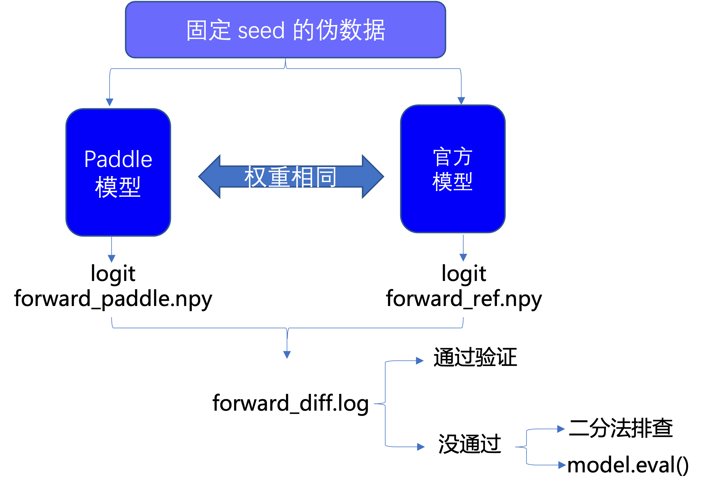
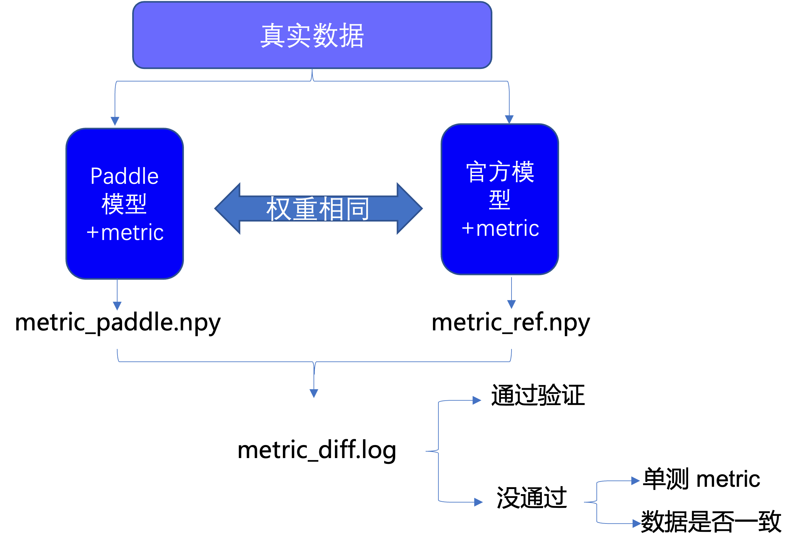
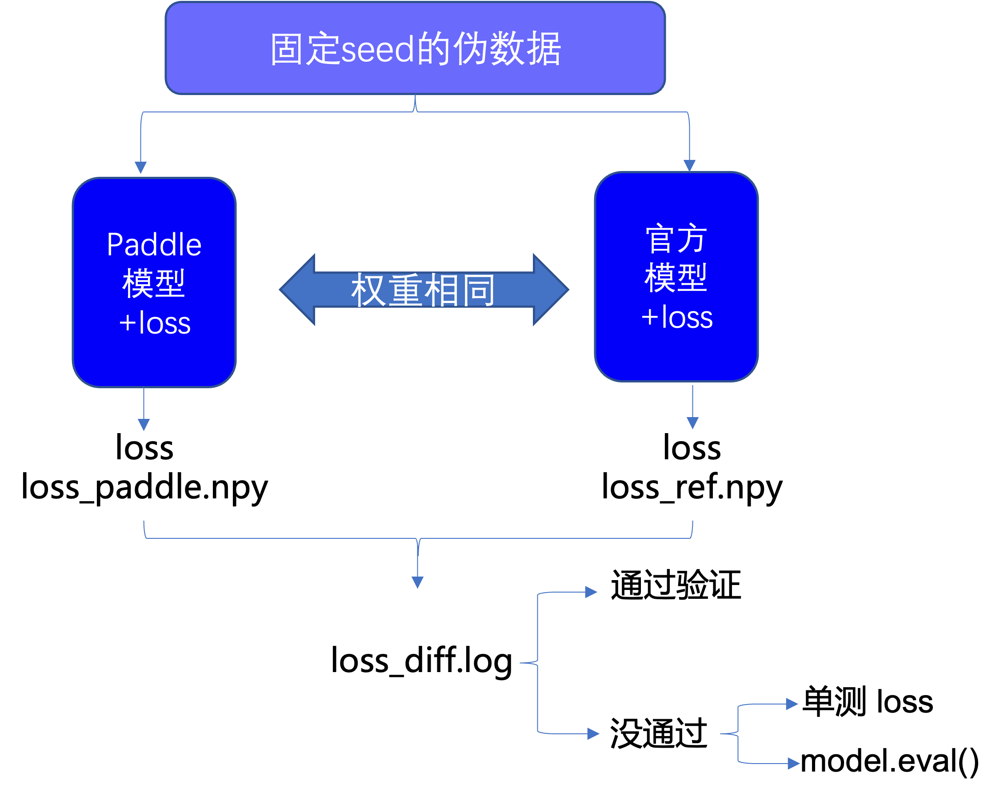
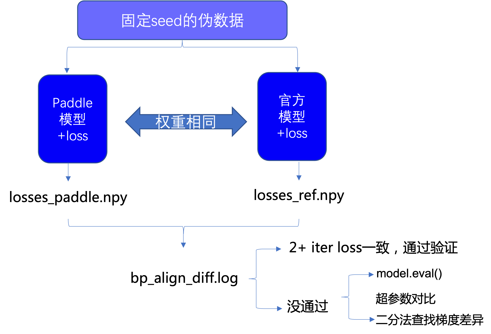
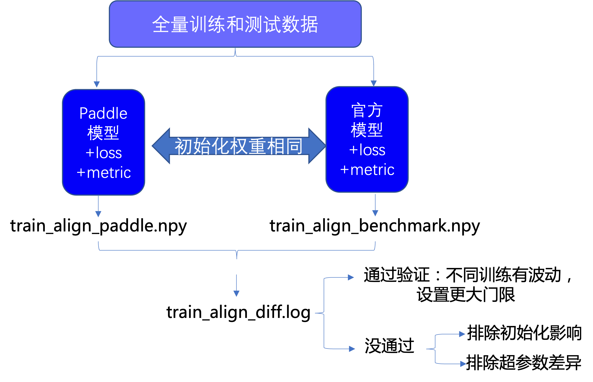

# MobileNetV3

## 目录


- [1. 简介](#1)
- [2. 复现流程](#2)
    - [2.1 reprod_log简介](#2.1)
- [3. 准备数据与环境](#3)
    - [3.1 准备环境](#3.1)
    - [3.2 生成伪数据](#3.2)
    - [3.3 准备模型](#3.3)
- [4. 开始使用](#4)
    - [4.1 模型前向对齐](#4.1)
    - [4.2 数据加载对齐](#4.2)
    - [4.3 评估指标对齐](#4.3)
    - [4.4 损失对齐](#4.4)
    - [4.5 反向梯度对齐](#4.5)
    - [4.6 训练对齐](#4.6)

<a name="1"></a>
## 1. 简介

本部分内容包含基于 [MobileNetV3](https://arxiv.org/abs/1905.02244) 的复现对齐过程，可以结合[论文复现指南]()进行学习。

<a name="2"></a>
## 2. 复现流程
在论文复现中我们可以根据网络训练的流程，将对齐流程划分为数据加载对齐、模型前向对齐、评估指标对齐、反向梯度对齐和训练对齐。其中不同对齐部分我们会在下方详细介绍。

在对齐验证的流程中，我们依靠 reprod_log 日志工具查看 paddle 和官方同样输入下的输出是否相同，这样的查看方式具有标准统一，比较过程方便等优势。

<a name="2.1"></a>
### 2.1 reprod_log 简介
Reprod_log 是一个用于 numpy 数据记录和对比工具，通过传入需要对比的两个 numpy 数组就可以在指定的规则下得到数据之差是否满足期望的结论。其主要接口的说明可以看它的 [github 主页](https://github.com/WenmuZhou/reprod_log)。

<a name="3"></a>
## 3. 准备数据和环境
在进行我们的对齐验证之前，我们需要准备运行环境、用于输入的伪数据、paddle 模型参数和官方模型权重参数。

<a name="3.1"></a>
### 3.1 准备环境
* 克隆本项目

```bash
git clone https://github.com/PaddlePaddle/models.git
cd model/tutorials/mobilenetv3_prod/
```

* 安装paddlepaddle

```bash
# 需要安装2.2及以上版本的Paddle，如果
# 安装GPU版本的Paddle
pip install paddlepaddle-gpu==2.2.0
# 安装CPU版本的Paddle
pip install paddlepaddle==2.2.0
```

更多版本或者环境下的安装可以参考：[Paddle安装指南](https://www.paddlepaddle.org.cn/)
* 安装requirements

```bash
pip install -r requirements.txt
```
<a name="3.2"></a>

### 3.2 生成伪数据
为了保证模型对齐不会受到输入数据的影响，我们生成一组数据作为两个模型的输入。
伪数据可以通过如下代码生成，我们在本地目录下也提供了好的伪数据（./data/fake_*.npy）。

```python
def gen_fake_data():
    fake_data = np.random.rand(1, 3, 224, 224).astype(np.float32) - 0.5
    fake_label = np.arange(1).astype(np.int64)
    np.save("fake_data.npy", fake_data)
    np.save("fake_label.npy", fake_label)
```

<a name="3.3"></a>
### 3.3 准备模型
为了保证模型前向对齐不受到模型参数不一致的影响，我们使用相同的权重参数对模型进行初始化。

生成相同权重参数分为以下 2 步：
1. 随机初始化官方模型参数并保存成 mobilenet_v3_small-047dcff4.pth
2. 将 model.pth 通过 ./torch2paddle.py 生成mv3_small_paddle.pdparams

转换模型时，torch 和 paddle 存在参数需要转换的部分，主要是bn层、全连接层、num_batches_tracked等，可以参见转换脚本(./torch2paddle.py)。

<a name="4"></a>
## 4. 开始使用
准备好数据之后，我们通过下面对应训练流程的拆解步骤进行复现对齐。

<a name="4.1"></a>
### 4.1 模型前向对齐
论文复现中，最重要的来到前向对齐的验证，验证流程如下图所示:

<div align="center">
    
</div>

这里，为了判断判断模型组网部分能获得和原论文同样的输出，我们将两个模型参数固定，并输入相同伪数据，观察 paddle 模型产出的 logit 是否和官方模型一致。

我们的示例代码如下所示：

```python
def test_forward():
    # load paddle model
    paddle_model = mv3_small_paddle()
    paddle_model.eval()
    paddle_state_dict = paddle.load("./data/mv3_small_paddle.pdparams")
    paddle_model.set_dict(paddle_state_dict)

    # load torch model
    torch_model = mv3_small_torch()
    torch_model.eval()
    torch_state_dict = torch.load("./data/mobilenet_v3_small-047dcff4.pth")
    torch_model.load_state_dict(torch_state_dict)

    # load data
    inputs = np.load("./data/fake_data.npy")

    # save the paddle output
    reprod_logger = ReprodLogger()
    paddle_out = paddle_model(paddle.to_tensor(inputs, dtype="float32"))
    reprod_logger.add("logits", paddle_out.cpu().detach().numpy())
    reprod_logger.save("./result/forward_paddle.npy")

    # save the torch output
    torch_out = torch_model(torch.tensor(inputs, dtype=torch.float32))
    reprod_logger.add("logits", torch_out.cpu().detach().numpy())
    reprod_logger.save("./result/forward_torch.npy")
```

可以看到，我们在代码中加载准备的相同的模型参数、并固定输入，从而获得两个模型的输出。输出结果使用相同的 key 值存到 numpy 文件中，随后使用下列代码加载并比较：

```python
    # load data
    diff_helper = ReprodDiffHelper()
    torch_info = diff_helper.load_info("./result/forward_torch.npy")
    paddle_info = diff_helper.load_info("./result/forward_paddle.npy")

    # compare result and produce log
    diff_helper.compare_info(torch_info, paddle_info)
    diff_helper.report(path="./result/log/forward_diff.log")
```

在代码示例中也可以学习到 reprod_log的主要接口，包含add、save、load_infor、compare_infor、report的用法。

【**运行文件**】
通过运行以下代码，我们验证前向对齐效果。
```bash
cd models/tutorials/mobilenetv3_prod/
python 01_test_forward.py
```

【**获得结果**】
根据示例代码可以看到，我们将结果保存在`result/log/forward_diff.log`中，打开对应文件或者直接观察命令行输出，就会有下列结果：

```bash
[2021/12/21 15:00:38] root INFO: logits:
[2021/12/21 15:00:38] root INFO:     mean diff: check passed: False, value: 2.308018565599923e-06
[2021/12/21 15:00:38] root INFO: diff check failed
```

这里我们发现在`reprod_log`默认的平均差异小于1e-6的标准下，当前前向对齐是不符合条件的，但是这是由于前向 op 计算导致的微小的差异。

一般说来前向误差在 1e-5 左右都是可以接受的，到这里我们就验证了网络的前向是对齐的，完成了第一个打卡点。

<a name="4.2"></a>
### 4.2 数据加载对齐

在验证了模型的前向对齐之后，我们验证数据读取部分，这一部分，我们比较从数据读取到模型传入之间我们进行的操作是否和参考操作一致。

主要代码如下所示，我们读取相同的输入，比较数据增强后输出之间的差异，即可知道我们的数据增强是否和参考实现保持一致：

```python
def build_torch_data_pipeline():
    dataset_test = torchvision.datasets.ImageFolder(
        "./lite_data/val/",
        presets_torch.ClassificationPresetEval(
            crop_size=224, resize_size=256), is_valid_file=None)

    test_sampler = torch.utils.data.SequentialSampler(dataset_test)

    data_loader_test = torch.utils.data.DataLoader(
        dataset_test,
        batch_size=4,
        sampler=test_sampler,
        num_workers=0,
        pin_memory=True)
    return dataset_test, data_loader_test


def test_data_pipeline():
    paddle_dataset, paddle_dataloader = build_paddle_data_pipeline()
    torch_dataset, torch_dataloader = build_torch_data_pipeline()

    logger_paddle_data = ReprodLogger()
    logger_torch_data = ReprodLogger()

    logger_paddle_data.add("length", np.array(len(paddle_dataset)))
    logger_torch_data.add("length", np.array(len(torch_dataset)))


    for idx, (paddle_batch, torch_batch
              ) in enumerate(zip(paddle_dataloader, torch_dataloader)):
        if idx >= 5:
            break
        logger_paddle_data.add(f"dataloader_{idx}", paddle_batch[0].numpy())
        logger_torch_data.add(f"dataloader_{idx}",
                              torch_batch[0].detach().cpu().numpy())
    logger_paddle_data.save("./result/data_paddle.npy")
    logger_torch_data.save("./result/data_ref.npy")

```

【**运行文件**】
通过运行以下指令，我们进行测试，测试数据可以解压我们准备的 [lite_data.tar](https://github.com/PaddlePaddle/models/blob/release%2F2.2/tutorials/mobilenetv3_prod/Step6/test_images/lite_data.tar) 获得，对于自身的数据，也可以抽取几张 validationset 的图片用作验证。

```python
cd models/tutorials/mobilenetv3_prod/
tar -xvf lite_data.rar
python 02_test_data.py
```

【**获得结果**】
运行文件之后，我们获得以下命令行输出，可以发现我们的验证结果满足预期，数据加载部分验证通过：

```bash
[2021/12/23 17:21:22] root INFO: length:
[2021/12/23 17:21:22] root INFO:        mean diff: check passed: True, value: 0.0
[2021/12/23 17:21:22] root INFO: dataloader_0:
[2021/12/23 17:21:22] root INFO:        mean diff: check passed: True, value: 0.0
[2021/12/23 17:21:22] root INFO: dataloader_1:
[2021/12/23 17:21:22] root INFO:        mean diff: check passed: True, value: 0.0
[2021/12/23 17:21:22] root INFO: dataloader_2:
[2021/12/23 17:21:22] root INFO:        mean diff: check passed: True, value: 0.0
[2021/12/23 17:21:22] root INFO: dataloader_3:
[2021/12/23 17:21:22] root INFO:        mean diff: check passed: True, value: 0.0
[2021/12/23 17:21:22] root INFO: diff check passed
```

<a name="4.3"></a>
### 4.3 评估指标对齐
随后我们来到评估指标对齐，对齐流程如图所示：

<div align="center">
    
</div>

这部分的对齐流程主要差异在于我们在模型基础上添加了对应参考代码实现 metric，并导入到测试文件中。在论文复现中，我们尽量将模型的不同部分封装起来，之后就可以通过我们这样导入的方式进行验证。

这部分的参考代码如下：

```python

def evaluate(image, labels, model, acc, tag, reprod_logger):
    model.eval()
    output = model(image)

    accracy = acc(output, labels, topk=(1, 5))

    reprod_logger.add("acc_top1", np.array(accracy[0]))
    reprod_logger.add("acc_top5", np.array(accracy[1]))

    reprod_logger.save("./result/metric_{}.npy".format(tag))


def test_forward():
    # load model & data

    evaluate(
        paddle.to_tensor(
            inputs, dtype="float32"),
        paddle.to_tensor(
            labels, dtype="int64"),
        paddle_model,
        accuracy_paddle,
        'paddle', reprod_logger)
    evaluate(
        torch.tensor(
            inputs, dtype=torch.float32),
        torch.tensor(
            labels, dtype=torch.int64),
        torch_model,
        accuracy_torch,
        'ref', reprod_logger)
```
这部分模型和输入的导入均和之前一致，只是在之前的基础上增加了模型计算评估指标的部分。

由于我们之前验证了模型的输出一致。那么也就是评估指标的输入相同，我们只需要对比输出是否一致，即可确定评估指标的实现是否正确。

【**运行文件**】
通过运行以下代码，我们验证评估指标对齐效果。

```bash
cd models/tutorials/mobilenetv3_prod/
python 03_test_metric.py
```

【**获得结果**】

进入`result/log/metric_diff.log`中，就会有下列结果，而结果说明我们评估指标的实现正确， 从而完成第二个打卡点：
```bash
[2021/12/21 19:28:49] root INFO: acc_top1:
[2021/12/21 19:28:49] root INFO:     mean diff: check passed: True, value: 0.0
[2021/12/21 19:28:49] root INFO: acc_top5:
[2021/12/21 19:28:49] root INFO:     mean diff: check passed: True, value: 0.0
[2021/12/21 19:28:49] root INFO: diff check passed
```

<a name="4.4"></a>
### 4.4 损失对齐
进一步，我们验证损失实现的正确性，验证流程如下：

<div align="center">
    
</div>

这部分的对齐流程主要差异在于我们在模型基础上添加了对应参考代码实现的 loss。这部分的参考代码如下：

```python
def test_forward():
    # init loss
    criterion_paddle = paddle.nn.CrossEntropyLoss()
    criterion_torch = torch.nn.CrossEntropyLoss()

    # load model & data

    # save the paddle output
    paddle_out = paddle_model(paddle.to_tensor(inputs, dtype="float32"))
    loss_paddle = criterion_paddle(
        paddle_out, paddle.to_tensor(
            labels, dtype="int64"))
    reprod_logger.add("loss", loss_paddle.cpu().detach().numpy())
    reprod_logger.save("./result/loss_paddle.npy")

    # save the torch output
    torch_out = torch_model(torch.tensor(inputs, dtype=torch.float32))
    loss_torch = criterion_torch(
        torch_out, torch.tensor(
            labels, dtype=torch.int64))
    reprod_logger.add("loss", loss_torch.cpu().detach().numpy())
    reprod_logger.save("./result/loss_ref.npy")
```
这部分代码进一步增加损失导入的部分，由于我们之前验证了模型的输出一致，也就是损失的输入相同，我们只需要对比输出是否一致，即可确定损失的实现是否正确。

【**运行文件**】
通过运行以下代码，我们验证评估指标对齐效果。
```bash
cd models/tutorials/mobilenetv3_prod/
python 04_test_loss.py
```

【**获得结果**】

进入`result/log/loss_diff.log`中，就会有下列结果，而结果说明我们评估指标的实现正确，完成第三个打卡点：
```bash
[2021/12/22 20:13:41] root INFO: loss:
[2021/12/22 20:13:41] root INFO:     mean diff: check passed: True, value: 0.0
[2021/12/22 20:13:41] root INFO: diff check passed
```

<a name="4.5"></a>
### 4.5 反向梯度对齐

结合模型和损失，我们就可以验证反向过程，反向梯度传导的是否正确包含了优化器，学习率以及梯度的计算，而验证过程只需要多观察几轮损失即可明确反向是否正确传导，主要验证流程如下所示：

<div align="center">
    
</div>

以上参考流程可以使用以下代码实现：

```python
def train_one_epoch_torch(inputs, labels, model, criterion, optimizer,
                          max_iter, reprod_logger):
    for idx in range(max_iter):
        image = torch.tensor(inputs, dtype=torch.float32).cuda()
        target = torch.tensor(labels, dtype=torch.int64).cuda()
        model = model.cuda()

        output = model(image)
        loss = criterion(output, target)

        reprod_logger.add("loss_{}".format(idx), loss.cpu().detach().numpy())

        optimizer.zero_grad()
        loss.backward()
        optimizer.step()

    reprod_logger.save("./result/losses_ref.npy")


def test_backward():
    max_iter = 3
    lr = 1e-3
    momentum = 0.9

    # load model, loss, data

    # init optimizer
    opt_paddle = paddle.optimizer.Momentum(
        learning_rate=lr,
        momentum=momentum,
        parameters=paddle_model.parameters())

    opt_torch = torch.optim.SGD(torch_model.parameters(), lr=lr, momentum=momentum)

    train_one_epoch_paddle(inputs, labels, paddle_model, criterion_paddle,
                           opt_paddle, max_iter, reprod_logger)

    train_one_epoch_torch(inputs, labels, torch_model, criterion_torch,
                          opt_torch, max_iter, reprod_logger)
```

代码中增加了optimizer用于迭代网络参数，其他则基本一致。

【**运行文件**】
通过运行以下代码，我们验证反向传播对齐效果。
```bash
cd models/tutorials/mobilenetv3_prod/
python 05_test_backward.py
```

【**获得结果**】
进入`result/log/loss_diff.log`中，就会有下列结果，结果表示三轮损失的差异在 1e-6 附近，说明我们反向传播的实现对齐， 完成第四个打卡点：

```bash
[2021/12/23 15:51:16] root INFO: loss_0:
[2021/12/23 15:51:16] root INFO:     mean diff: check passed: False, value: 1.9073486328125e-06
[2021/12/23 15:51:16] root INFO: lr_0:
[2021/12/23 15:51:16] root INFO:     mean diff: check passed: True, value: 0.0
[2021/12/23 15:51:16] root INFO: loss_1:
[2021/12/23 15:51:16] root INFO:     mean diff: check passed: False, value: 2.384185791015625e-06
[2021/12/23 15:51:16] root INFO: lr_1:
[2021/12/23 15:51:16] root INFO:     mean diff: check passed: True, value: 0.0
[2021/12/23 15:51:16] root INFO: loss_2:
[2021/12/23 15:51:16] root INFO:     mean diff: check passed: False, value: 1.1920928955078125e-05
[2021/12/23 15:51:16] root INFO: lr_2:
[2021/12/23 15:51:16] root INFO:     mean diff: check passed: True, value: 0.0
[2021/12/23 15:51:16] root INFO: diff check failed


```

<a name="4.6"></a>
### 4.6 训练对齐
通过以上步骤，我们验证了模型、数据、评估指标、损失、反向传播的正确性，也就为我们的训练对齐打下了良好的基础。

接下来，我们按照以下流程验证训练对齐结果，即对网络进行训练，并在训练后验证精度是否达到指标：

<div align="center">
    
</div>


我们可以使用reprd logger对比精度，也可以直接肉眼观察结果对比：

```python
if paddle.distributed.get_rank() == 0:
    reprod_logger = ReprodLogger()
    reprod_logger.add("top1", np.array([top1]))
    reprod_logger.save("train_align_paddle.npy")
```

【**运行文件**】

```bash
cd models/tutorials/mobilenetv3_prod/Checkpoint6
python train.py
```

【**获得结果**】
最终训练精度超过原模型精度，我们的复现到这里就圆满结束，如果还有任何问题，欢迎随时向我们[提问](https://github.com/PaddlePaddle/Paddle/issues)！
