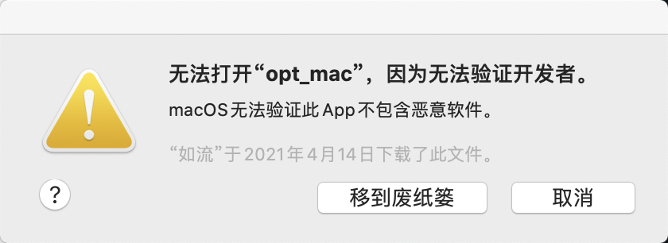
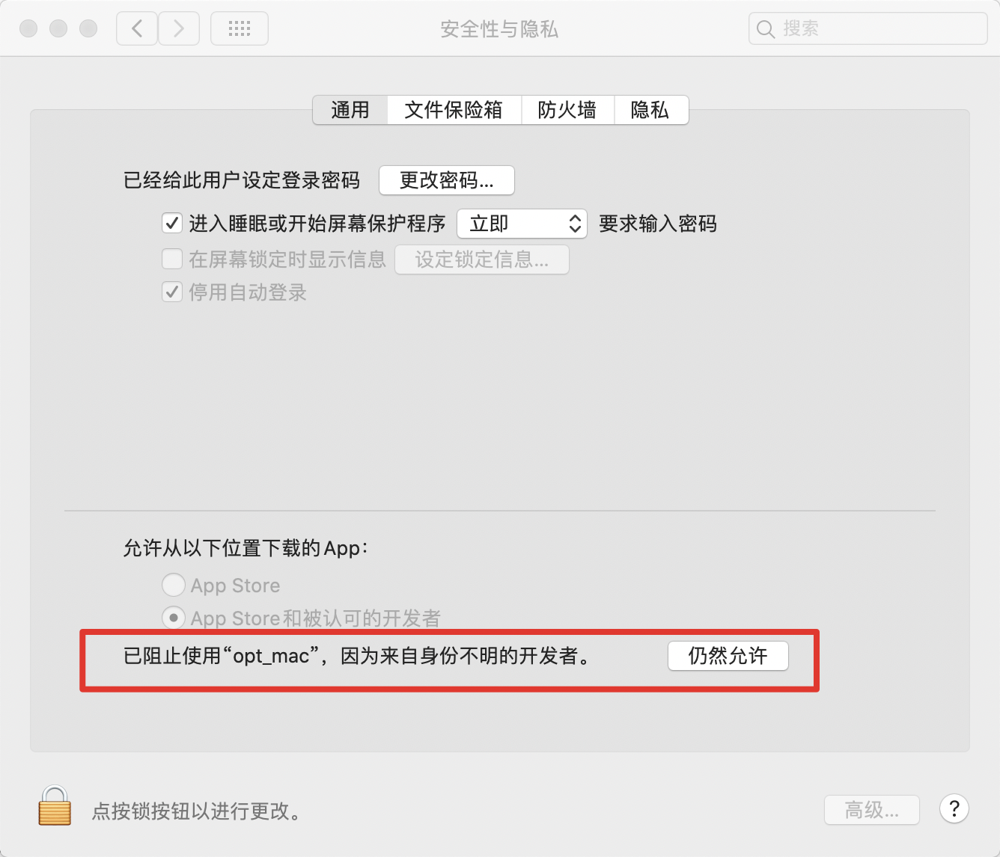

# MobileNetV3

## 目录


- [1. 简介]()
- [2. 数据集和复现精度]()
- [3. 准备数据与环境]()
    - [3.1 准备环境]()
    - [3.2 准备数据]()
    - [3.3 准备模型]()
- [4. 开始使用]()
    - [4.1 模型训练]()
    - [4.2 模型评估]()
    - [4.3 模型预测]()
- [5. 模型推理部署]()
- [6. TIPC自动化测试脚本]()
- [7. 参考链接与文献]()


## 1. 简介

* coming soon!

**论文:** [Searching for MobileNetV3](https://arxiv.org/abs/1905.02244)

**参考repo:** [https://github.com/pytorch/vision](https://github.com/pytorch/vision)


在此感谢[vision](https://github.com/pytorch/vision)，提高了MobileNetV3论文复现的效率。

注意：在这里为了简化流程，仅关于`ImageNet标准训练过程`做训练对齐，具体地：
* 训练总共120epoch，总的batch size是256*8=2048，学习率为0.8，下降策略为Piecewise Decay(30epoch下降10倍)
* 训练预处理：RandomResizedCrop(size=224) + RandomFlip(p=0.5) + Normalize
* 评估预处理：Resize(256) + CenterCrop(224) + Normalize

这里`mobilenet_v3_small`的参考指标也是重新训练得到的。

## 2. 数据集和复现精度

数据集为ImageNet，训练集包含1281167张图像，验证集包含50000张图像。

您可以从[ImageNet 官网](https://image-net.org/)申请下载数据。


| 模型      | top1/5 acc (参考精度) | top1/5 acc (复现精度) | 下载链接 |
|:---------:|:------:|:----------:|:----------:|
| Mo | -/-   | 0.601/0.826   | [预训练模型](https://paddle-model-ecology.bj.bcebos.com/model/mobilenetv3_reprod/mobilenet_v3_small_pretrained.pdparams) \|  [Inference模型(coming soon!)]() \| [日志](https://paddle-model-ecology.bj.bcebos.com/model/mobilenetv3_reprod/train_mobilenet_v3_small.log) |


## 3. 准备环境与数据

### 3.1 准备环境

* 下载代码

```bash
https://github.com/PaddlePaddle/models.git
cd model/tutorials/mobilenetv3_prod/Step6
```

* 安装paddlepaddle

```bash
# 需要安装2.2及以上版本的Paddle，如果
# 安装GPU版本的Paddle
pip install paddlepaddle-gpu==2.2.0
# 安装CPU版本的Paddle
pip install paddlepaddle==2.2.0
```

更多安装方法可以参考：[Paddle安装指南](https://www.paddlepaddle.org.cn/)。

* 安装requirements

```bash
pip install -r requirements.txt
```

### 3.2 准备数据

如果您已经下载好ImageNet1k数据集，那么该步骤可以跳过，如果您没有，则可以从[ImageNet官网](https://image-net.org/download.php)申请下载。

如果只是希望快速体验模型训练功能，则可以直接解压`test_images/lite_data.tar`，其中包含16张训练图像以及16张验证图像。

```bash
tar -xf test_images/lite_data.tar
```

### 3.3 准备模型

如果您希望直接体验评估或者预测推理过程，可以直接根据第2章的内容下载提供的预训练模型，直接体验模型评估、预测、推理部署等内容。


## 4. 开始使用

### 4.1 模型训练

* 单机单卡训练

```bash
export CUDA_VISIBLE_DEVICES=0
python3.7 train.py --data-path=./ILSVRC2012 --lr=0.1 --batch-size=256
```

部分训练日志如下所示。

```
[Epoch 1, iter: 4780] top1: 0.10312, top5: 0.27344, lr: 0.01000, loss: 5.34719, avg_reader_cost: 0.03644 sec, avg_batch_cost: 0.05536 sec, avg_samples: 64.0, avg_ips: 1156.08863 images/sec.
[Epoch 1, iter: 4790] top1: 0.08750, top5: 0.24531, lr: 0.01000, loss: 5.28853, avg_reader_cost: 0.05164 sec, avg_batch_cost: 0.06852 sec, avg_samples: 64.0, avg_ips: 934.08427 images/sec.
```

* 单机多卡训练

```bash
export CUDA_VISIBLE_DEVICES=0,1,2,3
python3.7 -m paddle.distributed.launch --gpus="0,1,2,3" train.py --data-path="./ILSVRC2012" --lr=0.4 --batch-size=256
```

更多配置参数可以参考[train.py](./train.py)的`get_args_parser`函数。

### 4.2 模型评估

该项目中，训练与评估脚本相同，指定`--test-only`参数即可完成预测过程。

```bash
python train.py --test-only --data-path=/paddle/data/ILSVRC2012 --pretrained=./mobilenet_v3_small_paddle.pdparams
```

期望输出如下。

```
Test:  [   0/1563]  eta: 1:14:20  loss: 1.0456 (1.0456)  acc1: 0.7812 (0.7812)  acc5: 0.9062 (0.9062)  time: 2.8539  data: 2.8262
...
Test:  [1500/1563]  eta: 0:00:05  loss: 1.2878 (1.9196)  acc1: 0.7344 (0.5639)  acc5: 0.8750 (0.7893)  time: 0.0623  data: 0.0534
Test: Total time: 0:02:05
 * Acc@1 0.564 Acc@5 0.790
```

### 4.3 模型预测

* 使用GPU预测

```
python tools/predict.py --pretrained=./mobilenet_v3_small_paddle_pretrained.pdparams --img-path=images/demo.jpg
```

对于下面的图像进行预测

<div align="center">
    
</div>

最终输出结果为`class_id: 8, prob: 0.9091238975524902`，表示预测的类别ID是`8`，置信度为`0.909`。

* 使用CPU预测

```
python tools/predict.py --pretrained=./mobilenet_v3_small_paddle_pretrained.pdparams --img-path=images/demo.jpg --device=cpu
```


## 5. 模型推理部署

### 5.1 使用paddle lite 部署
(1) 获取inference model

在tools文件夹下提供了输出inference model的脚本文件export_model.py，运行如下命令即可获取inference model。
```
python ./tools/export_model.py --pretrained=./mobilenet_v3_small_paddle_pretrained.pdparams  --save-inference-dir=./inference_model
```
在inference_model文件夹下有inference.pdmodel、inference.pdiparams和inference.pdiparams.info文件。

(2) 准备模型转换工具并生成paddle-lite的部署模型

- 模型转换工具[opt_linux](https://github.com/PaddlePaddle/Paddle-Lite/releases/download/v2.10/opt_linux)、[opt_mac](https://github.com/PaddlePaddle/Paddle-Lite/releases/download/v2.10/opt_mac)。或者参考[文档](https://paddle-lite.readthedocs.io/zh/develop/user_guides/model_optimize_tool.html)编译您的模型转换工具

- 使用如下命令转换可以转换inference model到paddle lite的nb模型：

```
./opt --model_file=./inference_model/inference.pdmodel --param_file=./inference_model/inference.pdiparams --optimize_out=./mobilenet_v3
```
在当前文件夹下可以发现mobilenet_v3.nb文件。

注：在mac上运行opt_mac可能会有如下错误：

<div align="center">
    
</div>
需要搜索**安全性与隐私**，点击通用，点击**仍然允许**，即可。
<div align="center">
    
</div>

(3)以arm v8 、android系统为例进行部署,开发机为ubuntu。

- 准备编译环境

```
gcc、g++（推荐版本为 8.2.0)   
git、make、wget、python、adb   
Java Environment   
CMake（请使用 3.10 或以上版本）  
Android NDK（支持 ndk-r17c 及之后的所有 NDK 版本, 注意从 ndk-r18 开始，NDK 交叉编译工具仅支持 Clang, 不支持 GCC）  
```

- 环境安装命令

以 Ubuntu 为例介绍安装命令。注意需要 root 用户权限执行如下命令。mac环境下编译android库参考[链接](https://paddle-lite.readthedocs.io/zh/develop/source_compile/macos_compile_android.html)，windows下暂不支持变异android版本库。

```
   # 1. 安装 gcc g++ git make wget python unzip adb curl 等基础软件
   apt update
   apt-get install -y --no-install-recommends \
     gcc g++ git make wget python unzip adb curl

   # 2. 安装 jdk
   apt-get install -y default-jdk

   # 3. 安装 CMake，以下命令以 3.10.3 版本为例，其他版本步骤类似。
   wget -c https://mms-res.cdn.bcebos.com/cmake-3.10.3-Linux-x86_64.tar.gz && \
       tar xzf cmake-3.10.3-Linux-x86_64.tar.gz && \
       mv cmake-3.10.3-Linux-x86_64 /opt/cmake-3.10 &&  
       ln -s /opt/cmake-3.10/bin/cmake /usr/bin/cmake && \
       ln -s /opt/cmake-3.10/bin/ccmake /usr/bin/ccmake

   # 4. 下载 linux-x86_64 版本的 Android NDK，以下命令以 r17c 版本为例，其他版本步骤类似。
   cd /tmp && curl -O https://dl.google.com/android/repository/android-ndk-r17c-linux-x86_64.zip
   cd /opt && unzip /tmp/android-ndk-r17c-linux-x86_64.zip

   # 5. 添加环境变量 NDK_ROOT 指向 Android NDK 的安装路径
   echo "export NDK_ROOT=/opt/android-ndk-r17c" >> ~/.bashrc
   source ~/.bashrc
```

- 编译步骤

运行编译脚本之前，请先检查系统环境变量 ``NDK_ROOT`` 指向正确的 Android NDK 安装路径。
之后可以下载并构建 Paddle Lite 编译包。

```
   # 1. 检查环境变量 `NDK_ROOT` 指向正确的 Android NDK 安装路径
   echo $NDK_ROOT

   # 2. 下载 Paddle Lite 源码并切换到发布分支，如 release/v2.10
   git clone https://github.com/PaddlePaddle/Paddle-Lite.git
   cd Paddle-Lite && git checkout release/v2.10

   # (可选) 删除 third-party 目录，编译脚本会自动从国内 CDN 下载第三方库文件
   # rm -rf third-party

   # 3. 编译 Paddle Lite Android 预测库
   ./lite/tools/build_android.sh
```

如果按 ``./lite/tools/build_android.sh`` 中的默认参数执行，成功后会在 ``Paddle-Lite/build.lite.android.armv8.gcc/inference_lite_lib.android.armv8`` 生成 Paddle Lite 编译包，文件目录如下。

```
   inference_lite_lib.android.armv8/
   ├── cxx                                               C++ 预测库和头文件
   │   ├── include                                       C++ 头文件
   │   │   ├── paddle_api.h
   │   │   ├── paddle_image_preprocess.h
   │   │   ├── paddle_lite_factory_helper.h
   │   │   ├── paddle_place.h
   │   │   ├── paddle_use_kernels.h
   │   │   ├── paddle_use_ops.h
   │   │   └── paddle_use_passes.h
   │   └── lib                                           C++ 预测库
   │       ├── libpaddle_api_light_bundled.a             C++ 静态库
   │       └── libpaddle_light_api_shared.so             C++ 动态库
   │
   ├── java                                              Java 预测库
   │   ├── jar
   │   │   └── PaddlePredictor.jar                       Java JAR 包
   │   ├── so
   │   │   └── libpaddle_lite_jni.so                     Java JNI 动态链接库
   │   └── src
   │
   └── demo                                              C++ 和 Java 示例代码
       ├── cxx                                           C++ 预测库示例
       └── java                                          Java 预测库示例
```
- 推荐使用Paddle-Lite仓库提供的release的lib包，[下载链接](https://github.com/PaddlePaddle/Paddle-Lite/releases/tag/v2.10),在网页最下边选取要使用的lib包。

```
tar -xvzf inference_lite_lib.android.armv8.clang.c++_static.with_extra.with_cv.tar.gz
```
即可获取编译好的lib包。注意，即使获取编译好的lib包依然要进行上述**安装环境**的步骤，因为下面编译demo时候会用到。

- 连接一台开启了**USB调试功能**的手机，运行
```
adb devices
```
可以看到有输出
```
List of devices attached
1ddcf602	device
```

- 执行以下命令即可在手机上运行demo。

```bash
#################################
# 假设当前位于 build.xxx 目录下   #
#################################

# prepare enviroment on phone
adb shell mkdir -p /data/local/tmp/arm_cpu/

# build demo
cd inference_lite_lib.android.armv8/demo/cxx/mobile_light/
make
cd -

# push executable binary, library to device
adb push inference_lite_lib.android.armv8/demo/cxx/mobile_light/mobilenetv1_light_api /data/local/tmp/arm_cpu/
adb shell chmod +x /data/local/tmp/arm_cpu/mobilenetv1_light_api
adb push inference_lite_lib.android.armv8/cxx/lib/libpaddle_light_api_shared.so /data/local/tmp/arm_cpu/

# push model with optimized(opt) to device
adb push ./mobilenetv1_fp32.nb /data/local/tmp/arm_cpu/

# run demo on device
adb shell "export LD_LIBRARY_PATH=/data/local/tmp/arm_cpu/; \
           /data/local/tmp/arm_cpu/mobilenetv1_light_api \
           /data/local/tmp/arm_cpu/mobilenetv3.nb \
           1,3,224,224 \
           10 10 0 1 1 0" 
           # repeats=100, warmup=10
           # power_mode=0 绑定大核, thread_num=1
           # print_output=0 不打印模型输出 tensors 详细数据
```
得到以下输出：
```
run_idx:1 / 10: 33.821 ms
run_idx:2 / 10: 33.8 ms
run_idx:3 / 10: 33.867 ms
run_idx:4 / 10: 34.009 ms
run_idx:5 / 10: 33.699 ms
run_idx:6 / 10: 33.644 ms
run_idx:7 / 10: 33.611 ms
run_idx:8 / 10: 33.783 ms
run_idx:9 / 10: 33.731 ms
run_idx:10 / 10: 33.423 ms

======= benchmark summary =======
input_shape(NCHW):1 3 224 224
model_dir:mobilenet_v3.nb
warmup:10
repeats:10
max_duration:34.009
min_duration:33.423
avg_duration:33.7388

====== output summary ======
output tensor num:1

--- output tensor 0 ---
output shape(NCHW):1 1000
output tensor 0 elem num:1000
output tensor 0 standard deviation:0.00219646
output tensor 0 mean value:0.001
```
代表在android手机上推理部署完成。

(4) lite提供的mobilenet_light demo 的预测步骤分析以及添加前处理方法：

```c++
#include <iostream>
// 引入 C++ API
#include "paddle_lite/paddle_api.h"
#include "paddle_lite/paddle_use_ops.h"
#include "paddle_lite/paddle_use_kernels.h"

// 1. 设置 MobileConfig
MobileConfig config;
config.set_model_from_file(<modelPath>); // 设置 NaiveBuffer 格式模型路径
config.set_power_mode(LITE_POWER_NO_BIND); // 设置 CPU 运行模式
config.set_threads(4); // 设置工作线程数

// 2. 创建 PaddlePredictor
std::shared_ptr<PaddlePredictor> predictor = CreatePaddlePredictor<MobileConfig>(config);

// 3. 设置输入数据,可以在这里进行您的前处理，比如用opencv读取图片等。这里为全一输入。
std::unique_ptr<Tensor> input_tensor(std::move(predictor->GetInput(0)));
input_tensor->Resize({1, 3, 224, 224});
auto* data = input_tensor->mutable_data<float>();
for (int i = 0; i < ShapeProduction(input_tensor->shape()); ++i) {
  data[i] = 1;
}

//其他前处理

// 4. 执行预测
predictor->run();

// 5. 获取输出数据
std::unique_ptr<const Tensor> output_tensor(std::move(predictor->GetOutput(0)));
std::cout << "Output shape " << output_tensor->shape()[1] << std::endl;
for (int i = 0; i < ShapeProduction(output_tensor->shape()); i += 100) {
  std::cout << "Output[" << i << "]: " << output_tensor->data<float>()[i]
            << std::endl;
}
//后处理
```


## 6. TIPC自动化测试脚本

coming soon!

## 7. 参考链接与文献

1. Howard A, Sandler M, Chu G, et al. Searching for mobilenetv3[C]//Proceedings of the IEEE/CVF International Conference on Computer Vision. 2019: 1314-1324.
2. vision: https://github.com/pytorch/vision
