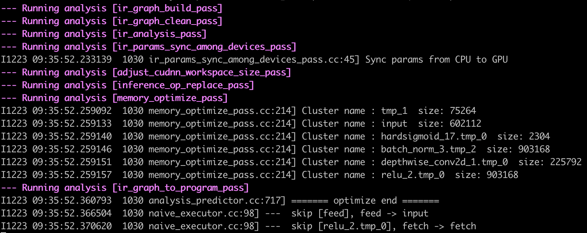
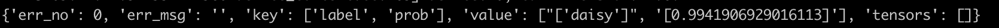

# MobileNetV3

## 目录


- [1. 简介]()
- [2. 数据集和复现精度]()
- [3. 准备数据与环境]()
    - [3.1 准备环境]()
    - [3.2 准备数据]()
    - [3.3 准备模型]()
- [4. 开始使用]()
    - [4.1 模型训练]()
    - [4.2 模型评估]()
    - [4.3 模型预测]()
- [5. 模型推理部署]()
- [6. TIPC自动化测试脚本]()
- [7. 参考链接与文献]()


## 1. 简介

* coming soon!

**论文:** [Searching for MobileNetV3](https://arxiv.org/abs/1905.02244)

**参考repo:** [https://github.com/pytorch/vision](https://github.com/pytorch/vision)


在此感谢[vision](https://github.com/pytorch/vision)，提高了MobileNetV3论文复现的效率。

注意：在这里为了简化流程，仅关于`ImageNet标准训练过程`做训练对齐，具体地：
* 训练总共120epoch，总的batch size是256*8=2048，学习率为0.8，下降策略为Piecewise Decay(30epoch下降10倍)
* 训练预处理：RandomResizedCrop(size=224) + RandomFlip(p=0.5) + Normalize
* 评估预处理：Resize(256) + CenterCrop(224) + Normalize

这里`mobilenet_v3_small`的参考指标也是重新训练得到的。

<a name="2---"></a>
## 2. 数据集和复现精度

数据集为ImageNet，训练集包含1281167张图像，验证集包含50000张图像。

您可以从[ImageNet 官网](https://image-net.org/)申请下载数据。


| 模型      | top1/5 acc (参考精度) | top1/5 acc (复现精度) | 下载链接 |
|:---------:|:------:|:----------:|:----------:|
| Mo | -/-   | 0.601/0.826   | [预训练模型](https://paddle-model-ecology.bj.bcebos.com/model/mobilenetv3_reprod/mobilenet_v3_small_pretrained.pdparams) \|  [Inference模型(coming soon!)]() \| [日志](https://paddle-model-ecology.bj.bcebos.com/model/mobilenetv3_reprod/train_mobilenet_v3_small.log) |


## 3. 准备环境与数据

### 3.1 准备环境

* 下载代码

```bash
https://github.com/PaddlePaddle/models.git
cd model/tutorials/mobilenetv3_prod/Step6
```

* 安装paddlepaddle

```bash
# 需要安装2.2及以上版本的Paddle，如果
# 安装GPU版本的Paddle
pip install paddlepaddle-gpu==2.2.0
# 安装CPU版本的Paddle
pip install paddlepaddle==2.2.0
```

更多安装方法可以参考：[Paddle安装指南](https://www.paddlepaddle.org.cn/)。

* 安装requirements

```bash
pip install -r requirements.txt
```

### 3.2 准备数据

如果您已经下载好ImageNet1k数据集，那么该步骤可以跳过，如果您没有，则可以从[ImageNet官网](https://image-net.org/download.php)申请下载。

如果只是希望快速体验模型训练功能，则可以直接解压`test_images/lite_data.tar`，其中包含16张训练图像以及16张验证图像。

```bash
tar -xf test_images/lite_data.tar
```

### 3.3 准备模型

如果您希望直接体验评估或者预测推理过程，可以直接根据第2章的内容下载提供的预训练模型，直接体验模型评估、预测、推理部署等内容。


## 4. 开始使用

### 4.1 模型训练

* 单机单卡训练

```bash
export CUDA_VISIBLE_DEVICES=0
python3.7 train.py --data-path=./ILSVRC2012 --lr=0.1 --batch-size=256
```

部分训练日志如下所示。

```
[Epoch 1, iter: 4780] top1: 0.10312, top5: 0.27344, lr: 0.01000, loss: 5.34719, avg_reader_cost: 0.03644 sec, avg_batch_cost: 0.05536 sec, avg_samples: 64.0, avg_ips: 1156.08863 images/sec.
[Epoch 1, iter: 4790] top1: 0.08750, top5: 0.24531, lr: 0.01000, loss: 5.28853, avg_reader_cost: 0.05164 sec, avg_batch_cost: 0.06852 sec, avg_samples: 64.0, avg_ips: 934.08427 images/sec.
```

* 单机多卡训练

```bash
export CUDA_VISIBLE_DEVICES=0,1,2,3
python3.7 -m paddle.distributed.launch --gpus="0,1,2,3" train.py --data-path="./ILSVRC2012" --lr=0.4 --batch-size=256
```

更多配置参数可以参考[train.py](./train.py)的`get_args_parser`函数。

### 4.2 模型评估

该项目中，训练与评估脚本相同，指定`--test-only`参数即可完成预测过程。

```bash
python train.py --test-only --data-path=/paddle/data/ILSVRC2012 --pretrained=./mobilenet_v3_small_paddle.pdparams
```

期望输出如下。

```
Test:  [   0/1563]  eta: 1:14:20  loss: 1.0456 (1.0456)  acc1: 0.7812 (0.7812)  acc5: 0.9062 (0.9062)  time: 2.8539  data: 2.8262
...
Test:  [1500/1563]  eta: 0:00:05  loss: 1.2878 (1.9196)  acc1: 0.7344 (0.5639)  acc5: 0.8750 (0.7893)  time: 0.0623  data: 0.0534
Test: Total time: 0:02:05
 * Acc@1 0.564 Acc@5 0.790
```

### 4.3 模型预测

* 使用GPU预测

```
python tools/predict.py --pretrained=./mobilenet_v3_small_paddle_pretrained.pdparams --img-path=images/demo.jpg
```

对于下面的图像进行预测

<div align="center">
    
</div>

最终输出结果为`class_id: 8, prob: 0.9091238975524902`，表示预测的类别ID是`8`，置信度为`0.909`。

* 使用CPU预测

```
python tools/predict.py --pretrained=./mobilenet_v3_small_paddle_pretrained.pdparams --img-path=images/demo.jpg --device=cpu
```


## 5. 模型推理部署

### 5.2 使用 Paddle Serving 部署
#### 5.2.1 准备测试数据和部署环境
**【基本流程】**

**（1）准备测试数据：** 从验证集或者测试集中抽出至少一张图像，用于后续推理过程验证。

**（2）准备部署环境**

docker是一个开源的应用容器引擎，可以让应用程序更加方便地被打包和移植。建议在docker中进行Serving服务化部署。

首先准备docker环境，AIStudio环境已经安装了合适的docker。如果是非AIStudio环境，请[参考文档](https://github.com/PaddlePaddle/Serving/blob/v0.7.0/doc/Install_CN.md)中的 "1.2 Paddle开发镜像" 安装docker环境。

然后安装Paddle Serving三个安装包，paddle-serving-server，paddle-serving-client 和 paddle-serving-app。

```
wget https://paddle-serving.bj.bcebos.com/test-dev/whl/paddle_serving_server_gpu-0.7.0.post102-py3-none-any.whl
pip3 install paddle_serving_server_gpu-0.7.0.post102-py3-none-any.whl

wget https://paddle-serving.bj.bcebos.com/test-dev/whl/paddle_serving_client-0.7.0-cp37-none-any.whl
pip3 install paddle_serving_client-0.7.0-cp37-none-any.whl

wget https://paddle-serving.bj.bcebos.com/test-dev/whl/paddle_serving_app-0.7.0-py3-none-any.whl
pip3 install paddle_serving_app-0.7.0-py3-none-any.whl
```

Paddle Serving Server更多不同运行环境的whl包下载地址，请参考：[下载页面](https://github.com/PaddlePaddle/Serving/blob/v0.7.0/doc/Latest_Packages_CN.md)

#### 5.2.2 准备服务化部署模型

【基本流程】

为了便于模型服务化部署，需要将jit.save保存的静态图模型（具体参考[《Linux GPU/CPU 基础训练推理开发文档》](../train_infer_python/README.md) 使用paddle_serving_client.convert按如下命令转换为服务化部署模型：

```
python3 -m paddle_serving_client.convert --dirname {静态图模型路径} --model_filename {模型结构文件} --params_filename {模型参数文件} --serving_server {转换后的服务器端模型和配置文件存储路径} --serving_client {转换后的客户端模型和配置文件存储路径}
```
上面命令中 "转换后的服务器端模型和配置文件" 将用于后续服务化部署。其中`paddle_serving_client.convert`命令是`paddle_serving_client` whl包内置的转换函数，无需修改。

【实战】
                       
进入部署完成的Docker
* 下载代码

```bash
git clone https://github.com/PaddlePaddle/models.git
cd models/tutorials/mobilenetv3_prod/Step6
```
由于[MobileNetV3](#2---)暂时只提供了预训练模型，因此需要先转换为Inference模型。若后期提供，可省略该步骤。
                       
在tools文件夹下提供了输出inference模型的脚本文件export_model.py，运行如下命令即可获取inference模型。

```
python3 ./tools/export_model.py --pretrained=./mobilenet_v3_small_pretrained.pdparams  --save-inference-dir=./mobilenetv3_model
```
在inference_model文件夹下有inference.pdmodel、inference.pdiparams和inference.pdiparams.info文件。

针对MobileNetV3网络，将inference模型转换为服务化部署模型的示例命令如下，转换完后在本地生成serving_server和serving_client两个文件夹。本教程后续主要使用serving_server文件夹中的模型。

```python
python3 -m paddle_serving_client.convert \
    --dirname ./mobilenetv3_model/ \
    --model_filename inference.pdmodel \
    --params_filename inference.pdiparams \
    --serving_server serving_server \
    --serving_client serving_client
```
【注意】：0.7.0版本的 PaddleServing 需要和PaddlePaddle 2.2之后的版本搭配进行模型转换   
                       
#### 5.2.3 复制部署样例程序
**【基本流程】**

服务化部署的样例程序的目录地址为：`**/models/docs/tipc/serving/template/code`

该目录下面包含3个文件，具体如下：

- web_service.py：用于开发服务端模型预测相关程序。由于使用多卡或者多机部署预测服务，设计高效的服务调度策略比较复杂，Paddle Serving将网络预测进行了封装，在这个程序里面开发者只需要关心部署服务引擎的初始化，模型预测的前处理和后处理开发，不用关心模型预测调度问题。

- config.yml：服务端模型预测相关配置文件，里面有各参数的详细说明。开发者只需要关注如下配置：http_port（服务的http端口），model_config（服务化部署模型的路径），device_type（计算硬件类型），devices（计算硬件ID）。

- pipeline_http_client.py：用于客户端访问服务的程序，开发者需要设置url（服务地址）、logid（日志ID）和测试图像。

**【实战】**

如果服务化部署MobileNetV3网络，需要拷贝上述三个文件以及上述导出的serving_server、serving_client文件夹到运行目录，建议在`**/models/community/repo_template/deploy/pdserving/`目录下。                      
#### 5.2.4 初始化部署引擎

**【基本流程】**

针对模型名称，修改web_service.py中类TIPCExampleService、TIPCExampleOp的名称，以及这些类初始化中任务名称name，同时通过uci_service.prepare_pipeline_config设置配置参数。

同时修改服务配置文件中的配置：OP名称，http_port（服务的http端口），model_config（服务化部署模型的路径），device_type（计算硬件类型），devices（计算硬件ID）

**【实战】**

针对MobileNetV3网络
                       
（1）修改web_service.py文件后的代码如下：

```
from paddle_serving_server.web_service import WebService, Op

class MobileNetOp(Op):
    def init_op(self):
        pass

    def preprocess(self, input_dicts, data_id, log_id):
        pass

    def postprocess(self, input_dicts, fetch_dict, data_id, log_id):
        pass


class MobileNetvService(WebService):
    def get_pipeline_response(self, read_op):
        mobilenet_op = MobileNetOp(name="imagenet", input_ops=[read_op])
        return mobilenet_op

uci_service = MobileNetService(name="imagenet")
uci_service.prepare_pipeline_config("config.yml")
uci_service.run_service()
```
（2）修改服务配置文件config.yml。
- http_port：使用默认的端口号18080
- OP名称：第14行更新imagenet
- model_config：与5.2.2转换后服务化部署模型文件夹路径一致，这里使用默认配置 "./serving_server"
- device_type：使用默认配置1，基于GPU预测
- devices：使用默认配置"0"，0号卡预测     
                   
#### 5.2.5 开发数据预处理程序

**【基本流程】**

web_service.py文件中的TIPCExampleOp类的preprocess函数用于开发数据预处理程序，包含输入、处理流程和输出三部分。

**（1）输入：** 一般开发者使用时，只需要关心input_dicts和log_id两个输入参数。这两个参数与客户端访问服务程序tipc_pipeline_http_client.py中的请求参数相对应，即：
```
    data = {"key": ["image"], "value": [image], "logid":logid}
```
其中key和value的数据类型都是列表，并且一一对应。input_dicts是一个字典，它的key和value和data中的key和value是一致的。log_id和data中的logid一致。

**（2）处理流程：** 数据预处理流程和基于Paddle Inference的模型预处理流程相同。

**（3）输出：** 需要返回四个参数，一般开发者使用时只关心第一个返回值，网络输入字典，其余返回值使用默认的即可。

```
{"input": input_imgs}, False, None, ""
```
上述网络输入字典的key可以通过服务化模型配置文件serving_server/serving_server_conf.prototxt中的feed_var字典的name字段获取。

**【实战】**

针对MobileNetV3网络的数据预处理开发，修改web_service.py文件中代码如下：

添加头文件：

```py
import sys
import logging
import numpy as np
import base64, cv2
from paddle_serving_app.reader import Sequential, URL2Image, Resize, CenterCrop, RGB2BGR, Transpose, Div, Normalize, Base64ToImage
```     
修改MobileNetOp中的init_op和preprocess函数相关代码：

```py
class MobileNetOp(Op):
    def init_op(self):
        self.seq = Sequential([
            Resize(256), CenterCrop(224), RGB2BGR(), Transpose((2, 0, 1)),
            Div(255), Normalize([0.485, 0.456, 0.406], [0.229, 0.224, 0.225],
                                True)
        ])
        self.label_dict = {}
        label_idx = 0
        with open("../../images/imagenet.label") as fin:
            for line in fin:
                self.label_dict[label_idx] = line.strip()
                label_idx += 1

    def preprocess(self, input_dicts, data_id, log_id):
        (_, input_dict), = input_dicts.items()
        batch_size = len(input_dict.keys())
        imgs = []
        for key in input_dict.keys():
            data = base64.b64decode(input_dict[key].encode('utf8'))
            data = np.fromstring(data, np.uint8)
            im = cv2.imdecode(data, cv2.IMREAD_COLOR)
            img = self.seq(im)
            imgs.append(img[np.newaxis, :].copy())
        input_imgs = np.concatenate(imgs, axis=0)
        return {"input": input_imgs}, False, None, ""
```
                                                     
#### 5.2.6 开发预测结果后处理程序

【基本流程】

web_service.py文件中的TIPCExampleOp类的 postprocess 函数用于开发预测结果后处理程序，包含输入、处理流程和输出三部分。

**（1）输入：** 包含四个参数，其中参数input_dicts、log_id和数据预处理函数preprocess中一样，data_id可忽略，fetch_dict 是网络预测输出字典，其中输出的key可以通过服务化模型配置文件serving_server/serving_server_conf.prototxt中的fetch_var字典的name字段获取。

**（2）处理流程：** 数据预处理流程和基于Paddle Inference的预测结果后处理一致。

**（3）输出：** 需要返回三个参数，一般开发者使用时只关心第一个返回值，预测结果字典，其余返回值使用默认的即可。

```
result, None, ""
```

【实战】

针对AlexNet网络的预测结果后处理开发，修改web_service.py文件中AlexNetOp中的postprocess函数相关代码如下：

```py
    def postprocess(self, input_dicts, fetch_dict, data_id, log_id):
        score_list = fetch_dict["softmax_1.tmp_0"]
        result = {"label": [], "prob": []}
        for score in score_list:
            score = score.tolist()
            max_score = max(score)
            result["label"].append(self.label_dict[score.index(max_score)]
                                   .strip().replace(",", ""))
            result["prob"].append(max_score)
        result["label"] = str(result["label"])
        result["prob"] = str(result["prob"])
        return result, None, ""

```
#### 5.2.7 启动模型预测服务
                               
**【基本流程】**

当完成服务化部署引擎初始化、数据预处理和预测结果后处理开发，则可以按如下命令启动模型预测服务：

```bash
python3 web_service.py &
```                               
**【实战】**

针对AlexNet网络, 启动成功的界面如下：

    
                               
### 2.8 开发客户端访问服务的程序

**【基本流程】**

当成功启动了模型预测服务，可以修改pipeline_http_client.py程序，访问该服务。主要设置url（服务地址）、logid（日志ID）和测试图像。其中服务地址的url的样式为 "http://127.0.0.1:18080/tipc_example/prediction" ，url的设置需要将url中的tipc_example更新为TIPCExampleService类初始化的name。

**【实战】**

针对AlexNet网络, 修改pipeline_http_client.py程序中的url（服务地址）、logid（日志ID）和测试图像地址，其中url改为：

```
url = "http://127.0.0.1:18080/imagenet/prediction"
```        
                                                 
客户端访问服务的命令如下：

```
python3 pipeline_http_client.py
```                                                  

【注意事项】
如果访问不成功，可能设置了代理影响的，可以用下面命令取消代理设置。

```
unset http_proxy
unset https_proxy
```
访问成功的界面如下：


                                                  
## 6. TIPC自动化测试脚本

coming soon!

## 7. 参考链接与文献

1. Howard A, Sandler M, Chu G, et al. Searching for mobilenetv3[C]//Proceedings of the IEEE/CVF International Conference on Computer Vision. 2019: 1314-1324.
2. vision: https://github.com/pytorch/vision
