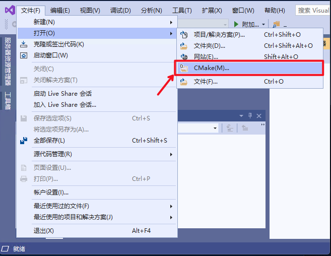
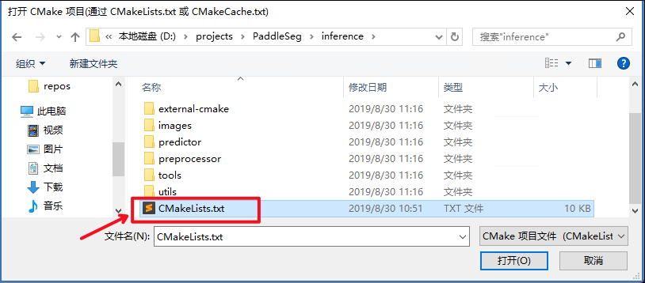
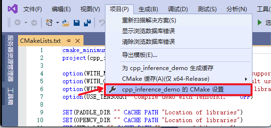
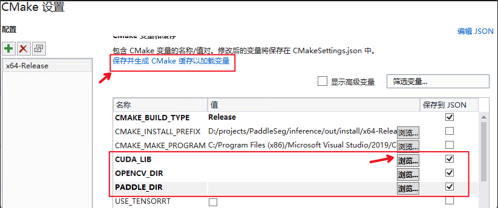
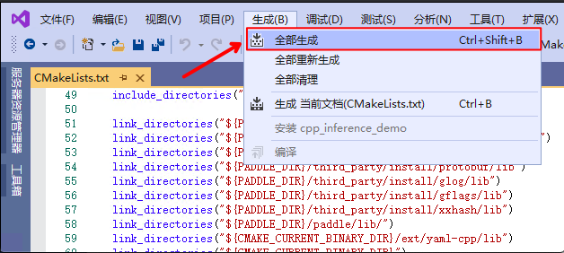

# Visual Studio 2019 Community CMake 编译指南

PaddleClas在Windows 平台下基于`Visual Studio 2019 Community` 进行了测试。微软从`Visual Studio 2017`开始即支持直接管理`CMake`跨平台编译项目，但是直到`2019`才提供了稳定和完全的支持，所以如果你想使用CMake管理项目编译构建，我们推荐使用`Visual Studio 2019`。如果您希望通过生成`sln解决方案`的方式进行编译，可以参考该文档：[https://zhuanlan.zhihu.com/p/145446681](https://zhuanlan.zhihu.com/p/145446681)。


## 前置条件
* Visual Studio 2019
* CUDA 9.0 / CUDA 10.0，cudnn 7.6+ （仅在使用GPU版本的预测库时需要）
* CMake 3.0+

请确保系统已经正确安装并配置好上述基本软件，其中：
  * 在安装`Visual Studio 2019`时，`工作负载`需要勾选`使用C++的桌面开发`；
  * CUDA需要正确安装并设置系统环境变量；
  * CMake需要正确安装并将路径添加到系统环境变量中。

以下测试基于`Visual Studio 2019 Community`版本。

**下面所有示例以工作目录为 `D:\projects`演示**。

### Step1: 下载PaddlePaddle C++ 预测库 paddle_inference_install_dir

PaddlePaddle C++ 预测库针对不同的`CPU`和`CUDA`版本提供了不同的预编译版本，请根据实际情况下载:  [C++预测库下载列表](https://www.paddlepaddle.org.cn/documentation/docs/zh/develop/guides/05_inference_deployment/inference/windows_cpp_inference.html)。

解压后`D:\projects\paddle_inference_install_dir`目录包含内容为：

```
paddle_inference_install_dir
├── paddle # paddle核心库和头文件
|
├── third_party # 第三方依赖库和头文件
|
└── version.txt # 版本和编译信息
```

然后需要将`Paddle预测库`的路径`D:\projects\paddle_inference_install_dir\paddle\lib`添加到系统环境变量`Path`中。

### Step2: 安装配置OpenCV

1. 在OpenCV官网下载适用于Windows平台的3.4.6版本， [下载地址](https://sourceforge.net/projects/opencvlibrary/files/3.4.6/opencv-3.4.6-vc14_vc15.exe/download)  
2. 运行下载的可执行文件，将OpenCV解压至指定目录，如`D:\projects\opencv`
3. 配置环境变量，如下流程所示  
    - 此电脑（我的电脑）-> 属性 -> 高级系统设置 -> 环境变量
    - 在系统变量中找到Path（如没有，自行创建），并双击编辑
    - 新建，将OpenCV路径填入并保存，如 `D:\projects\opencv\build\x64\vc14\bin`

### Step3: 使用Visual Studio 2019直接编译CMake

1. 打开Visual Studio 2019 Community，点击 `继续但无需代码`


2. 点击： `文件`->`打开`->`CMake`



选择项目代码所在路径，并打开`CMakeList.txt`：



3. 点击：`项目`->`cpp_inference_demo的CMake设置`



4. 请设置以下参数的值


| 名称                          | 值                 | 保存到 JSON |
| ----------------------------- | ------------------ | ----------- |
| CMAKE_BACKWARDS_COMPATIBILITY | 3.17               | [√]         |
| CMAKE_BUILD_TYPE              | RelWithDebInfo     | [√]         |
| CUDA_LIB                      | CUDA的库路径       | [√]         |
| CUDNN_LIB                     | CUDNN的库路径      | [√]         |
| OpenCV_DIR                    | OpenCV的安装路径   | [√]         |
| PADDLE_LIB                    | Paddle预测库的路径 | [√]         |
| WITH_GPU                      | [√]                | [√]         |
| WITH_MKL                      | [√]                | [√]         |
| WITH_STATIC_LIB               | [√]                | [√]         |

**注意**：

1. `CMAKE_BACKWARDS_COMPATIBILITY` 的值请根据自己 `cmake` 版本设置，`cmake` 版本可以通过命令：`cmake --version` 查询；
2. `CUDA_LIB` 、 `CUDNN_LIB` 的值仅需在使用**GPU版本**预测库时指定，其中CUDA库版本尽量对齐，**使用9.0、10.0版本，不使用9.2、10.1等版本CUDA库**；
3. 在设置 `CUDA_LIB`、`CUDNN_LIB`、`OPENCV_DIR`、`PADDLE_LIB` 时，点击 `浏览`，分别设置相应的路径；
   * `CUDA_LIB`和`CUDNN_LIB`：该路径取决于CUDA与CUDNN的安装位置。
   * `OpenCV_DIR`：该路径下需要有`.cmake`文件，一般为`opencv/build/`；
   * `PADDLE_LIB`：该路径下需要有`CMakeCache.txt`文件，一般为`paddle_inference_install_dir/`。
4. 在使用 `CPU` 版预测库时，请不要勾选 `WITH_GPU` - `保存到 JSON`。



**设置完成后**, 点击上图中 `保存并生成CMake缓存以加载变量` 。

5. 点击`生成`->`全部生成`




### Step4: 预测及可视化

在完成上述操作后，`Visual Studio 2019` 编译产出的可执行文件 `clas_system.exe` 在 `out\build\x64-Release`目录下，打开`cmd`，并切换到该目录：

```
cd D:\projects\PaddleClas\deploy\cpp_infer\out\build\x64-Release
```
可执行文件`clas_system.exe`即为编译产出的的预测程序，其使用方法如下：

```shell
.\clas_system.exe D:\projects\PaddleClas\deploy\cpp_infer\tools\config.txt .\docs\ILSVRC2012_val_00008306.JPEG
```

上述命令中，第一个参数（`D:\projects\PaddleClas\deploy\cpp_infer\tools\config.txt`）为配置文件路径，第二个参数（`.\docs\ILSVRC2012_val_00008306.JPEG`）为需要预测的图片路径。

注意，需要在配置文件中正确设置预测参数，包括所用模型文件的路径（`cls_model_path`和`cls_params_path`）。


### 注意
* 在Windows下的终端中执行文件exe时，可能会发生乱码的现象，此时需要在终端中输入`CHCP 65001`，将终端的编码方式由GBK编码(默认)改为UTF-8编码，更加具体的解释可以参考这篇博客：[https://blog.csdn.net/qq_35038153/article/details/78430359](https://blog.csdn.net/qq_35038153/article/details/78430359)。
* 如果需要使用CPU预测，PaddlePaddle在Windows上仅支持avx的CPU预测，目前不支持noavx的CPU预测。
* 在使用生成的`clas_system.exe`进行预测时，如提示`由于找不到paddle_fluid.dll，无法继续执行代码。重新安装程序可能会解决此问题`，请检查是否将Paddle预测库路径添加到系统环境变量，详见[Step1: 下载PaddlePaddle C++ 预测库 paddle_inference_install_dir](#step1-下载paddlepaddle-c-预测库-paddle_inference_install_dir)
