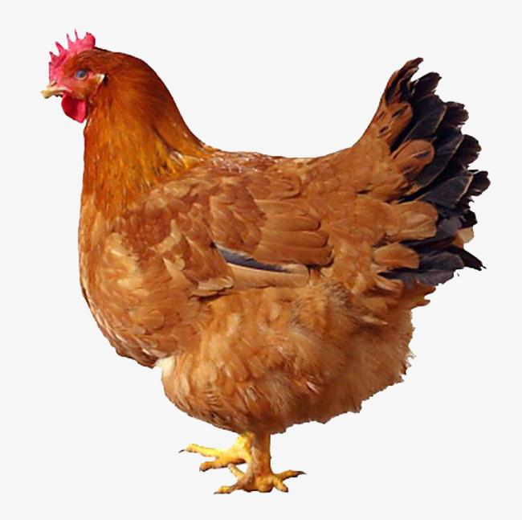

# Paddle2ONNX 推理

# 目录

- [1. 简介](#1---)
- [2. Paddle2ONNX推理过程](#2---)
    - [2.1 准备推理环境](#2.1---)
    - [2.2 模型转换](#2.2---)
    - [2.3 ONNX 推理](#2.3---)
- [3. FAQ](#3---)

## 1. 简介
Paddle2ONNX 支持将 PaddlePaddle 模型格式转化到 ONNX 模型格式，算子目前稳定支持导出 ONNX Opset 9~11，部分Paddle算子支持更低的ONNX Opset转换。

本文档主要介绍 MobileNetV3 模型如何转化为 ONNX 模型，并基于 ONNX 引擎预测。

更多细节可参考 [Paddle2ONNX官方教程](https://github.com/PaddlePaddle/Paddle2ONNX/blob/develop/README_zh.md)

## 2. Paddle2ONNX推理过程
### 2.1 准备推理环境

需要准备 Paddle2ONNX 模型转化环境，和 ONNX 模型预测环境

- 安装 Paddle2ONNX
```
python3 -m pip install paddle2onnx
```

- 安装 ONNX
```
# 建议安装 1.9.0 版本，可根据环境更换版本号
python3 -m pip install onnxruntime==1.9.0
```

- 下载代码
```bash
git clone https://github.com/PaddlePaddle/models.git
cd models/tutorials/mobilenetv3_prod/Step6
```

### 2.2 模型转换


- Paddle 模型动转静导出

使用下面的命令完成`mobilenet_v3_net`模型的动转静导出。

```bash
#下载预训练好的参数
wget https://paddle-model-ecology.bj.bcebos.com/model/mobilenetv3_reprod/mobilenet_v3_small_pretrained.pdparams
#生成推理模型
python tools/export_model.py --pretrained=./mobilenet_v3_small_pretrained.pdparams --save-inference-dir="./mobilenet_v3_small_infer" --model=mobilenet_v3_small
```

最终在`mobilenet_v3_small_infer/`文件夹下会生成下面的3个文件。

```
mobilenet_v3_small_infer
     |----inference.pdiparams     : 模型参数文件
     |----inference.pdmodel       : 模型结构文件
     |----inference.pdiparams.info: 模型参数信息文件
```

- ONNX 模型转换

使用 Paddle2ONNX 将Paddle静态图模型转换为ONNX模型格式：

```
paddle2onnx --model_dir=./mobilenetv3_model/ \
--model_filename=inference.pdmodel \
--params_filename=inference.pdiparams \
--save_file=./inference/mobilenetv3_model/model.onnx \
--opset_version=10 \
--enable_onnx_checker=True
```

执行完毕后，ONNX 模型会被保存在 `./inference/mobilenetv3_model/` 路径下


### 2.3 ONNX 推理

ONNX模型测试：

- Step1：初始化`ONNXRuntime`库并配置相应参数, 并进行预测

```
import numpy as np
from PIL import Image
from onnxruntime import InferenceSession
from presets import ClassificationPresetEval

# 加载ONNX模型
sess = InferenceSession('./inference/mobilenetv3_model/model.onnx')

# define transforms
input_shape = sess.get_inputs()[0].shape[2:]
eval_transforms = ClassificationPresetEval(crop_size=input_shape,
                                           resize_size=256)
# 准备输入
with open('./images/demo.jpg', 'rb') as f:
    img = Image.open(f).convert('RGB')

img = eval_transforms(img)
img = np.expand_dims(img, axis=0)

# 模型预测
ort_outs = sess.run(output_names=None,
                    input_feed={sess.get_inputs()[0].name: img})

output = ort_outs[0]
class_id = output.argmax()
prob = output[0][class_id]
print(f"class_id: {class_id}, prob: {prob}")

```

- Step2：`ONNXRuntime`预测结果和`paddle inference`预测结果对比

```

import paddle
import paddle.nn as nn
# 从模型代码中导入模型
from paddlevision.models import mobilenet_v3_small

# 实例化模型
model = mobilenet_v3_small(pretrained="./mobilenet_v3_small_pretrained.pdparams")
model = nn.Sequential(model, nn.Softmax())

# 将模型设置为推理状态
model.eval()

# 对比ONNXRuntime和Paddle预测的结果
paddle_outs = model(paddle.to_tensor(img))

diff = ort_outs[0] - paddle_outs.numpy()
max_abs_diff = np.fabs(diff).max()
if max_abs_diff < 1e-05:
    print("The difference of results between ONNXRuntime and Paddle looks good!")
else:
    relative_diff = max_abs_diff / np.fabs(paddle_outs.numpy()).max()
    if relative_diff < 1e-05:
        print("The difference of results between ONNXRuntime and Paddle looks good!")
    else:
        print("The difference of results between ONNXRuntime and Paddle looks bad!")
    print('relative_diff: ', relative_diff)
print('max_abs_diff: ', max_abs_diff)

```

对于下面的图像进行预测

<div align="center">
    
</div>

在`ONNXRuntime`输出结果如下。

```

class_id: 8, prob: 0.9091270565986633

```

表示预测的类别ID是`8`，置信度为`0.909`，该结果与基于训练引擎的结果完全一致

`ONNXRuntime`预测结果和`paddle inference`预测结果对比，如下。

```

The difference of results between ONNXRuntime and Paddle looks good!
max_abs_diff:  1.5646219e-07

```

从diff可见


## 3. FAQ
