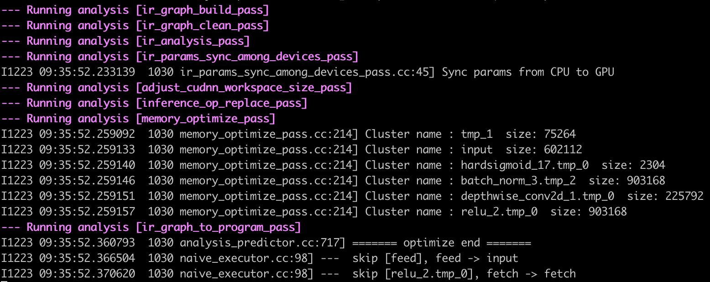

# Serving 服务化部署

# 目录

- [1. 简介](#1)
- [2. 部署流程](#2)
    - [2.1 准备部署环境](#2.1)
    - [2.2 准备服务化部署模型](#2.2)
    - [2.3 启动模型预测服务](#2.3)
    - [2.4 客户端访问服务](#2.4)
- [3. FAQ](#3)

<a name="1"></a>
## 1. 简介

Paddle Serving是飞桨开源的**服务化部署**框架，提供了C++ Serving和Python Pipeline两套框架，C++ Serving框架更倾向于追求极致性能，Python Pipeline框架倾向于二次开发的便捷性。旨在帮助深度学习开发者和企业提供高性能、灵活易用的工业级在线推理服务，助力人工智能落地应用。


更多关于Paddle Serving的介绍，可以参考[Paddle Serving官网repo](https://github.com/PaddlePaddle/Serving)。

本文档主要介绍利用Paddle Serving Pipeline框架实现飞桨模型（以MobilenetV3为例）的服务化部署。

**【注意】**：本项目仅支持Python3.6/3.7/3.8，接下来所有的与Python/Pip相关的操作都需要选择正确的Python版本。

<a name="2"></a>
## 2. 部署流程

<a name="2.1"></a>
### 2.1 准备部署环境

**docker**是一个开源的应用容器引擎，可以让应用程序更加方便地被打包和移植。建议在docker中进行Serving服务化部署。本教程在docker环境运行。

以下安装docker的Paddle Serving环境，CPU/GPU版本二选一即可（本教程均采用GPU版本进行部署）。

 1）docker环境安装（CPU版本）
   
  ```
  # 拉取并进入 Paddle Serving的 CPU Docker
  docker pull paddlepaddle/serving:0.7.0-devel
  docker run -p 9292:9292 --name test -dit paddlepaddle/serving:0.7.0-devel bash
  docker exec -it test bash
  ````
  
  2)docker环境安装（GPU版本）
    
  ```
  # 拉取并进入 Paddle Serving的GPU Docker
  docker pull paddlepaddle/serving:0.7.0-cuda10.2-cudnn7-devel
  nvidia-docker run -p 9292:9292 --name test -dit paddlepaddle/serving:0.7.0-cuda10.2-cudnn7-devel bash
  nvidia-docker exec -it test bash
  ```
  
  
（2）安装Paddle Serving四个安装包，分别是：paddle-serving-server(CPU/GPU版本二选一), paddle-serving-client, paddle-serving-app和paddlepaddle(CPU/GPU版本二选一)。

  ```
  pip3 install paddle-serving-client==0.7.0
  pip3 install paddle-serving-server==0.7.0 # CPU
  pip3 install paddle-serving-server-gpu==0.7.0.post102 # GPU with CUDA10.2 + TensorRT6
  pip3 install paddle-serving-app==0.7.0
  pip3 install paddlepaddle==2.2.1 # CPU
  pip3 install paddlepaddle-gpu==2.2.1 #GPU
  ```
  您可能需要使用国内镜像源（例如百度源, 在pip命令中添加`-i https://mirror.baidu.com/pypi/simple`）来加速下载。  
  Paddle Serving Server更多不同运行环境的whl包下载地址，请参考：[下载页面](https://github.com/PaddlePaddle/Serving/blob/v0.7.0/doc/Latest_Packages_CN.md)  
  PaddlePaddle更多版本请参考[官网](https://www.paddlepaddle.org.cn/install/quick?docurl=/documentation/docs/zh/install/pip/linux-pip.html)

(3)在docker中下载工程

```
git clone https://github.com/PaddlePaddle/models.git
cd models/tutorials/mobilenetv3_prod/Step6/deploy/serving_python/
```

<a name="2.2"></a>
### 2.2 准备服务化部署模型
#### 2.2.1 下载MobilenetV3 inference模型

参考[MobilenetV3](../../README.md#2)，下载inference模型

#### 2.2.2 准备服务化部署模型

为了便于模型服务化部署，需要将静态图模型(模型结构文件：\*.pdmodel和模型参数文件：\*.pdiparams)使用paddle_serving_client.convert命令转换为服务化部署模型。

针对MobileNetV3网络，将inference模型转换为服务化部署模型的示例命令如下，转换完后在本地生成**serving_server**和**serving_client**两个文件夹。本教程后续主要使用serving_server文件夹中的模型。

```
python3 -m paddle_serving_client.convert \
    --dirname ./mobilenet_v3_small_infer/ \
    --model_filename inference.pdmodel \
    --params_filename inference.pdiparams \
    --serving_server serving_server \
    --serving_client serving_client
```
**【注意】**：0.7.0版本的 PaddleServing 需要和PaddlePaddle 2.2之后的版本搭配进行模型转换.如果最开始使用docker安装整个环境，则Paddle Serving和PaddlePaddle版本已做好对应。   

<a name="2.3"></a>
### 2.3 启动模型预测服务

当完成服务化部署引擎初始化、数据预处理和预测结果后处理开发，则可以按如下命令启动模型预测服务：

```bash
python3 web_service.py &
```                               

针对MobileNet网络, 启动成功的界面如下：


   
<a name="2.4"></a>
#### 2.4 客户端访问服务

**【基本流程】**

当成功启动了模型预测服务，可以启动客户端代码
       
客户端访问服务的命令如下：

```
python3 pipeline_http_client.py
```                                                  
访问成功的界面如下图：


<a name="3"></a>
## 3. FAQ

1. 如果在模型转换时报错，比如`AttributeError: 'Program' object has no attribute '_remove_training_info'`，可以将paddle更新到2.2版本。

2. 如果访问不成功，可能设置了代理影响的，可以用下面命令取消代理设置。

```bash
unset http_proxy
unset https_proxy
```

如果您在使用该文档完成Paddle Serving服务化部署的过程中遇到问题，可以给在[这里](https://github.com/PaddlePaddle/Serving/issues)提一个ISSUE，我们会高优跟进。
