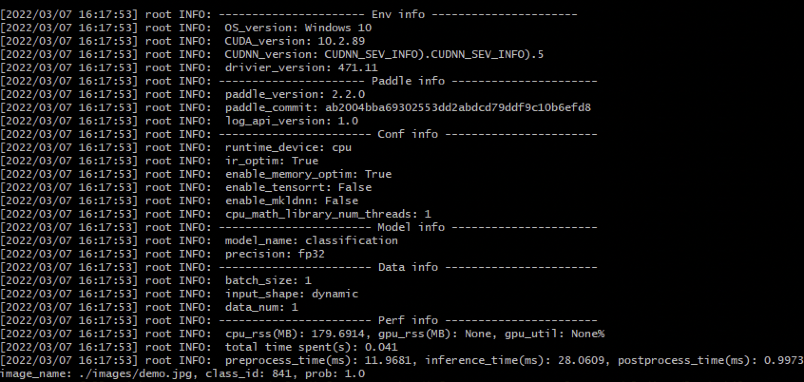

# Windows GPU/CPU 基础训练推理测试

Windows GPU/CPU 基础训练推理测试的主程序为`test_train_inference_python.sh`，可以测试基于Python的模型训练、评估、推理等基本功能。

**注意：在Windows平台上执行命令和Linux平台略有不同，主要体现在：下载与解压数据、设置环境变量、数据加载等方面。此外Windows平台只支持单卡的训练与预测，DataLoader只支持单进程模式，因此需要设置 workers 为0。**

## 1. 测试结论汇总

- 训练相关：

| 算法名称 | 模型名称 | 单机单卡 | 单机多卡 |
|  :----: |   :----:  |    :----:  |  :----:   |
|  MobileNetV3  | mobilenet_v3_small | 正常训练 | 不支持 |


- 推理相关：

| 算法名称 | 模型名称 | device_CPU | device_GPU | batchsize |
|  :----:   |  :----: |   :----:   |  :----:  |   :----:   |
|  MobileNetV3   |  mobilenet_v3_small |  支持 | 支持 | 1 |


## 2. 测试流程

### 2.1 准备数据

用于基础训练推理测试的数据位于`test_images/lite_data.tar`，直接解压即可（如果已经解压完成，则无需运行下面的命令）。

```bash
python -c "import shutil;shutil.unpack_archive('test_images/lite_data.tar', extract_dir='./',format='tar')"
```

执行该命令后，会在当前路径下解压出对应的数据集文件夹`lite_data`

### 2.2 准备预训练模型

使用下面的命令下载 MobileNetV3 预训练模型，便于后续测试模型评估、预测、推理部署等功能。

```bash
pip install wget
python -c "import wget;wget.download('https://paddle-model-ecology.bj.bcebos.com/model/mobilenetv3_reprod/mobilenet_v3_small_pretrained.pdparams')"
```

### 2.3 准备环境

- 安装PaddlePaddle：如果您已经安装了2.2或者以上版本的paddlepaddle，那么无需运行下面的命令安装paddlepaddle。
    ```
    # 需要安装2.2及以上版本的Paddle
    # 安装GPU版本的Paddle
    pip install paddlepaddle-gpu==2.2.0
    # 安装CPU版本的Paddle
    pip install paddlepaddle==2.2.0
    ```

- 安装依赖
    ```
    pip install  -r requirements.txt
    ```

- 安装AutoLog（规范化日志输出工具）
    ```
    pip install  https://paddleocr.bj.bcebos.com/libs/auto_log-1.2.0-py3-none-any.whl
    ```
- 安装 Git
    在windows下想要执行shell脚本，需要使用到"Git Bash"，所以需要先安装Git，具体可百度搜索安装方法。

### 2.4 功能测试

测试方法如下所示，希望测试不同的模型文件，只需更换为自己的参数配置文件，即可完成对应模型的测试。

```bash
bash test_tipc/test_train_inference_python.sh ${your_params_file} lite_train_lite_infer
```

以`mobilenet_v3_small`的`Windows GPU/CPU 基础训练推理测试`为例，命令如下所示。

```bash
bash test_tipc/test_train_inference_python.sh test_tipc/configs/mobilenet_v3_small/win_train_infer_python.txt lite_train_lite_infer
```

输出结果如下，表示命令运行成功。

```bash
Run successfully with command - python train.py --workers=0 --output-dir=./log/mobilenet_v3_small/lite_train_lite_infer/norm_train_gpus_0 --epochs=5   --batch-size=4!
......
Run successfully with command - python deploy/inference_python/infer.py --use-gpu=False --model-dir=./log/mobilenet_v3_small/lite_train_lite_infer/norm_train_gpus_0 --batch-size=1   --benchmark=True > ./log/mobilenet_v3_small/lite_train_lite_infer/python_infer_cpu_batchsize_1.log 2>&1 !
```

在开启benchmark参数时，可以得到测试的详细数据，包含运行环境信息（系统版本、CUDA版本、CUDNN版本、驱动版本），Paddle版本信息，参数设置信息（运行设备、线程数、是否开启内存优化等），模型信息（模型名称、精度），数据信息（batchsize、是否为动态shape等），性能信息（CPU,GPU的占用、运行耗时、预处理耗时、推理耗时、后处理耗时），如下图所示

<div align="center">
    
</div>

该信息可以在运行log中查看，以`mobilenet_v3_small`为例，log位置在`./log/mobilenet_v3_small/lite_train_lite_infer/python_infer_cpu_batchsize_1.log`。

如果运行失败，也会在终端中输出运行失败的日志信息以及对应的运行命令。可以基于该命令，分析运行失败的原因。
