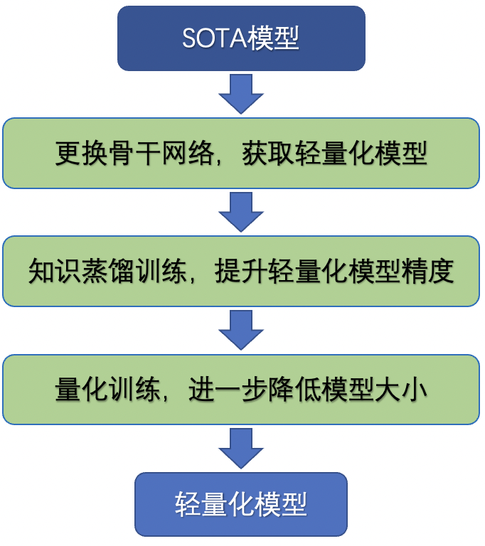

# 产业级SOTA模型优化指南

## 1. 背景

在基于深度学习的视觉任务中，许多论文中SOTA模型所需的计算量都很大，预测耗时很长。实际场景部署过程中，希望模型大小尽可能小，模型速度尽可能快，因此需要对模型进行轻量化，实现在模型预测速度明显加速的情况下，尽量减少模型精度损失的目标，最终打造产业级的SOTA模型。

模型优化包含模型速度与精度优化，既有针对不同任务的通用优化方案，也有与任务紧密相关的模型优化方案，结构框图如下所示。

## 2. 通用模型轻量化方法

通用模型轻量化方法需要完成下面三个部分的内容，包括轻量化骨干网络、知识蒸馏、模型量化，最终将复现的模型打造为轻量化模型。

更多内容请参考：[通用模型轻量化方案指南](general_lite_model_optimization.md)。

## 3. 模型定制优化

CV任务应用场景广泛，下面分方向介绍更多的模型优化策略。在对轻量化模型进行精度优化时，可以参考。

### 3.1 图像分类

* 论文[Bag of Tricks for Image Classification with Convolutional Neural Networks](https://arxiv.org/abs/1812.01187)中，介绍了关于ResNet50系列模型的改进，包括`bottleneck结构改进`、`Cosine学习率策略`、`Mixup数据增广`，最终将ResNet系列模型在ImageNet1k数据集上的精度从76.5%提升至79.2%。更多实现细节可以参考[ResNet50_vd.yaml](https://github.com/PaddlePaddle/PaddleClas/blob/release/2.3/ppcls/configs/ImageNet/ResNet/ResNet50_vd.yaml)。

### 3.2 目标检测

* PP-YOLOv2算法中，通过对数据、模型结构、训练策略进行优化，最终精度超过YOLOv5等SOTA模型。具体地，在数据增强方面，引入了Mixup、AutoAugment方法；在模型结构方面，引入了SPP、PAN特征融合模块以及Mish激活函数，在损失函数方面，引入了IOU aware loss；在后处理方面，引入Matrix NMS；训练过程中，使用EMA，对模型权重进行指数滑动平均，提升收敛效果。更多关于PP-YOLOv2的优化技巧可以参考：[检测模型优化思路：PP-YOLOv2](./det_ppyolov2_optimization.md)。

### 3.3 图像分割

### 3.4 视频识别

### 3.5 文本检测与识别

### 3.6 对抗生成网络
