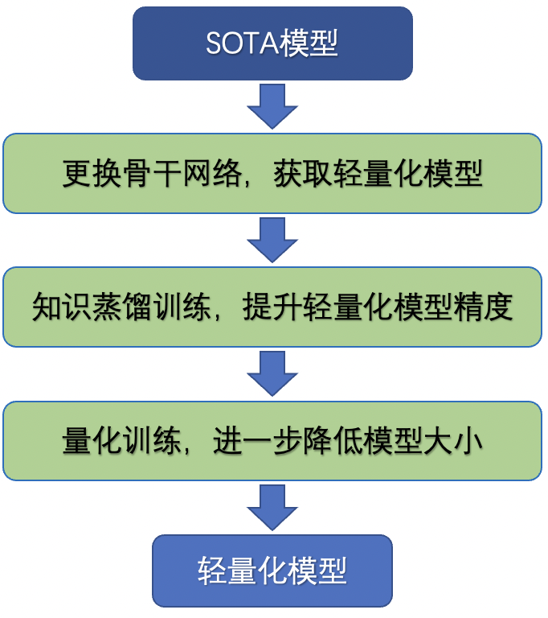

# 模型轻量化指南

## 1. 简介

本文主要关注模型轻量化过程中的通用优化方案，需要完成下面三个部分的内容，将复现的模型打造为轻量化模型。

<div align="center">

</div>

对于一个任务，达到下面二者之一的条件，即可认为核验通过。

1. `模型大小`、`模型精度`和`模型速度`三个方面达到要求(该要求与任务相关，比如在某一目标检测任务中，要求模型大小（模型动转静导出的`pdiparams`与`pdmodel`文件大小之和）**20M**以内，模型精度与论文中大模型精度差距在**5%**以内，同时CPU上预测速度在**100ms**以内)。
2. 在满足模型大小与速度的情况下，截止日期之前提交的模型中，模型精度最高。


## 2. 具体内容

### 2.1 更换骨干网络

#### 2.1.1 简介

视觉任务中，模型骨干网络直接影响模型大小和预测速度。

大部分论文都是基于相对较大的骨干网络进行实验，如VGG、ResNet等（模型存储大小为100M量级），本部分希望通过更换骨干网络（模型存储大小为10M量级），让模型轻量化，方便实际部署过程。

#### 2.1.2 具体内容

使用`PP-LCNet_x2_5` (`~30M`)、`MobileNetV3_large_x1_0`  (`~20M`)、`MobileNetV3_small_x1_0` (`~10M`) 或者针对该任务设计（如关键点检测任务中的lite_HRNet）的轻量级骨干网络，替代原始任务中的骨干网络，训练模型。

#### 2.1.3 操作步骤

PaddleClas提供了便于下游任务使用的骨干网络以及调用接口，支持网络截断、返回网络中间层输出和修改网络中间层的功能。只需要安装whl包，便可以在自己的任务中使用骨干网络。

如果使用的是常用的feature map，则可以直接通过安装paddleclas的whl包，来直接使用骨干网络。

首先需要安装paddleclas whl包。

```bash
pip install https://paddle-model-ecology.bj.bcebos.com/whl/paddleclas-0.0.0-py3-none-any.whl
```

如果希望提取中间层特征进行训练，使用方法如下。

```python
import paddle
import paddleclas
# PPLCNet_x2_5
model = paddleclas.PPLCNet_x2_5(pretrained=True, return_stages=True)
# MobileNetV3_large
# model = paddleclas.MobileNetV3_large_x1_0(pretrained=True, return_stages=True)
# MobileNetV3_smal
# model = paddleclas.MobileNetV3_small_x1_0(pretrained=True, return_stages=True)
x = paddle.rand([1, 3, 224, 224])
y = model(x)

for key in y:
    print(key, y[key].shape)
```

最终会同时返回logits以及中间层特征，可以根据自己的任务，选择合适分辨率的特征图进行训练。

以PP-LCNet为例，输出信息与特征图分辨率如下所示，在检测任务中，一般抽取出`blocks3`,  `blocks4`,  `blocks5`,  `blocks5`， 4个特征图，即可用于下游任务的训练。

```
logits [1, 1000]
blocks2 [1, 80, 112, 112]
blocks3 [1, 160, 56, 56]
blocks4 [1, 320, 28, 28]
blocks5 [1, 640, 14, 14]
blocks6 [1, 1280, 7, 7]
```

更多关于该接口的功能介绍和使用可以参考[theseus_layer使用教程](https://github.com/PaddlePaddle/PaddleClas/blob/develop/docs/zh_CN/advanced_tutorials/theseus_layer.md)。

在某些任务中，对需要对骨干网络的batch norm等参数状态进行修改（比如freeze norm或者stop grad等），此时建议直接拷贝骨干网络代码，修改代码并添加到自己的项目中。飞桨骨干网络代码地址：[常用backbone参考链接](https://github.com/PaddlePaddle/PaddleClas/blob/develop/ppcls/arch/backbone/legendary_models)。

#### 2.1.4 实战

关键点检测任务对高低层特征融合的要求较高，这里使用`lite_hrnet`网络作为该任务的轻量化骨干网络：[lite_hrnet.py](HRNet-Keypoint/lib/models/lite_hrnet.py)。

训练方法如下所示。

```shell
python tools/train.py -c configs/lite_hrnet_30_256x192_coco.yml
```

COCO数据集上结果对比如下所示。

| Model    | Input Size | AP(coco val) |    Model Download | Model size | Config File |
| :---------- | -------- | :--------: |:--------: | :----------: | ----------- |
| HRNet-w32             | 256x192  |     76.9     | [hrnet_w32_256x192.pdparams](https://paddle-model-ecology.bj.bcebos.com/model/hrnet_pose/hrnet_w32_256x192.pdparams) | 165M | [config](./configs/hrnet_w32_256x192.yml)                     |
| LiteHRNet-30          | 256x192  |    69.4     | [lite_hrnet_30_256x192_coco.pdparams](https://paddle-model-ecology.bj.bcebos.com/model/hrnet_pose/lite_hrnet_30_256x192_coco.pdparams) | 7.1M |  [config](./configs/lite_hrnet_30_256x192_coco.yml)

#### 2.1.5 核验点

（1）基于轻量化骨干网络训练模型，提供模型训练结果与模型，**模型精度/速度指标满足该项任务的要求**。

（2）在提交的文档中补充轻量化骨干网络的模型精度、存储大小、训练日志以及模型下载地址。

（3）文档中补充轻量化骨干网络模型的训练方法。

### 2.2 模型蒸馏

#### 2.2.1 简介

模型蒸馏指的是用大模型指导小模型的训练过程，让小模型的精度更高，因此在相同精度情况下，所需模型更小，从而达到模型轻量化的目的。

后续又衍生出两个完全相同的模型互相学习，这种模式称之为DML（互学习策略）

大小模型蒸馏中也可以使用DML的loss，唯一的区别是在大小模型蒸馏中，教师模型的参数不需要更新。

模型蒸馏有2种主要损失函数：

* 对于分类输出，对于最终的回归输出，使用JSDIV loss
* 对于回归输出，使用距离loss（l2、l1、smooth l1等）

#### 2.2.2 具体内容

（1）如果有大模型，则使用大模型（默认的骨干网络）指导小模型（超轻量骨干网络）学习，根据任务输出，选择用于计算的loss，加入训练loss中，训练得到最终模型，保存模型、日志与最终精度。

（2）如果没有大模型，建议使用2个完全相同的小模型互相学习，根据任务输出，选择用于计算的loss，加入训练loss中，训练得到最终模型，保存模型、日志与最终精度。

#### 2.2.3 操作步骤

（1）定义蒸馏模型：蒸馏模型中包含教师与学生模型，教师模型基于默认骨干网络搭建，学生模型基于超轻量骨干网络搭建。如果默认骨干网络已经是超量网骨干网络，则可以使用结构相同的模型进行互学习。

（2）定义损失函数：蒸馏任务中，包含3个损失函数：

* 教师模型输出与groundtruth的损失函数
* 学生模型与groundtruth之间的损失函数
* 教师模型与学生模型输出之间的损失函数

（3）加载预训练模型：

* 如果教师模型是大模型，则需要加载大模型的训练结果，并且将教师模型的参数状态设置为`trainable=False`，停止参数更新
* 如果是教师模型是小模型，则与学生模型的加载逻辑相同

（4）蒸馏训练：和该任务的默认训练过程保持一致。


#### 2.2.4 实战

关键点检测任务中，教师模型直接使用HRNet骨干网络训练得到的模型，学生模型使用`lite_hrnet`作为骨干网络。

* 教师模型构建（通过传入教师模型的结构配置与预训练模型路径，初始化教师模型）：[build_teacher_model函数](HRNet-Keypoint/tools/train.py#46)。
* 损失函数构建：[DistMSELoss](HRNet-Keypoint/lib/models/loss.py#L67)，由于关键点检测任务是回归任务，这里选用了MSE loss作为蒸馏的损失函数。

最终使用知识蒸馏训练轻量化模型的命令如下所示。

```bash
python tools/train.py -c configs/lite_hrnet_30_256x192_coco.yml  --distill_config=./configs/hrnet_w32_256x192_teacher.yml
```

最终在模型大小不变的情况下，精度从`69.4%`提升至`69.9%`。

#### 2.2.5 核验点

（1）提供轻量化骨干网络的蒸馏结果精度，**模型精度指标满足该项任务的要求（如果有）**。

（2）提供知识蒸馏训练后的模型下载地址以及训练日志。

（3）文档中补充知识蒸馏训练的说明文档与命令。


### 2.3 模型量化

#### 2.3.1 简介

Paddle 量化训练（Quant-aware Training, QAT）是指在训练过程中对模型的权重及激活做模拟量化，并且产出量化训练校准后的量化模型，使用该量化模型进行预测，可以减少计算量、降低计算内存、减小模型大小。


#### 2.3.2 具体内容

添加模型PACT训练代码与训练脚本，并且提供训练日志、模型与精度对比。

**注意：**量化模型在导出为用于端侧部署的Lite模型时，才会以int8的形式保存模型，这里保存的预训练模型仍然以FP32的形式保存，因此不会小于使用fp32训练得到的模型。

#### 2.3.3 操作步骤

向代码中添加PACT量化代码包含以下5个步骤。

<div align="center">

</div>

具体内容请参考[Linux GPU/CPU PACT量化训练功能开发文档](../tipc/train_pact_infer_python/train_pact_infer_python.md)。

#### 2.3.4 实战

在关键点检测任务中，首先在配置中添加PACT量化的配置文件：[lite_hrnet_30_256x192_coco_pact.yml#L19](HRNet-Keypoint/configs/lite_hrnet_30_256x192_coco_pact.yml#L19)。

```yaml
pretrain_weights: https://bj.bcebos.com/v1/paddledet/models/keypoint/lite_hrnet_30_256x192_coco.pdparams
slim: QAT
QAT:
  quant_config: {
    'activation_preprocess_type': 'PACT',
    'weight_quantize_type': 'channel_wise_abs_max', 'activation_quantize_type': 'moving_average_abs_max',
    'weight_bits': 8, 'activation_bits': 8, 'dtype': 'int8', 'window_size': 10000, 'moving_rate': 0.9,
    'quantizable_layer_type': ['Conv2D', 'Linear']}
  print_model: True
```

在代码中，基于配置文件创建PACT的量化类，之后再将fp32的`nn.Layer`模型传入PACT量化类中，得到量化后的模型，用于训练。代码如下所示。

```python
def build_slim_model(cfg, mode='train'):
    assert cfg.slim == 'QAT', 'Only QAT is supported now'
    model = create(cfg.architecture)
    if mode == 'train':
        load_pretrain_weight(model, cfg.pretrain_weights)
    slim = create(cfg.slim)
    cfg['slim_type'] = cfg.slim
    # TODO: fix quant export model in framework.
    if mode == 'test' and cfg.slim == 'QAT':
        slim.quant_config['activation_preprocess_type'] = None
    cfg['model'] = slim(model)
    cfg['slim'] = slim
    if mode != 'train':
        load_pretrain_weight(cfg['model'], cfg.weights)

    return cfg
```

#### 2.3.5 核验点


（1）提供量化后的模型精度，**模型精度指标满足该项任务的要求（如果有）**。

（2）提供量化训练后的模型下载地址以及训练日志。

（3）文档中补充量化训练的说明文档与命令。

## 3. FAQ

### 3.1 轻量化骨干网络

* 关于模型大小的定义如下：将训练得到的动态图模型使用`paddle.jit.save`接口，保存为静态图模型，得到模型参数文件`*.pdiparams`和结构文件`*.pdmodel`，二者的存储大小之和。
* 2.1章节中提供的骨干网络为推荐使用，具体不做限制，最终模型大小/速度/精度满足验收条件即可。

### 3.2 知识蒸馏

* 不同任务中有针对该任务的定制知识蒸馏训练策略，2.2章节中内容仅供建议参考，蒸馏策略不做限制，模型精度满足要求验收条件即可。

### 3.3 模型量化

* 量化时，加载训练得到的fp32模型之后，可以将初始学习率修改为fp32训练时的`0.2~0.5`倍，迭代轮数也可以缩短为之前的`0.25~0.5`倍。
* 对于大多数CV任务，模型量化的精度损失在0.3%~1.0%左右，如果量化后精度大幅降低（超过3%），则需要仔细排查量化细节，建议仅对`conv`以及`linear`参数进行量化。
