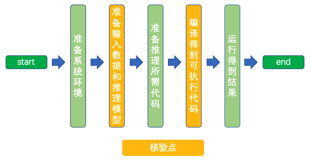

# Linux GPU/CPU C++ 推理开发文档

# 目录

- [1. 简介](#1)
- [2. C++推理功能开发与规范](#2)
    - [2.1 开发流程](#2.1)
    - [2.2 核验点](#2.2)
- [3. C++推理功能测试开发与规范](#3)
    - [3.1 开发流程](#3.1)
    - [3.2 核验点](#3.2)

## 1. 简介

Paddle Inference 是飞桨的原生推理库， 作用于服务器端和云端，提供高性能的推理能力。相比于直接基于预训练模型进行预测，Paddle Inference可使用MKLDNN、CUDNN、TensorRT进行预测加速，从而实现更优的推理性能。
更多关于Paddle Inference推理引擎的介绍，可以参考[Paddle Inference官网教程](https://www.paddlepaddle.org.cn/documentation/docs/zh/guides/05_inference_deployment/inference/inference_cn.html)。
本文档主要介绍飞桨模型在 Linux GPU/CPU 下基于预测引擎的推理过程开发。

## 2. C++推理功能开发与规范

### 2.1 开发流程

基于Paddle Inference的推理过程可以分为5个步骤，如下图所示。

    

更多的介绍可以参考:[C++推理文档开发文档](./infer_cpp.md)。

### 2.2 核验点
这里设置了2个核验点

#### 2.2.1 准备输入数据和推理模型
参考[C++推理文档开发文档](./infer_cpp.md)准备好相应的环境和基础库。
#### 2.2.2 编译得到可执行代码
参考[C++推理文档开发文档](./infer_cpp.md)得到可执行的代码。

