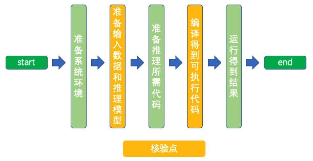

# Linux GPU/CPU C++ 推理功能测试开发文档

# 目录

- [1. 简介](#1)
- [2. 命令与配置文件解析](#2)
    - [2.1 命令解析](#2.1)
    - [2.2 配置文件和运行命令映射解析](#2.2)
- [3. 基本C++推理功能测试开发](#3)
    - [3.1 准备系统环境](#3.1)
    - [3.2 准备输入数据和推理模型](#3.2)
    - [3.3 准备推理所需代码](#3.3)
    - [3.4 编译得到可执行代码](#3.4)
    - [3.5 运行得到结果](#3.5)
    - [3.6 填写配置文件](#3.6)
    - [3.7 验证配置正确性](#3.7)
    - [3.8 撰写说明文档](#3.8)
- [4. FAQ](#4)

<a name="1"></a>

## 1. 简介

Paddle Inference 是飞桨的原生推理库， 作用于服务器端和云端，提供高性能的推理能力。相比于直接基于预训练模型进行预测，Paddle Inference可使用MKLDNN、CUDNN、TensorRT进行预测加速，从而实现更优的推理性能。
更多关于Paddle Inference推理引擎的介绍，可以参考[Paddle Inference官网教程](https://www.paddlepaddle.org.cn/documentation/docs/zh/guides/05_inference_deployment/inference/inference_cn.html)。
本文档主要介绍飞桨模型在 Linux GPU/CPU 下基于C++预测引擎的推理过程开发。

<a name="2"></a>

## 2. 命令与配置文件解析

<a name="2.1"></a>

### 2.1 命令解析

基于paddle inference的C++预测命令如下：
```
run_scripts configs_path img_path
```

* `run_scripts`：最终编译好的可执行命令。
* `configs_path`：设置模型路径、是否使用GPU、是否开启mkldnn、是否开启TensorRT等。
* `img_path`：待预测的图像路径。

<a name="2.2"></a>

### 2.2 配置文件解析
完整的`inference_cpp.txt`配置文件共有14行，包含两个方面的内容。
* 运行环境参数配置：第1~8行
* 模型参数配置：第10~14行

具体内容见[inference_cpp.txt](../../mobilenetv3_prod/Step6/test_tipc/configs/mobilenet_v3_small/inference_cpp.txt)

配置文件中主要有以下2种类型的字段。

* 一行内容以空格为分隔符：该行可以被解析为`key value`的格式，需要根据实际的含义修改该行内容，下面进行详细说明。
* 一行内容为`# xxxxx`：该行内容为注释信息，无需修改。

<details>
<summary><b>配置参数（点击以展开详细内容或者折叠）
</b></summary>

| 行号 | 参考内容                                | 含义            | key是否需要修改 | value是否需要修改 | 修改内容                             |
|----|-------------------------------------|---------------|-----------|-------------|----------------------------------|
| 2  | use_gpu      | 是否使用GPU    | 否         | 是           | value根据是否使用GPU进行修改               |
| 3  | gpu_id       | 使用的GPU卡号  | 否         | 是           | value修改为自己的GPU ID              |
| 4  | gpu_mem      | 显存          | 否         | 是           | value修改为自己的GPU 显存             |
| 5  | cpu_math_library_num_thread | 底层科学计算库所用线程的数量  | 否      | 是           | value修改为合适的线程数         |
| 6  | use_mkldnn   | 是否使用MKLDNN加速    | 否        | 是          | value根据是否使用MKLDNN进行修改          |
| 7  | use_tensorrt | 是否使用tensorRT进行加速          | 否         | 是           | value根据是否使用tensorRT进行修改             |
| 8  | use_fp16 | 是否使用半精度浮点数进行计算，该选项仅在use_tensorrt为true时有效 | 否         | 是          | value根据在开启tensorRT时是否使用半精度进行修改|
| 11 | cls_model_path  | 预测模型结构文件路径         | 否         | 是           | value修改为预测模型结构文件路径 |
| 12 | cls_params_path | 预测模型参数文件路径  | 否         | 是           | vvalue修改为预测模型参数文件路径 |
| 13 | resize_short_size  | 预处理时图像缩放大小         | 否         | 是           | value修改为预处理时图像缩放大小  
| 14 | crop_size          | 预处理时图像裁剪后的大小      | 否         | 是           | value修改为预处理时图像裁剪后的大小  


</details>

<a name="3"></a>

## 3. 基本C++推理功能测试开发

基于Paddle Inference的推理过程可以分为5个步骤，如下图所示。
<div align="center">
    
</div>
其中设置了2个核验点，分别为

* 准备输入数据和推理模型
* 编译得到可执行代码

<a name="3.1"></a>

### 3.1 准备系统环境

该部分可参考 [文档](../../mobilenetv3_prod/Step6/test_tipc/docs/test_inference_cpp.md) 中的2.2.1，2.2.1，2.2.3章节准备环境。

<a name="3.2"></a>

### 3.2 准备输入数据和推理模型
该部分可参考 [文档](../../mobilenetv3_prod/Step6/test_tipc/docs/test_inference_cpp.md) 中的2.1章节准备数据和推理模型。

<a name="3.3"></a>

### 3.3 准备推理所需代码
基于预测引擎的推理过程包含4个步骤：初始化预测引擎、预处理、推理、后处理。

#### 3.3.1 初始化预测引擎

**【基本内容】**
该部分主要根据配置文件对预测引擎进行初始化，包括设置模型结构和参数文件路径、是否使用GPU、是否开启MKLDNN、是否开启TensorRT等。
**【实战】**
以mobilenet_v3_small模型为例，推理引擎初始化函数实现如下，其中模型结构和参数文件路径、是否使用GPU、是否开启MKLDNN等内容都是可以配置的。
主要实现在[cls.cpp](../../mobilenetv3_prod/Step6/deploy/inference_cpp/src/cls.cpp)
```c++
void Classifier::LoadModel(const std::string &model_path,
                           const std::string &params_path) {
  paddle_infer::Config config;
  config.SetModel(model_path, params_path);

  if (this->use_gpu_) {
    config.EnableUseGpu(this->gpu_mem_, this->gpu_id_);
    if (this->use_tensorrt_) {
      config.EnableTensorRtEngine(
          1 << 20, 1, 3,
          this->use_fp16_ ? paddle_infer::Config::Precision::kHalf
                          : paddle_infer::Config::Precision::kFloat32,
          false, false);
    }
  } else {
    config.DisableGpu();
    if (this->use_mkldnn_) {
      config.EnableMKLDNN();
      // cache 10 different shapes for mkldnn to avoid memory leak
      config.SetMkldnnCacheCapacity(10);
    }
    config.SetCpuMathLibraryNumThreads(this->cpu_math_library_num_threads_);
  }

  config.SwitchUseFeedFetchOps(false);
  // true for multiple input
  config.SwitchSpecifyInputNames(true);

  config.SwitchIrOptim(true);

  config.EnableMemoryOptim();
  config.DisableGlogInfo();

  this->predictor_ = CreatePredictor(config);
}

```
#### 3.3.2 预处理
**【基本内容】**
该部分主要用来读取指定图像，对其进行数据变换，转化为符合模型推理所需要的输入格式,
**【实战】**
以mobilenet_v3_small模型为例，使用的数据预处理如下:

* resize
* crop
* normalize
* RGB -> CHW

主要实现在[preprocess_op.cpp](../../mobilenetv3_prod/Step6/deploy/inference_cpp/src/preprocess_op.cpp)中。
```c++
//Resize
class ResizeImg {
public:
  virtual void Run(const cv::Mat &img, cv::Mat &resize_img, int max_size_len);
};
//Crop
class CenterCropImg {
public:
  virtual void Run(cv::Mat &im, const int crop_size = 224);
};
//Norm
class Normalize {
public:
  virtual void Run(cv::Mat *im, const std::vector<float> &mean,
                   const std::vector<float> &scale, const bool is_scale = true);
};
// RGB -> CHW
class Permute {
public:
  virtual void Run(const cv::Mat *im, float *data);
};
```
#### 3.3.3 推理
**【基本内容】**
前向推理是主要步骤，会将预处理好的输入图像输出到预测引擎中，得到输出结果。
**【实战】**
以mobilenet_v3_small模型为例，前向推理主要实现在[cls.cpp](../../mobilenetv3_prod/Step6/deploy/inference_cpp/src/cls.cpp)。
```C++
  auto input_names = this->predictor_->GetInputNames();
  auto input_t = this->predictor_->GetInputHandle(input_names[0]);
  input_t->Reshape({1, 3, resize_img.rows, resize_img.cols});
  auto start = std::chrono::system_clock::now();
  input_t->CopyFromCpu(input.data());
  this->predictor_->Run();

  std::vector<float> out_data;
  auto output_names = this->predictor_->GetOutputNames();
  auto output_t = this->predictor_->GetOutputHandle(output_names[0]);
  std::vector<int> output_shape = output_t->shape();
  int out_num = std::accumulate(output_shape.begin(), output_shape.end(), 1,
                                std::multiplies<int>());  
  out_data.resize(out_num);
  output_t->CopyToCpu(out_data.data());
```

#### 3.3.4 后处理
**【基本内容】**
模型最后的输出可能是数组，一般并不是我们最后想要获取的结果，因此需要对模型的输出做后处理。
**【实战】**
以mobilenet_v3_small模型为例，模型输出的是一个一维的数组，代表输入图片分类到每个类目的概率，为了得到有实际含义的输出，需要获取该数组中最大值的位置和大小，mobilenet_v3_small的后处理代码如下所示。

```c++
int maxPosition = max_element(out_data.begin(), out_data.end()) - out_data.begin();
int score = out_data[maxPosition];
```
<a name="3.4"></a>

### 3.4 编译得到可执行代码
**【基本内容】**
在准备好相应的代码后需要开始准备编译，这里可以利用cmake来实现。
**【实战】**
以mobilenet_v3_small模型为例，代码示例如：[CMakeLists.txt](../../mobilenetv3_prod/Step6/deploy/inference_cpp/CMakeLists.txt)
```bash
set(DEPS ${DEPS} ${OpenCV_LIBS})
AUX_SOURCE_DIRECTORY(./src SRCS)
add_executable(${DEMO_NAME} ${SRCS})
target_link_libraries(${DEMO_NAME} ${DEPS})
```
执行脚本：
```bash
OPENCV_DIR=../opencv-3.4.7/opencv3/
LIB_DIR=../paddle_inference/
CUDA_LIB_DIR=/usr/local/cuda/lib64
CUDNN_LIB_DIR=/usr/lib64
TENSORRT_DIR=/usr/local/TensorRT-7.2.3.4

BUILD_DIR=build
rm -rf ${BUILD_DIR}
mkdir ${BUILD_DIR}
cd ${BUILD_DIR}
cmake .. \
    -DPADDLE_LIB=${LIB_DIR} \
    -DWITH_MKL=ON \
    -DWITH_GPU=OFF \
    -DWITH_STATIC_LIB=OFF \
    -DUSE_TENSORRT=OFF \
    -DOPENCV_DIR=${OPENCV_DIR} \
    -DCUDNN_LIB=${CUDNN_LIB_DIR} \
    -DCUDA_LIB=${CUDA_LIB_DIR} \

make -j
```

上述命令中，Paddle C++预测库、opencv等其他依赖库的地址需要换成自己机器上的实际地址。

* `OPENCV_DIR`为opencv编译安装的地址（本例中为`opencv-3.4.7/opencv3`文件夹的路径）；

* `LIB_DIR`为下载的Paddle预测库（`paddle_inference`文件夹），或编译生成的Paddle预测库（`build/paddle_inference_install_dir`文件夹）的路径；

* `CUDA_LIB_DIR`为cuda库文件地址，在docker中一般为`/usr/local/cuda/lib64`；

* `CUDNN_LIB_DIR`为cudnn库文件地址，在docker中一般为`/usr/lib64`。

* `TENSORRT_DIR`是tensorrt库文件地址，在dokcer中一般为`/usr/local/TensorRT-7.2.3.4/`，TensorRT需要结合GPU使用。

在执行上述命令，编译完成之后，会在当前路径下生成`build`文件夹，其中生成一个名为`clas_system`的可执行文件。

<a name="3.5"></a>

### 3.5 运行得到结果

相关脚本位置[run.sh](../../mobilenetv3_prod/Step6/deploy/inference_cpp/tools/run.sh)
```bash
./build/clas_system ./tools/config.txt ../../images/demo.jpg
```

<a name="3.6"></a>

### 3.6 填写配置文件
**【基本内容】**

在repo的`test_tipc/`目录中新建`configs/model_name`，将文件 [inference_cpp.txt](../../mobilenetv3_prod/Step6/test_tipc/configs/mobilenet_v3_small/inference_cpp.txt) 拷贝到该目录中，其中`model_name`需要修改为您自己的模型名称。

**【实战】**

配置文件的含义解析可以参考 [2.2节配置文件解析](#2.2) 部分。

mobilenet_v3_small的测试开发配置文件可以参考：[inference_cpp.txt](../../mobilenetv3_prod/Step6/test_tipc/configs/mobilenet_v3_small/inference_cpp.txt)。

<a name="3.7"></a>

### 3.7 验证配置正确性

**【基本内容】**

基于修改完的配置，运行

```bash
bash test_tipc/test_inference_cpp.sh ${your_params_file}
```

**【注意事项】**

如果运行失败，会输出具体的报错命令，可以根据输出的报错命令排查下配置文件的问题并修改，示例报错如下所示。

```
Run failed with command - ./deploy/inference_cpp/build/clas_system test_tipc/configs/mobilenet_v3_small/inference_cpp.txt ./images/demo.jpg > ./log/infer_cpp/infer_cpp_use_cpu_use_mkldnn.log 2>&1 !
```

**【实战】**

以mobilenet_v3_small的`Linux GPU/CPU C++推理功能测试` 为例，命令如下所示。

```bash
bash test_tipc/test_inference_cpp.sh test_tipc/configs/mobilenet_v3_small/inference_cpp.txt
```

输出结果如下，表示命令运行成功。

```bash
Run successfully with command - ./deploy/inference_cpp/build/clas_system test_tipc/configs/mobilenet_v3_small/inference_cpp.txt ./images/demo.jpg > ./log/infer_cpp/infer_cpp_use_cpu_use_mkldnn.log 2>&1 !
```

也可以在`./log/infer_cpp/infer_cpp_use_cpu_use_mkldnn.log`中查看详细的输出结果。

**【核验】**

基于修改后的配置文件，测试通过，全部命令成功

<a name="3.8"></a>

### 3.8 撰写说明文档

**【基本内容】**

撰写TIPC功能总览和测试流程说明文档，分别为

1. TIPC功能总览文档：test_tipc/README.md
2. Linux GPU/CPU C++推理功能测试说明文档：test_tipc/docs/test_inference_cpp.md

2个文档模板分别位于下述位置，可以直接拷贝到自己的repo中，根据自己的模型进行修改。

1. [README.md](../../mobilenetv3_prod/Step6/test_tipc/README.md)
2. [test_inference_cpp](../../mobilenetv3_prod/Step6/test_tipc/docs/test_inference_cpp.md)

**【实战】**

mobilenet_v3_small中`test_tipc`文档如下所示。

1. TIPC功能总览文档：[README.md](../../mobilenetv3_prod/Step6/test_tipc/README.md)
2. Paddle2ONNX 测试说明文档：[test_inference_cpp.md](../../mobilenetv3_prod/Step6/test_tipc/docs/test_inference_cpp.md)

**【核验】**

repo中最终目录结构如下所示。

```
test_tipc
    |--configs                              # 配置目录
    |    |--model_name                      # 您的模型名称
    |           |--inference_cpp.txt        # inference_cpp测试配置文件
    |--docs                                 # 文档目录
    |   |--test_inference_cpp.md            # inference_cpp测试说明文档
    |----README.md                          # TIPC说明文档
    |----test_inference_cpp.sh              # TIPC inference_cpp解析脚本，无需改动
    |----common_func.sh                     # TIPC基础训练推理测试常用函数，无需改动
```

基于`test_inference_cpp.md`文档，跑通`inference_cpp功能测试`流程。

<a name="4"></a>

## 4. FAQ
