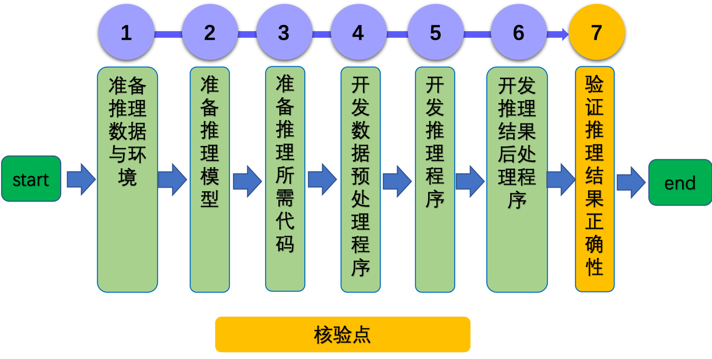

# Paddle Lite 预测流程 

- [1. 简介](#1)
- [2. 使用 Paddle Lite 在 arm cpu 上的部署流程](#2)
    - [2.1 准备模型 ](#2.1)
    - [2.2 模型优化 ](#2.1)
    - [2.2 下载或编译预测库](#2.2)
    - [2.3 开发应用程序](#2.3)
- [3. FAQ](#3)
    - [3.1 通用问题](#3.1)

## 1. 简介

在 arm cpu 上部署需要使用 [Paddle Lite](https://github.com/PaddlePaddle/Paddle-Lite) 进行部署，Paddle Lite 是一个轻量级、灵活性强、易于扩展的高性能的深度学习预测框架，它可以支持诸如 ARM、OpenCL 、NPU 等等多种终端，同时拥有强大的图优化及预测加速能力。如果您希望将 Paddle Lite 框架集成到自己的项目中，那么只需要如下几步简单操作即可。

    

## 2.使用 Paddle Lite 在 arm cpu 上的部署流程

### 2.1 准备模型

Paddle Lite 框架直接支持模型结构为[ PaddlePaddle ](https://www.paddlepaddle.org.cn/)深度学习框架产出的模型格式。在 PaddlePaddle 静态图模式下，使用`save_inference_model`这个 API 保存预测模型，Paddle Lite 对此类预测模型已经做了充分支持；在 PaddlePaddle 动态图模式下，使用`paddle.jit.save`这个 API 保存预测模型，Paddle Lite 可以支持绝大部分此类预测模型了。

### 2.2 模型优化

Paddle Lite 框架拥有优秀的加速、优化策略及实现，包含量化、子图融合、Kernel 优选等优化手段。优化后的模型更轻量级，耗费资源更少，并且执行速度也更快。
这些优化通过 Paddle Lite 提供的 opt 工具实现。opt 工具还可以统计并打印出模型中的算子信息，并判断不同硬件平台下 Paddle Lite 的支持情况。您获取 PaddlePaddle 格式的模型之后，一般需要通过 opt 工具做模型优化。

### 2.3 下载或编译预测库

Paddle Lite 提供了 `Android/IOS/ArmLinux/Windows/MacOS/Ubuntu` 平台的官方 Release 预测库下载，我们优先推荐您直接下载 [Paddle Lite 预编译库](https://github.com/PaddlePaddle/Paddle-Lite/releases/tag/v2.10)。您也可以根据目标平台选择对应的 [源码编译方法](https://paddle-lite.readthedocs.io/zh/latest/source_compile/compile_env.html)。Paddle Lite 提供了源码编译脚本，位于 `lite/tools/` 文件夹下，只需要进行必要的环境准备之后即可运行。

### 2.4 开发应用程序

Paddle Lite提供了 `C++` 、`Java` 、`Python` 三种 `API` ，只需简单五步即可完成预测（以 `C++ API` 为例）：

1. 声明 `MobileConfig` ，设置第二步优化后的模型文件路径，或选择从内存中加载模型
2. 创建 `Predictor` ，调用 `CreatePaddlePredictor` 接口，一行代码即可完成引擎初始化
3. 准备输入，通过 `predictor->GetInput(i)` 获取输入变量，并为其指定输入大小和输入值
4. 执行预测，只需要运行 `predictor->Run()` 一行代码，即可使用 Paddle Lite 框架完成预测执行
5. 获得输出，使用 `predictor->GetOutput(i)` 获取输出变量，并通过 `data<T>` 取得输出值

Paddle Lite 提供了 `C++` 、`Java` 、`Python` 三种 `API` 的完整[使用示例和开发说明文档](https://paddle-lite.readthedocs.io/zh/latest/user_guides/cpp_demo.html)，您可以参考示例中的说明文档进行快速学习，并集成到您自己的项目中。

## 3. FAQ

### 3.1 通用问题
如果您在使用过程中遇到任何问题，可以参考 [Paddle Lite 文档](https://paddle-lite.readthedocs.io/zh/latest/index.html) ，还可以在[这里](https://github.com/PaddlePaddle/Paddle-Lite/issues)提 issue 给我们，我们会高优跟进。
