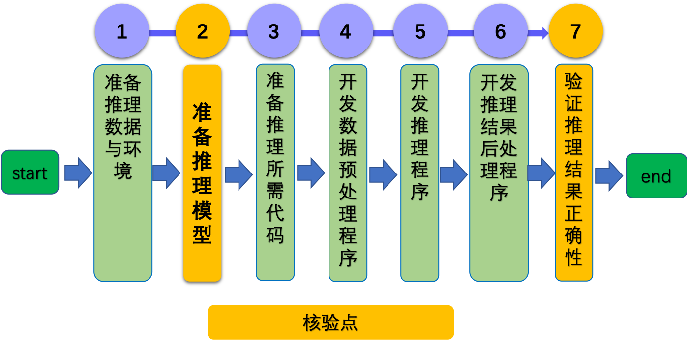

# Lite ARM CPU 推理开发文档

# 目录

- [1. 简介](#1)
- [2. Lite ARM CPU 推理功能开发与规范](#2)
    - [2.1 开发流程](#2.1)
    - [2.2 核验点](#2.2)
- [3. Lite ARM CPU 推理测试开发与规范](#3)
    - [3.1 开发流程](#3.1)
    - [3.2 核验点](#3.2)

## 1. 简介

该系列文档主要介绍飞桨模型基于 Linux ARM CPU 推理开发过程，主要包含2个步骤。

- 步骤一：参考[《Lite ARM CPU 推理开发文档》](./lite_infer_cpp_arm_cpu.md)，完成基于Paddle-Lite的Lite ARM CPU 推理程序开发。

- 步骤二：参考[《Lite ARM CPU 推理测试开发文档》](./test_lite_infer_cpp_arm_cpu.md)，完成Lite ARM CPU 推理测试程序开发。

# 2. Lite ARM CPU 推理功能开发与规范

### 2.1 开发流程

Lite ARM CPU 推理开发过程可以分为下面7个步骤。

    

更多的介绍可以参考：[Lite ARM CPU 推理开发文档](./lite_infer_cpp_arm_cpu.md)。

### 2.2 核验点

#### 2.2.1 准备推理模型

* 使用Paddle-Lite提供的opt工具进行转换之后，需要生成后缀为`*.nb`的推理模型。

#### 2.2.2 验证推理结果正确性

* 对于相同的输入，Lite ARM CPU 推理结果需要与Paddle Inference推理结果相同。**如果预处理或者后处理部分无法保持一致，导致输出结果有不同，需要给出详细的原因说明**。

# 3. Lite ARM CPU 推理测试开发与规范

coming soon!
