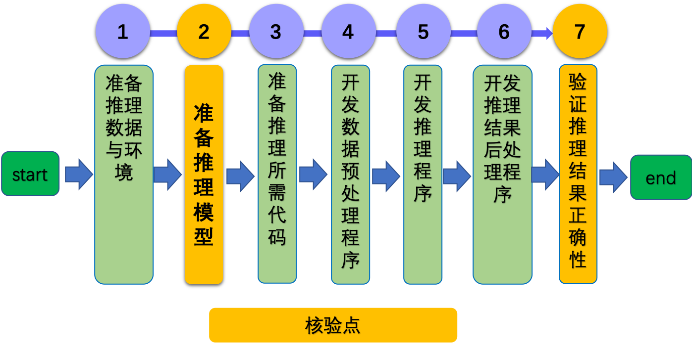

# Paddle Lite arm cpu 推理开发文档

# 目录

- [1. 简介](#1)
- [2. 使用 Paddle Lite 在 ARM CPU 上的部署流程](#2)
    - [2.1 准备推理数据与环境 ](#2.1)
    - [2.2 准备推理模型 ](#2.1)
    - [2.3 准备推理所需代码](#2.2)
    - [2.4 开发数据预处理程序](#2.3)
    - [2.5 开发推理程序](#2.4)
    - [2.6 开发推理结果后处理程序](#2.5)
    - [2.7 验证推理结果正确性](#2.6)
- [3. FAQ](#3)
    - [3.1 通用问题](#3.1)

## 1. 简介

在 ARM CPU 上部署需要使用 [Paddle Lite](https://github.com/PaddlePaddle/Paddle-Lite) 进行部署，Paddle Lite 是一个轻量级、灵活性强、易于扩展的高性能的深度学习预测框架，它可以支持诸如 ARM、OpenCL 、NPU 等等多种终端，同时拥有强大的图优化及预测加速能力。如果您希望将 Paddle Lite 框架集成到自己的项目中，那么只需要如下几步简单操作即可。

<div align="center">
    
</div>

图中的2、7是核验点，需要核验结果正确性。

## 2.使用 Paddle Lite 在 ARM CPU 上的部署流程

### 2.1 准备推理数据与环境

- 推理环境

开发机器：一台开发机，可以是 x86 linux 或者 Mac 设备。开发机器上需要安装开发环境。

推理设备：一台 ARM CPU 设备，可以连接到开发机上。开发板的系统可以是 Android 或 Armlinux。

开发机上安装开发环境以及对推理设备的配置参考[mobilenet_v3开发实战](../../mobilenetv3_prod/Step6/deploy/lite_infer_cpp_arm_cpu)中的**准备开发环境**和**在 Android 手机上部署**章节。

- 推理数据

一张可用于推理的[图片](../../mobilenetv3_prod/Step6/images/demo.jpg)和用于前处理的[配置文件](../../mobilenetv3_prod/Step6/deploy/lite_infer_cpp_arm_cpu/mobilenet_v3/config.txt)(可选，和前处理有关)以及用于推理结果后处理相关的 [label](../../mobilenetv3_prod/Step6/deploy/lite_infer_cpp_arm_cpu/mobilenet_v3/imagenet1k_label_list.txt) 文件（可选，跟后处理有关）。

### 2.2 准备推理模型

- 准备 inference model

Paddle Lite 框架直接支持[ PaddlePaddle ](https://www.paddlepaddle.org.cn/)深度学习框架产出的模型。在 PaddlePaddle 静态图模式下，使用`save_inference_model`这个 API 保存预测模型，Paddle Lite 对此类预测模型已经做了充分支持；在 PaddlePaddle 动态图模式下，使用`paddle.jit.save`这个 API 保存预测模型，Paddle Lite 可以支持绝大部分此类预测模型了。

- 使用 opt 工具优化模型

Paddle Lite 框架拥有优秀的加速、优化策略及实现，包含量化、子图融合、Kernel 优选等优化手段。优化后的模型更轻量级，耗费资源更少，并且执行速度也更快。
这些优化通过 Paddle Lite 提供的 opt 工具实现。opt 工具还可以统计并打印出模型中的算子信息，并判断不同硬件平台下 Paddle Lite 的支持情况。

导出 inference model 和使用 opt 工具优化参考[mobilenet_v3开发实战](../../mobilenetv3_prod/Step6/deploy/lite_infer_cpp_arm_cpu)中的**获取 inference model**和**生成 Paddle Lite 部署模型**章节，注意本步骤需要核验是否有```xxx.nb```模型生成。

### 2.3 准备推理所需代码

- Paddle Lite 预测库

Paddle Lite 提供了 `Android/IOS/ArmLinux/Windows/MacOS/Ubuntu` 平台的官方 Release 预测库下载，我们优先推荐您直接下载 [Paddle Lite 预编译库](https://github.com/PaddlePaddle/Paddle-Lite/releases/tag/v2.10)。您也可以根据目标平台选择对应的 [源码编译方法](https://paddle-lite.readthedocs.io/zh/latest/source_compile/compile_env.html)。Paddle Lite 提供了源码编译脚本，位于 `lite/tools/` 文件夹下，只需要进行必要的环境准备之后即可运行。

- 用户的推理应用程序，例如mobilenet_v3.cc

- Makefile用于编译应用程序

至此已经准备好部署所需的全部文件。以[mobilenet_v3开发实战](../../mobilenetv3_prod/Step6/deploy/lite_infer_cpp_arm_cpu)中的 mobilenet_v3 文件夹为例展示：

```
   mobilenet_v3/                                            示例文件夹
   ├── inference_lite_lib.android.armv8/                 Paddle Lite C++ 预测库和头文件
   │
   ├── Makefile                                          编译相关
   │
   ├── Makefile.def                                      编译相关
   │
   ├── mobilenet_v3_small.nb                             优化后的模型
   │
   ├── mobilenet_v3.cc                                   C++ 示例代码
   │
   ├── demo.jpg                                          示例图片
   │
   ├── imagenet1k_label_list.txt                         示例label(用于后处理)
   │
   └── config.txt                                        示例config(用于前处理)
```

### 2.4 开发数据预处理程序

Paddle Lite 推理框架的输入不能直接是图片，所以需要对图片进行预处理，预处理过程一般包括 `opencv 读取`、`resize`、 `crop`、`归一化`等操作，之后才能变成最后输入给推理框架的数据。预处理参考 [mobilenet_v3开发实战](../../mobilenetv3_prod/Step6/deploy/lite_infer_cpp_arm_cpu/mobilenet_v3) 中的mobilenet_v3.cc 文件。


### 2.5 开发推理程序

使用 Paddle Lite 的 `API` 只需简单五步即可完成预测：

1. 声明 `MobileConfig` ，设置第二步优化后的模型文件路径，或选择从内存中加载模型
2. 创建 `Predictor` ，调用 `CreatePaddlePredictor` 接口，一行代码即可完成引擎初始化
3. 准备输入，通过 `predictor->GetInput(i)` 获取输入变量，并为其指定输入大小和输入值
4. 执行预测，只需要运行 `predictor->Run()` 一行代码，即可使用 Paddle Lite 框架完成预测执行
5. 获得输出，使用 `predictor->GetOutput(i)` 获取输出变量，并通过 `data<T>` 取得输出值

在此提供简单示例：

```c++
#include <iostream>
// 引入 C++ API
#include "paddle_lite/paddle_api.h"
#include "paddle_lite/paddle_use_ops.h"
#include "paddle_lite/paddle_use_kernels.h"

// 1. 设置 MobileConfig
MobileConfig config;
config.set_model_from_file(<modelPath>); // 设置 NaiveBuffer 格式模型路径
config.set_power_mode(LITE_POWER_NO_BIND); // 设置 CPU 运行模式
config.set_threads(4); // 设置工作线程数

// 2. 创建 PaddlePredictor
std::shared_ptr<PaddlePredictor> predictor = CreatePaddlePredictor<MobileConfig>(config);

// 3. 设置输入数据,可以在这里进行您的前处理，比如用opencv读取图片等。这里为全一输入。
std::unique_ptr<Tensor> input_tensor(std::move(predictor->GetInput(0)));
input_tensor->Resize({1, 3, 224, 224});
auto* data = input_tensor->mutable_data<float>();
for (int i = 0; i < ShapeProduction(input_tensor->shape()); ++i) {
  data[i] = 1;
}

//其他前处理

// 4. 执行预测
predictor->run();

// 5. 获取输出数据
std::unique_ptr<const Tensor> output_tensor(std::move(predictor->GetOutput(0)));
std::cout << "Output shape " << output_tensor->shape()[1] << std::endl;
for (int i = 0; i < ShapeProduction(output_tensor->shape()); i += 100) {
  std::cout << "Output[" << i << "]: " << output_tensor->data<float>()[i]
            << std::endl;
}
//后处理
```

### 2.6 开发推理结果后处理程序

后处理主要处理的是Paddle Lite 推理框架的输出 `tensor`， 包括选取哪个 `tensor` 以及根据 `label` 文件进行获得预测的类别，后处理参考 [mobilenet_v3开发实战](../../mobilenetv3_prod/Step6/deploy/lite_infer_cpp_arm_cpu/mobilenet_v3) 中的mobilenet_v3.cc 文件。

### 2.7 验证推理结果正确性

Paddle Lite 的推理结果，需要和训练框架的预测结果对比是否一致。注意此过程中需要首先保证前处理和后处理与训练代码是一致的。具体可以参考 [mobilenet_v3开发实战](../../mobilenetv3_prod/Step6/deploy/lite_infer_cpp_arm_cpu)。

## 3. FAQ

### 3.1 通用问题
如果您在使用过程中遇到任何问题，可以参考 [Paddle Lite 文档](https://paddle-lite.readthedocs.io/zh/latest/index.html) ，还可以在[这里](https://github.com/PaddlePaddle/Paddle-Lite/issues)提 issue 给我们，我们会高优跟进。
