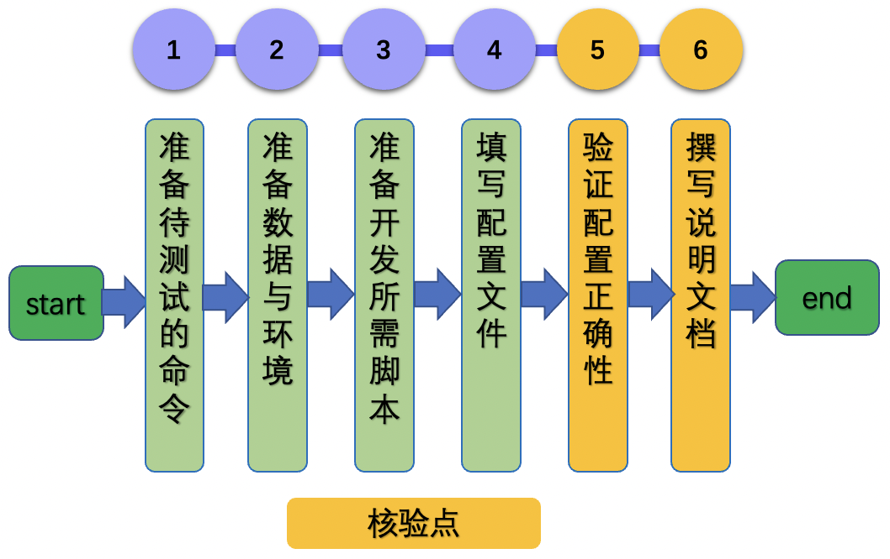
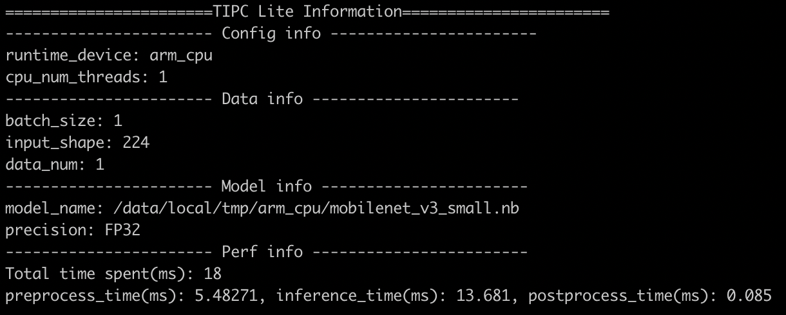

# Lite cpp arm cpu 推理功能测试开发文档

# 目录

- [1. 简介](#1)
- [2. 命令与配置文件解析](#2)
- [3. Lite infer cpp arm cpu 推理功能测试开发](#3)
    - [3.1 准备待测试的命令](#3.1)
    - [3.2 准备数据与环境](#3.2)
    - [3.3 准备开发所需脚本](#3.3)
    - [3.4 填写配置文件](#3.4)
    - [3.5 验证配置正确性](#3.5)
    - [3.6 撰写说明文档](#3.6)
- [4. FAQ](#4)

<a name="1"></a>

## 1. 简介

本文档主要关注 Lite arm cpu 下模基于 c++ 语言的推理全流程功能测试，具体测试点如下：

- 模型推理：推理过程跑通

为了一键跑通上述所有功能，本文档提供了`训推一体全流程`功能自动化测试工具，它包含 2 个脚本文件和 1 个配置文件，分别是：

* `test_lite_arm_cpu_cpp.sh`: 测试在Lite arm cpu上模型推理功能的脚本，会对`lite_arm_cpu_cpp.txt`进行解析，得到具体的执行命令。**该脚本无需修改**。
* `prepare_lite_arm_cpu_cpp.sh`: 准备测试需要的数据、需要的Lite模型、需要的Lite预测库等。
* `lite_arm_cpu_cpp.txt`: 配置文件，其中的内容会被`test_lite_arm_cpu_cpp.sh`解析成具体的执行命令字段。

<a name="2"></a>

## 2. 命令与配置文件解析

完整的`lite_arm_cpu_cpp.txt`配置文件共有8行，包含2个方面的内容。

* 推理基础配置，如模型路径、预测库路径等：第1~5行
* 推理参数配置，如线程数、batch-size等：第6~8行

具体内容见[lite_arm_cpu_cpp.txt](../../mobilenetv3_prod/Step6/test_tipc/configs/mobilenet_v3_small/lite_arm_cpu_cpp.txt)。


**注意**：单行内容以冒号为分隔符，该行可以被解析为`key:value`的格式，需要根据实际的含义修改该行内容，下面进行详细说明。


在配置文件中，可以通过下面的方式配置一些常用的超参数，如：线程数、batch-size等，下面给出了常用的训练配置以及需要修改的内容。

<details>
<summary><b>配置参数（点击以展开详细内容或者折叠）
</b></summary>
    
| 行号 | 参考内容                                | 含义            | key是否需要修改 | value是否需要修改 | 修改内容                             |
|----|-------------------------------------|---------------|-----------|-------------|----------------------------------|
| 1  | runtime_device:arm_cpu       | Lite硬件设备类型          | 否         | 否           | 无需修改内容                  |
| 2  | lite_arm_work_path:/data/local/tmp/arm_cpu/            | Lite硬件设备的工作路径  | 否    | 是   | value修改为Lite设备的实际工作路径              |
| 3  | lite_arm_so_path:inference_lite_lib.android.armv8/cxx/lib/libpaddle_light_api_shared.so | Lite预测库路径        | 否         | 是           | value修改为实际的Lite预测库路径              |
| 4  | clas_model_file:mobilenet_v3_small.nb                        | Lite模型名字      | 否         | 是           | value修改为自己的模型名字        |
| 5  | inference_cmd:mobilenet_v3 config.txt demo.jpg    | Lite预测命令    | 否         | 是           | value修改为实际的的预测命令         |
| 6  | --num_threads_list:1             | Lite预测的线程数         | 否         | 是          |  value修改为预测的线程数            |
| 7  | --batch_size_list:1 | Lite预测的batch size | 否         | 是          | value修改为实际推理的batch-size       |
| 8 | --precision_list:FP32                   | 精度类型         | 否        | 是           | value修改为`FP32`或者`INT8` |
 
    

</details>

`test_lite_arm_cpu_cpp.sh` 会将 `lite_arm_cpu_cpp.txt` 中的相关参数重写 `config.txt`, 最终，不同的配置在 Lite 上运行的命令`mobilenet_v3 config.txt demo.jpg`是完全一样的，具体的参数信息均已在`config.txt`中体现。

<a name="3"></a>

## 3. Lite infer cpp arm cpu 推理功能测试开发

Lite infer cpp arm cpu 推理功能测试开发过程主要分为以下6个步骤。

<div align="center">
    
</div>

其中设置了2个核验点，下面详细介绍开发过程。

<a name="3.1"></a>

### 3.1 准备待测试的命令

**【基本内容】**

准备 Lite infer cpp arm cpu 模型推理的命令，后续会将这些命令按照[第2节](#2)所述内容，映射到配置文件中。

**【实战】**

MobileNetV3的 Lite infer cpp arm cpu 推理示例运行命令如下所示。

```bash
adb shell 'export LD_LIBRARY_PATH=${lite_arm_work_path}; ${real_inference_cmd}'
```

其中`${lite_arm_work_path}`是在手机上运行存放模型、数据、预测库等的路径，`${real_inference_cmd}`是在手机上执行的命令，此处可以是`           ${lite_arm_work_path}/mobilenet_v3 ${lite_arm_work_path}config.txt ${lite_arm_work_path}/demo.jpg"`。

<a name="3.2"></a>

### 3.2 准备数据与环境

**【基本内容】**

1. 数据集：为方便快速验证推理过程，需要准备一张demo图片，该图片需要 push 到 Lite 设备的 `${lite_arm_work_path}` 目录下，本案例的图片存放于`mobilenetv3_prod/Step6/images/`下。

2. 环境：此处需要准备编译环境与 Paddle-Lite 预测库，具体过程可以参考[Mobilenet_v3 基于 ARM CPU 部署教程](../../mobilenetv3_prod/Step6/deploy/lite_infer_cpp_arm_cpu/README.md)。


<a name="3.3"></a>

### 3.3 准备开发所需脚本

**【基本内容】**

在repo中新建`test_tipc`目录，将文件 [prepare_lite_arm_cpu_cpp.sh](../../mobilenetv3_prod/Step6/test_tipc/prepare_lite_arm_cpu_cpp.sh) 和[test_lite_arm_cpu_cpp.sh](../../mobilenetv3_prod/Step6/test_tipc/test_lite_arm_cpu_cpp.sh) 分别拷贝到`test_tipc`目录中。


**【注意事项】**

* 上述2个脚本文件无需改动，在实际使用时，直接修改配置文件即可。


<a name="3.4"></a>

### 3.4 填写配置文件

**【基本内容】**

在repo的`test_tipc/`目录中新建`configs/model_name`，将文件 [lite_arm_cpu_cpp.txt](../../mobilenetv3_prod/Step6/test_tipc/configs/mobilenet_v3_small/lite_arm_cpu_cpp.txt) 拷贝到该目录中，其中`model_name`需要修改为您自己的模型名称。

**【实战】**

配置文件的含义解析可以参考 [第二节 配置文件解析](#2) 部分。

mobilenet_v3_small的测试开发配置文件可以参考：[lite_arm_cpu_cpp.txt](../../mobilenetv3_prod/Step6/test_tipc/configs/mobilenet_v3_small/lite_arm_cpu_cpp.txt)。

<a name="3.5"></a>

### 3.5 验证配置正确性

**【基本内容】**

基于修改完的配置，运行

```bash
bash test_tipc/prepare_lite_arm_cpu_cpp.sh ${your_config_file}
bash test_tipc/test_lite_arm_cpu_cpp.sh ${your_config_file}
```

**【注意事项】**

如果运行失败，会输出具体的报错命令，可以根据输出的报错命令排查下配置文件的问题并修改，示例报错如下所示。

```
 Run failed with command - adb shell 'export LD_LIBRARY_PATH=/data/local/tmp/arm_cpu/; /data/local/tmp/arm_cpu/mobilenet_v3 /data/local/tmp/arm_cpu/config.txt /data/local/tmp/arm_cpu/demo.jpg'  > ./output/lite_mobilenet_v3_small.nb_runtime_device_arm_cpu_precision_FP32_batchsize_1_threads_1.log 2>&1!
```

**【实战】**

以mobilenet_v3_small的`Lite cpp arm cpu 推理功能测试` 为例，命令如下所示。

准备模型、数据、预测库等。

```bash
bash test_tipc/prepare_lite_arm_cpu_cpp.sh test_tipc/configs/mobilenet_v3_small/lite_arm_cpu_cpp.txt
```

执行预测命令。

```bash
bash test_tipc/test_lite_arm_cpu_cpp.sh test_tipc/configs/mobilenet_v3_small/lite_arm_cpu_cpp.txt
```

输出结果如下，表示命令运行成功。

```bash
 Run successfully with command - adb shell 'export LD_LIBRARY_PATH=/data/local/tmp/arm_cpu/; /data/local/tmp/arm_cpu/mobilenet_v3 /data/local/tmp/arm_cpu/config.txt /data/local/tmp/arm_cpu/demo.jpg'  > ./output/lite_mobilenet_v3_small.nb_runtime_device_arm_cpu_precision_FP32_batchsize_1_threads_1.log 2>&1!
```

可以打印参数设置信息（运行设备、线程数等），模型信息（模型名称、精度等），数据信息（batchsize等），性能信息（预处理耗时、推理耗时、后处理耗时），如下图所示

<div align="center">
    
</div>

该信息可以在运行log中查看，以`mobilenet_v3_small`为例，log位置在`./output/lite_mobilenet_v3_small.nb_runtime_device_arm_cpu_precision_FP32_batchsize_1_threads_1.log`。

如果运行失败，也会在终端中输出运行失败的日志信息以及对应的运行命令。可以基于该命令，分析运行失败的原因。

**【核验】**

基于修改后的配置文件，测试通过，全部命令成功

<a name="3.6"></a>

### 3.6 撰写说明文档

**【基本内容】**

3.5的步骤做完之后，需要撰写TIPC功能总览和测试流程说明文档，该过程也是核验的一部分。文档分别为

1. TIPC功能总览文档：test_tipc/README.md
2. Lite cpp arm cpu 推理功能测试说明文档：test_tipc/docs/test_lite_infer_cpp_arm_cpu.md

2个文档模板分别位于下述位置，可以直接拷贝到自己的repo中，根据自己的模型进行修改。

1. [README.md](../../mobilenetv3_prod/Step6/test_tipc/README.md)
2. [test_lite_infer_cpp_arm_cpu.md](../../mobilenetv3_prod/Step6/test_tipc/docs/test_lite_infer_cpp_arm_cpu.md)

**【实战】**

mobilenet_v3_small中`test_tipc`文档如下所示。

1. TIPC功能总览文档：[README.md](../../mobilenetv3_prod/Step6/test_tipc/README.md)
2. Lite cpp arm cpu 推理功能测试说明文档：[test_lite_infer_cpp_arm_cpu.md](../../mobilenetv3_prod/Step6/test_tipc/docs/test_lite_infer_cpp_arm_cpu.md)

**【核验】**

repo中最终目录结构如下所示。

```
test_tipc
    |--configs                              # 配置目录
    |    |--model_name                      # 您的模型名称
    |           |--lite_arm_cpu_cpp.txt     # lite_infer_cpp_arm_cpu推理测试配置文件
    |--docs                                 # 文档目录
    |   |--test_lite_infer_cpp_arm_cpu.md   # lite_infer_cpp_arm_cpu推理测试说明文档
    |----README.md                          # TIPC说明文档
    |----prepare_lite_arm_cpu_cpp.sh        # TIPC lite_infer_cpp_arm_cpu推理数据、模型、预测库准备脚本
    |----test_lite_arm_cpu_cpp.sh           # TIPC lite_infer_cpp_arm_cpu推理测试解析脚本，无需改动
```

基于`test_lite_infer_cpp_arm_cpu.md`文档，跑通`Lite cpp arm cpu 推理功能测试`流程。

<a name="4"></a>

## 4. FAQ