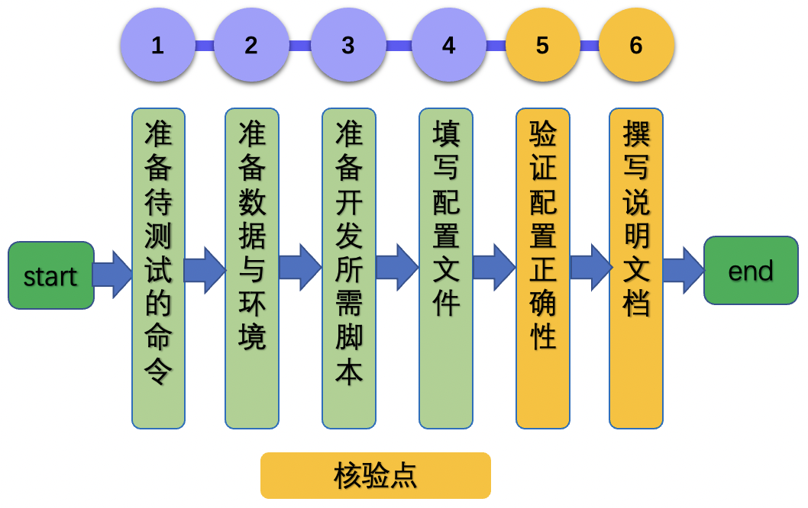

# Paddle2ONNX 开发文档

# 目录

- [1. 简介](#1)
- [2. Paddle2ONNX 功能开发与规范](#2)
    - [2.1 开发流程](#2.1)
    - [2.2 核验点](#2.2)
- [3. Paddle2ONNX 功能测试开发与规范](#3)
    - [3.1 开发流程](#3.1)
    - [3.2 核验点](#3.2)


<a name="1"></a>

## 1. 简介

该系列文档主要介绍 Paddle2ONNX 推理开发过程，主要包含2个步骤。


- 步骤一：参考[《Paddle2ONNX 功能开发文档》](./paddle2onnx.md)，完成Paddle2ONNX 推理程序开发。

- 步骤二：参考[《Paddle2ONNX 功能测试开发文档》](./test_paddle2onnx.md)，完成Paddle2ONNX 推理测试程序开发。


<a name="2"></a>

# 2. Paddle2ONNX 功能开发与规范

<a name="2.1"></a>

### 2.1 开发流程

Paddle2ONNX 开发过程可以分为下面6个步骤。

<div align="center">
    
</div>


更多的介绍可以参考：[Paddle2ONNX 功能开发文档](https://github.com/PaddlePaddle/models/blob/release/2.2/tutorials/tipc/paddle2onnx/paddle2onnx.md)。

<a name="2.2"></a>

### 2.2 核验点

#### 2.2.1 转换模型

* 使用Paddle2ONNX对模型转换成功之后，需要生成后缀为`*.onnx`的推理模型。

#### 2.2.2 验证推理结果正确性

* 对于相同的输入，Paddle2ONNX 推理结果需要与Paddle Inference推理结果相同。

<a name="3"></a>

# 3. Paddle2ONNX 功能测试开发与规范

## 3.1 开发流程

基础训练推理测试开发的流程如下所示。

<div align="center">
    
</div>

更多的介绍可以参考：[Paddle2ONNX 测试开发规范](./test_paddle2onnx.md)。

## 3.2 核验点

### 3.2.1 目录结构

在repo根目录下面新建`test_tipc`文件夹，目录结构如下所示。

```
test_tipc
    |--configs                              # 配置目录
    |    |--model_name                      # 您的模型名称
    |           |--paddle2onnx_infer_python.txt   # paddle2onnx测试配置文件
    |--docs                                 # 文档目录
    |   |--test_paddle2onnx.md   # paddle2onnx测试说明文档
    |----README.md                          # TIPC说明文档
    |----test_paddle2onnx.sh     # TIPC paddle2onnx解析脚本，无需改动
    |----common_func.sh                     # TIPC基础训练推理测试常用函数，无需改动
```


#### 3.2.2 配置文件和测试文档

* `test_tipc/README.md` 文档中对该模型支持的的功能进行总体介绍。
* `test_tipc/docs/test_paddle2onnx.md ` 文档中对**Paddle2ONNX**的功能支持情况进行介绍。
* 根据测试文档，基于配置文件，跑通训练推理全流程测试。
