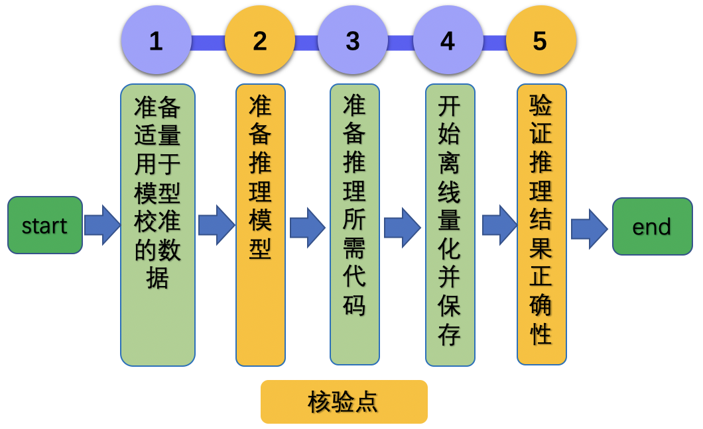

# Linux GPU/CPU 离线量化功能开发文档

# 目录

- [1. 简介](#1)
- [2. 离线量化功能开发](#2)
    - [2.1 准备校准数据和环境](#2.1)
    - [2.2 准备推理模型](#2.2)
    - [2.3 准备离线量化代码](#2.3)
    - [2.4 开始离线量化](#2.4)
    - [2.5 验证推理结果正确性](#2.5)
- [3. FAQ](#3)
    - [3.1 通用问题](#3.1)


<a name="1"></a>

## 1. 简介

Paddle中静态离线量化，使用少量校准数据计算量化因子，可以快速将FP32模型量化成低比特模型（比如最常用的int8量化）。使用该量化模型进行预测，可以减少计算量、降低计算内存、减小模型大小。

更多关于Paddle 模型离线量化的介绍，可以参考[Paddle 离线量化官网教程](https://github.com/PaddlePaddle/PaddleSlim/blob/develop/docs/zh_cn/api_cn/static/quant/quantization_api.rst#quant_post_static)。

<a name="2"></a>

## 2. 离线量化功能开发

Paddle 混合精度训练开发可以分为4个步骤，如下图所示。

<div align="center">
    
</div>

其中设置了2个核验点，分别为：

* 准备推理模型
* 验证量化模型推理结果正确性

<a name="2.1"></a>

### 2.1 准备校准数据和环境

**【准备校准数据】**

由于离线量化需要获得网络预测的每层的scale值，用来做数值范围的映射，所以需要适量的数据执行网络前向，故需要事先准备好校准数据集。

以ImageNet1k数据集为例，可参考[数据准备文档](https://github.com/PaddlePaddle/models/tree/release/2.2/tutorials/mobilenetv3_prod/Step6#32-%E5%87%86%E5%A4%87%E6%95%B0%E6%8D%AE)。

**【准备开发环境】**

- 确定已安装paddle，通过pip安装linux版本paddle命令如下，更多的版本安装方法可查看飞桨[官网](https://www.paddlepaddle.org.cn/)
- 确定已安装paddleslim，通过pip安装linux版本paddle命令如下，更多的版本安装方法可查看[PaddleSlim](https://github.com/PaddlePaddle/PaddleSlim)

```
pip install paddlepaddle-gpu==2.2.1.post112 -f https://www.paddlepaddle.org.cn/whl/linux/mkl/avx/stable.html
pip install paddleslim==2.2.1
```

<a name="2.2"></a>

### 2.2 准备推理模型

**【基本流程】**

准备推理模型分为三步：

- Step1：定义继承自`paddle.nn.Layer`的网络模型

- Step2：使用`paddle.jit.save`接口对模型进行动转静，导出成Inference模型

- Step3：检查导出的路径下是否生成 `model.pdmodel` 和 `model.pdiparams` 文件

**【实战】**

模型组网可以参考[mobilenet_v3](https://github.com/PaddlePaddle/models/blob/release/2.2/tutorials/mobilenetv3_prod/Step6/paddlevision/models/mobilenet_v3.py)

```python
fp32_model = mobilenet_v3_small()
fp32_model.eval()
```

然后将模型进行动转静：

```python
# save inference model
input_spec = paddle.static.InputSpec(
    shape=[None, 3, 224, 224], dtype='float32')
fp32_output_model_path = os.path.join("mv3_fp32_infer", "model")
paddle.jit.save(fp32_model, fp32_output_model_path, [input_spec])
```

会在`mv3_fp32_infer`文件夹下生成`model.pdmodel` 和 `model.pdiparams`两个文件。

<a name="2.3"></a>

### 2.3 准备离线量化代码

**【基本流程】**

基于PaddleSlim，使用接口``paddleslim.quant.quant_post_static``对模型进行离线量化：

- Step1：定义`sample_generator`，传入paddle.io.Dataloader实例化对象，用来遍历校准数据集

- Step2：定义Executor，由于离线量化模型是Inference模型，量化校准过程也需要在静态图下执行，所以需要定义静态图Executor，用来执行离线量化校准执行


**【实战】**

1）定义数据集，可以参考[Datasets定义](https://github.com/PaddlePaddle/models/blob/release/2.2/tutorials/mobilenetv3_prod/Step6/paddlevision/datasets/vision.py)

2）定义`sample_generator`：

```python
def sample_generator(loader):
    def __reader__():
        for indx, data in enumerate(loader):
            images = np.array(data[0])
            yield images

    return __reader__
```

2）定义Executor：

```python
use_gpu = True
place = paddle.CUDAPlace(0) if use_gpu else paddle.CPUPlace()
exe = paddle.static.Executor(place)
```


<a name="2.4"></a>

### 2.4 开始离线量化

**【基本流程】**

使用飞桨PaddleSlim中的`quant_post_static`接口开始进行离线量化：

- Step1：导入`quant_post_static`接口
```python
from paddleslim.quant import quant_post_static
```

- Step2：配置传入`quant_post_static`接口参数，开始离线量化

```python
fp32_model_dir = 'mv3_fp32_infer'
quant_output_dir = 'quant_model'
quant_post_static(
        executor=exe,
	model_dir=fp32_model_dir,
	quantize_model_path=quant_output_dir,
	sample_generator=sample_generator(data_loader),
	model_filename='model.pdmodel',
	params_filename='model.pdiparams',
	batch_size=32,
	batch_nums=10,
	algo='KL')
```

- Step3：检查输出结果，确保离线量化后生成`__model__`和`__params__`文件。


**【实战】**

开始离线量化，具体可参考MobileNetv3[离线量化代码](https://github.com/PaddlePaddle/models/tree/release/2.2/tutorials/mobilenetv3_prod/Step6/deploy/ptq_python/post_quant.py)。


<a name="2.5"></a>

### 2.5 验证推理结果正确性

**【基本流程】**

使用Paddle Inference库测试离线量化模型，确保模型精度符合预期。

- Step1：初始化`paddle.inference`库并配置相应参数

```python
import paddle.inference as paddle_infer
model_file = os.path.join('quant_model', '__model__')
params_file = os.path.join('quant_model', '__params__')
config = paddle_infer.Config(model_file, params_file)
if FLAGS.use_gpu:
    config.enable_use_gpu(1000, 0)
if not FLAGS.ir_optim:
    config.switch_ir_optim(False)

predictor = paddle_infer.create_predictor(config)
```

- Step2：配置预测库输入输出

```python
```python
input_names = predictor.get_input_names()
input_handle = predictor.get_input_handle(input_names[0])
output_names = predictor.get_output_names()
output_handle = predictor.get_output_handle(output_names[0])
```

- Step3：开始预测并检验结果正确性

```python
```python
input_handle.copy_from_cpu(img_np)
predictor.run()
 output_data = output_handle.copy_to_cpu()
```

**【实战】**


1）初始化`paddle.inference`库并配置相应参数：

具体可以参考MobileNetv3 [Inference模型测试代码](https://github.com/PaddlePaddle/models/tree/release/2.2/tutorials/mobilenetv3_prod/Step6/deploy/ptq_python/eval.py)

2）配置预测库输入输出：

具体可以参考MobileNetv3 [Inference模型测试代码](https://github.com/PaddlePaddle/models/tree/release/2.2/tutorials/mobilenetv3_prod/Step6/deploy/ptq_python/eval.py)

3）开始预测：

具体可以参考MobileNetv3 [Inference模型测试代码](https://github.com/PaddlePaddle/models/tree/release/2.2/tutorials/mobilenetv3_prod/Step6/deploy/ptq_python/eval.py)

4）测试单张图像预测结果是否正确，可参考[Inference预测文档](https://github.com/PaddlePaddle/models/blob/release/2.2/docs/tipc/train_infer_python/infer_python.md)

5）同时也可以测试量化模型和FP32模型的精度，确保量化后模型精度损失符合预期。参考[MobileNet量化模型精度验证文档](https://github.com/PaddlePaddle/models/tree/release/2.2/tutorials/mobilenetv3_prod/Step6/deploy/ptq_python/README.md)

<a name="3"></a>

## 3. FAQ

如果您在使用该文档完成离线量化的过程中遇到问题，可以给在[这里](https://github.com/PaddlePaddle/PaddleSlim/issues)提一个ISSUE，我们会高优跟进。

## 3.1 通用问题

- 如何选择离线量化方法？
选择合适的离线量化方法，比如`KL`、`hist`、`mse`等，具体离线量化方法选择可以参考API文档：[quant_post_static API文档](https://github.com/PaddlePaddle/PaddleSlim/blob/develop/docs/zh_cn/api_cn/static/quant/quantization_api.rst#quant_post_static)。
