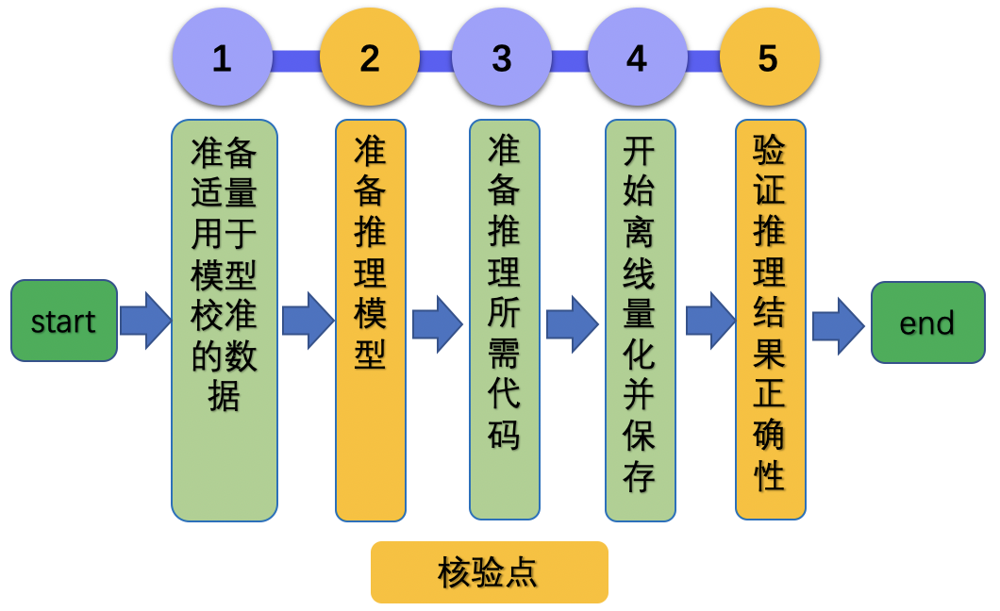

# Linux GPU/CPU 离线量化测试开发与规范

# 目录

- [1. 简介](#1)
- [2. 命令与配置文件解析](#2)
    - [2.1 命令解析](#2.1)
    - [2.2 配置文件和运行命令映射解析](#2.2)
- [3. 基本训练推理功能测试开发](#3)
    - [2.1 准备待测试的命令](#3.1)
    - [2.2 准备数据与环境](#3.2)
    - [2.3 准备开发所需脚本](#3.3)
    - [2.4 填写配置文件](#3.4)
    - [2.5 验证配置正确性](#3.5)
    - [2.6 撰写说明文档](#3.6)
- [4. FAQ](#4)

<a name="1"></a>

## 1. 简介

本文档主要关注Linux GPU/CPU 下模型的离线量化训练推理全流程功能测试，具体测试点如下：

- 模型训练：单机单卡训练跑通
- 模型推理：推理过程跑通

为了一键跑通上述所有功能，本文档提供了`训推一体全流程`功能自动化测试工具，它包含3个脚本文件和1个配置文件，分别是：

* `test_ptq_inference_python.sh`: 测试Linux上离线量化训练、推理功能的脚本，会对`train_ptq_infer_python.txt`进行解析，得到具体的执行命令。**该脚本无需修改**。
* `prepare.sh`: 准备测试需要的数据或需要的预训练模型。
* `common_func.sh`: 在配置文件一些通用的函数，如配置文件的解析函数等，**该脚本无需修改**。
* `train_ptq_infer_python.txt`: 配置文件，其中的内容会被`test_ptq_inference_python.sh`解析成具体的执行命令字段。

<a name="2"></a>

## 2. 命令与配置文件解析

<a name="2.1"></a>

### 2.1 命令解析

模型训练、动转静、推理过程的运行命令差别很大，但是都可以拆解为3个部分：

```
python  run_script   set_configs
```

例如：

* 对于通过配置文件传参的场景来说，`python3.7 post_quant.py --use-gpu=True  --batch_num=2 `
    * `python`部分为`python3.7`
    * `run_script`部分为` post_quant.py`
    * `set_configs`部分为`--use-gpu=True  --batch_num=2`
* 对于通过argparse传参的场景来说，`python3.7 post_quant.py --use-gpu=True --model_path=mobilenet_v3_small_infer/ --batch_num=2`
    * `python`部分为`python3.7`
    * `run_script`部分为`post_quant.py`
    * `set_configs`部分为`--model_path=mobilenet_v3_small_infer/`

其中，可修改参数`set_configs`一般通过`=`进行分隔，`=`前面的内容可以认为是key，后面的内容可以认为是value，那么通过给定配置文件模板，解析配置，得到其中的key和value，结合`python`和`run_script`，便可以组合出一条完整的命令。

<a name="2.2"></a>

### 2.2 配置文件和运行命令映射解析

完整的`train_ptq_infer_python.txt`配置文件共有20行，包含3个方面的内容。

* 训练参数：第1~10行
* 训练脚本配置：第11~12行
* 模型Inference推理：第15~20行

具体内容见[train_ptq_infer_python.txt](../../mobilenetv3_prod/Step6/test_tipc/configs/mobilenet_v3_small/train_ptq_infer_python.txt)。

配置文件中主要有以下3种类型的字段。

* 一行内容以冒号为分隔符：该行可以被解析为`key:value`的格式，需要根据实际的含义修改该行内容，下面进行详细说明。
* 一行内容为`======xxxxx=====`：该行内容为注释信息，无需修改。
* 一行内容为`##`：该行内容表示段落分隔符，没有实际意义，无需修改。

#### 2.2.1 训练配置参数

在配置文件中，可以通过下面的方式配置一些常用的超参数，如：是否使用GPU、迭代轮数、batch-size、预训练模型路径等，下面给出了常用的训练配置以及需要修改的内容。

<details>
<summary><b>训练配置参数（点击以展开详细内容或者折叠）
</b></summary>


| 行号 | 参考内容                                | 含义            | key是否需要修改 | value是否需要修改 | 修改内容                             |
|----|-------------------------------------|---------------|-----------|-------------|----------------------------------|
| 2  | model_name:mobilenet_v3_small       | 模型名字          | 否         | 是           | value修改为自己的模型名字                  |
| 3  | python:python3.7                    | python环境      | 否         | 是           | value修改为自己的python环境              |
| 4  | --use-gpu:True                      | 是否使用GPU       | 是         | 是           | key修改为设置GPU的内容，value修改为设置GPU的值         |
| 5  | --model_path:mobilenet_v3_small_infer/| 输出目录          | 是         | 否           | key修改为代码中设置模型路径的内容             |
| 6  | --output_dir:./mobilenet_v3_small_infer_ptq/ | 输出模型路径 | 是         | 是           | value修改为自定义的模型输出目录                  |
| 7  | --data_dir:./test_images/lite_data/ | 数据目录      | 是     | 是           | value修改为自己数据集目录            |
| 8  | --batch_num:2                       | 训练的batch 数量 | 是         | 是       | key修改为代码中设置batch num的内容       |
| 9  | --batch-size:2 | 训练的batch size | 是         | 是           | key修改为代码中设置batch size的内容       |


</details>

以训练命令`python3.7 deploy/ptq_python/post_quant.py --use-gpu=True --model_path=mobilenet_v3_small_infer/ --batch_num=2 --data_dir=./test_images/lite_data/ --output_dir=./mobilenet_v3_small_infer_ptq/ --batch-size=2`为例，总共包含5个超参数。

* 运行设备：`--use-gpu=True`，则需要修改为配置文件的第4行，`key`为`--use-gpu`， `value`为`True`，修改后内容为`--use-gpu:True`
* 离线量化模型： `--model_path=mobilenet_v3_small_infer/`，需要改为配置文件的第5行，`key`为`--model_path`， `value`为`mobilenet_v3_small_infer`，修改后内容为`--model_path:mobilenet_v3_small_infer/`，
* 离线量化输出模型：`--output_dir:./mobilenet_v3_small_infer_ptq/`，需要修改配置文件的第6行，`key`为`--output_dir`，`value`为`./mobilenet_v3_small_infer_ptq/`，
* 数据路径：`--data-path=test_images/lite_data/`，则需要修改为配置文件的第11行，修改后内容为`--data-path:test_images/lite_data/`
* 迭代轮数：`--batch_num=2`，则需要修改配置文件的第8行，修改后内容为`--batch_num:2`
* 数据批次：`--batch_size=2`，则需要修改配置文件的第8行，修改后内容为`--batch_size:2`

#### 2.2.2 训练命令配置参数

下面给出了配置文件中的训练命令配置参数（点击以展开详细内容或者折叠）

<details>
<summary><b>训练命令配置参数（点击以展开详细内容或者折叠）
</b></summary>

| 行号 | 参考内容                                        | 含义              | key是否需要修改 | value是否需要修改 |  修改内容                 |
|----|---------------------------------------------|-----------------|-----------|-------------|-------------------|
| 11 | trainer:ptq_train                          | 训练方法            | 否         | 否           | -                 |
| 12 | ptq_train:deploy/ptq_python/post_quant.py  | ptq_train的训练脚本  | 否         | 是           | value可以修改为自己的训练命令 |

</details>

以训练命令`python3.7 deploy/ptq_python/post_quant.py --use-gpu=True --model_path=mobilenet_v3_small_infer/ --batch_num=2 --batch-size=2 --data_dir=./test_images/lite_data/  --output_dir=./mobilenet_v3_small_infer_ptq/`为例，该命令为离线量化训练（非裁剪、量化、蒸馏等方式），因此

* 配置文件的第11行直接写`ptq_train`即可。
* 第12行配置`ptq_train`的具体运行脚本/入口，即上述命令中的`deploy/ptq_python/post_quant.py`因此配置文件的14行内容初步可以修改为`ptq_train:deploy/ptq_python/post_quant.py`。

#### 2.2.3 模型推理配置参数

下面给出了配置文件中的模型推理配置参数。

<details>
<summary><b>模型推理配置参数（点击以展开详细内容或者折叠）</b></summary>

| 行号 | 参考内容             | 含义     | key是否需要修改 | value是否需要修改 | 修改内容        |
|----|------------------|-----------------|-----------|-------------|-------------|
| 15 | inference:deploy/inference_python/infer.py         | 推理脚本            | 否         | 是           | value修改为自己的推理脚本                   |
| 16 | --use-gpu:True|False                                 | 是否使用GPU         | 是         | 是           | key和value修改为GPU设置的参数和值            |
| 17 | --batch_size:1                                       | 推理batch size    | 是         | 否           | key修改为代码中设置batch size的内容       |
| 18 | --model-dir:./output/mobilenet_v3_small_infer/   | 推理模型保存路径     | 是         | 否           | key修改为代码中可以设置inference model路径的内容 |
| 19 | --img-path:./images/demo.jpg                 | 图片路径或者图片文件夹路径   | 是         | 否           | key修改为代码中设置图片路径的内容       |
| 20 | --benchmark:False                                    | 是否使用benchmark            | 是         | 是           | key和value修改为规范化推理日志输出设置的参数和值      |


</details>

以推理命令`python deploy/inference_python/infer.py --model-dir=./mobilenet_v3_small_infer_ptq/ --img-path=./images/demo.jpg`为例。

* 推理的入口脚本为`deploy/inference_python/infer.py`，因此15行需要修改为`inference:deploy/inference_python/infer.py`。
* Inference模型路径配置在第6行参数中配置，`--output_dir:./mobilenet_v3_small_infer_ptq/`
* 测试图像路径配置为`--img-path=./images/demo.jpg`，因此19行修改为`--img-path:./images/demo.jpg`

<a name="3"></a>

## 3. 离线PACT量化训练推理功能测试开发

PACT量化训练推理功能测试开发过程主要分为以下6个步骤。

<div align="center">
    
</div>


其中设置了2个核验点，下面详细介绍开发过程。

<a name="3.1"></a>

### 3.1 准备待测试的命令

**【基本内容】**

准备离线量化训练、模型推理的命令，后续会将这些命令按照[第2节](#2)所述内容，映射到配置文件中。

**【实战】**

MobileNetV3的训练、动转静、推理示例运行命令如下所示。

```bash
# 模型训练
python3.7 deploy/ptq_python/post_quant.py --use-gpu=True --model_path=mobilenet_v3_small_infer/ --batch_num=2 --batch-size=2 --data_dir=./test_images/lite_data/ --output_dir=./mobilenet_v3_small_infer_ptq/ # 模型动转静
# 推理
python3.7 deploy/inference_python/infer.py --use-gpu=False --model-dir=./mobilenet_v3_small_infer_ptq/ --batch-size=1 --img-path=./images/demo.jpg --benchmark=True
```

<a name="3.2"></a>

### 3.2 准备数据与环境

**【基本内容】**

1. 数据集：为方便快速验证训练/评估/推理过程，需要准备一个小数据集（训练集和验证集各8~16张图像即可，压缩后数据大小建议在`20M`以内），放在`lite_data`文件夹下。

    相关文档可以参考[论文复现赛指南3.2章节](../../../docs/lwfx/ArticleReproduction_CV.md)，代码可以参考`基于ImageNet准备小数据集的脚本`：[prepare.py](https://github.com/littletomatodonkey/AlexNet-Prod/blob/tipc/pipeline/Step2/prepare.py)。

2. 环境：安装好PaddlePaddle即可进行离线量化训练推理测试开发

**【注意事项】**

* 为方便管理，建议在上传至github前，首先将lite_data文件夹压缩为tar包，直接上传tar包即可，在测试训练评估与推理过程时，可以首先对数据进行解压。
    * 压缩命令： `tar -zcf lite_data.tar lite_data`
    * 解压命令： `tar -xf lite_data.tar`


<a name="3.3"></a>

### 3.3 准备开发所需脚本

**【基本内容】**

在repo中新建`test_tipc`目录，将文件 [common_func.sh](../../mobilenetv3_prod/Step6/test_tipc/common_func.sh) ， [prepare.sh](../../mobilenetv3_prod/Step6/test_tipc/prepare.sh) 和 [test_train_inference_python.sh](../../mobilenetv3_prod/Step6/test_tipc/test_train_inference_python.sh) ， [test_ptq_inference_python.sh](../../mobilenetv3_prod/Step6/test_tipc/test_ptq_inference_python.sh)分别拷贝到`test_tipc`目录中。


**【注意事项】**

* 上述4个脚本文件无需改动，在实际使用时，直接修改配置文件即可。

<a name="3.4"></a>

### 3.4 填写配置文件

**【基本内容】**

在repo的`test_tipc/`目录中新建`configs/model_name`，将文件 [train_ptq_infer_python.txt](../../mobilenetv3_prod/Step6/test_tipc/configs/mobilenet_v3_small/train_ptq_infer_python.txt) 拷贝到该目录中，其中`model_name`需要修改为您自己的模型名称。

**【实战】**

配置文件的含义解析可以参考 [2.2节配置文件解析](#2.2) 部分。

mobilenet_v3_small的测试开发配置文件可以参考：[train_ptq_infer_python.txt](../../mobilenetv3_prod/Step6/test_tipc/configs/mobilenet_v3_small/train_ptq_infer_python.txt)。

<a name="3.5"></a>

### 3.5 验证配置正确性

**【基本内容】**

基于修改完的配置，运行

```bash
bash test_tipc/prepare.sh ${your_params_file} whole_infer
bash test_tipc/test_train_inference_python.sh ${your_params_file} whole_infer
```

**【注意事项】**

如果运行失败，会输出具体的报错命令，可以根据输出的报错命令排查下配置文件的问题并修改，示例报错如下所示。

```
Run failed with command - python3.7 deploy/ptq_python/post_quant.py --use-gpu=True --model_path=mobilenet_v3_small_infer/ --batch_num=2 --batch-size=2 --data_dir=./test_images/lite_data/ --output_dir=./mobilenet_v3_small_infer_ptq/!
```

**【实战】**

以mobilenet_v3_small的`Linux GPU/CPU 离线量化训练推理功能测试` 为例，命令如下所示。

```bash
bash test_tipc/test_train_ptq_python.sh ./test_tipc/configs/mobilenet_v3_small/train_ptq_infer_python.txt whole_infer
```

输出结果如下，表示命令运行成功。

```bash
 Run successfully with command - python3.7 deploy/ptq_python/post_quant.py --use-gpu=True --model_path=mobilenet_v3_small_infer/ --batch_num=2 --batch-size=2 --data_dir=./test_images/lite_data/ --output_dir=./mobilenet_v3_small_infer_ptq/!
......
 Run successfully with command - python3.7 deploy/inference_python/infer.py --use-gpu=True --model-dir=./mobilenet_v3_small_infer_ptq/ --batch-size=1 --img-path=./images/demo.jpg --benchmark=True > ./log/mobilenet_v3_small/whole_infer/python_infer_gpu_batchsize_1.log 2>&1 !
```

**【核验】**

基于修改后的配置文件，测试通过，全部命令成功

<a name="3.6"></a>

### 3.6 撰写说明文档

**【基本内容】**

撰写TIPC功能总览和测试流程说明文档，分别为

1. TIPC功能总览文档：test_tipc/README.md
2. Linux GPU/CPU 离线量化训练推理功能测试说明文档：test_tipc/docs/test_ptq_train_infer_python.md

2个文档模板分别位于下述位置，可以直接拷贝到自己的repo中，根据自己的模型进行修改。

1. [README.md](../../mobilenetv3_prod/Step6/test_tipc/README.md)
2. [test_train_ptq_inference_python.md](../../mobilenetv3_prod/Step6/test_tipc/docs/test_train_ptq_inference_python.md)

**【实战】**

mobilenet_v3_small中`test_tipc`文档如下所示。

1. TIPC功能总览文档：[README.md](../../mobilenetv3_prod/Step6/test_tipc/README.md)
2. Linux GPU/CPU PACT量化训练推理测试说明文档：[test_train_ptq_inference_python.md](../../mobilenetv3_prod/Step6/test_tipc/docs/test_train_ptq_inference_python.md)

**【核验】**

repo中最终目录结构如下所示。

```
test_tipc
    |--configs                                  # 配置目录
    |    |--model_name                          # 您的模型名称
    |           |--train_ptq_infer_python.txt   # 离线量化训练推理测试配置文件
    |--docs                                     # 文档目录
    |   |--test_train_ptq_inference_python.md   # 离线量化训练推理测试说明文档
    |----README.md                              # TIPC说明文档
    |----prepare.sh                             # TIPC离线量化训练推理测试数据准备脚本
    |----test_train_inference_python.sh         # TIPC离线量化训练推理测试解析脚本，无需改动
    |----test_ptq_inference_python.sh         # TIPC离线量化训练推理测试解析脚本，无需改动
    |----common_func.sh                         # TIPC离线量化训练推理测试常用函数，无需改动
```

基于`test_train_ptq_inference_python.md`文档，跑通`Linux GPU/CPU 离线量化训练推理功能测试`流程。

<a name="4"></a>

## 4. FAQ
