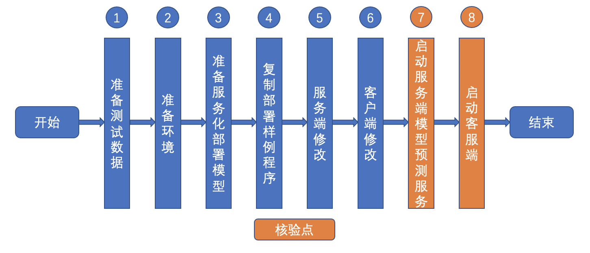
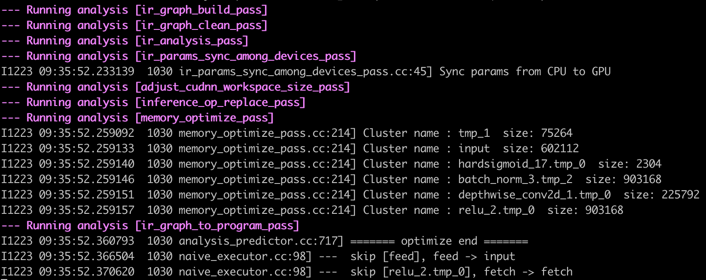
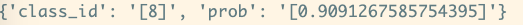

# Linux GPU/CPU C++ 服务化部署功能开发文档

# 目录

- [1. 简介](#1)
- [2. Paddle Serving服务化部署](#2)
    - [2.1 准备测试数据](#2.1)
    - [2.2 准备环境](#2.2)
    - [2.3 准备服务化部署模型](#2.3)
    - [2.4 复制部署样例程序](#2.4)
    - [2.5 服务端修改](#2.5)
    - [2.6 客户端修改](#2.6)
    - [2.7 启动服务端模型预测服务](#2.7)
    - [2.8 启动客服端](#2.7)
- [3. FAQ](#3)

<a name="1"></a>
## 1. 简介

Paddle Serving是飞桨开源的**服务化部署**框架，提供了C++ Serving和Python Pipeline两套框架，C++ Serving框架更倾向于追求极致性能，Python Pipeline框架倾向于二次开发的便捷性。旨在帮助深度学习开发者和企业提供高性能、灵活易用的工业级在线推理服务，助力人工智能落地应用。


更多关于Paddle Serving的介绍，可以参考[Paddle Serving官网repo](https://github.com/PaddlePaddle/Serving)。

本文档主要介绍利用C++ Serving框架实现飞桨模型（以MobilenetV3为例）的服务化部署。

**【注意】**：本项目仅支持Python3.6/3.7/3.8/3.9，接下来所有的与Python/Pip相关的操作都需要选择正确的Python版本。

<a name="2"></a>
## 2. Paddle Serving服务化部署
Paddle Serving服务化部署主要包括以下步骤：

<div align="center">
    
</div>

其中设置了2个核验点，分别为：
* 启动服务端
* 启动客户端

<a name="2.1"></a>
### 2.1 准备测试数据
准备测试数据及对应的数据标签，用于后续[推理预测阶段](#2.7)。

本教程以`./images/demo.jpg`作为测试用例。

<a name="2.2"></a>
### 2.2 准备环境

**docker**是一个开源的应用容器引擎，可以让应用程序更加方便地被打包和移植。Paddle Serving容器化部署建议在docker中进行Serving服务化部署。本教程在docker环境运行。

**【注意】**：推荐使用docker进行Serving部署。如果您已经准备好了docker环境，那么可以跳过此步骤。

（1）以下安装docker的Paddle Serving环境，CPU/GPU版本二选一即可。

 1）docker环境安装（CPU版本）

  ```bash
  # 拉取并进入 Paddle Serving的 CPU Docker
  docker pull paddlepaddle/serving:0.8.0-devel
  docker run -p 9292:9292 --name test -dit paddlepaddle/serving:0.8.0-devel bash
  docker exec -it test bash
  ````

  2)docker环境安装（GPU版本）

  ```bash
  # 拉取并进入 Paddle Serving的GPU Docker
  docker pull paddlepaddle/serving:0.8.0-cuda10.2-cudnn7-devel
  nvidia-docker run -p 9292:9292 --name test -dit paddlepaddle/serving:0.8.0-cuda10.2-cudnn7-devel bash
  nvidia-docker exec -it test bash
  ```

（2）安装Paddle Serving四个安装包，分别是：paddle-serving-server(CPU/GPU版本二选一), paddle-serving-client, paddle-serving-app和paddlepaddle(CPU/GPU版本二选一)。

  ```bash
  pip3 install paddle-serving-client==0.8.3
  #pip3 install paddle-serving-server==0.8.3 # CPU
  pip3 install paddle-serving-server-gpu==0.8.3.post102 # GPU with CUDA10.2 + TensorRT6
  pip3 install paddle-serving-app==0.8.3
  #pip3 install paddlepaddle==2.2.2 # CPU
  pip3 install paddlepaddle-gpu==2.2.2
  ```
  您可能需要使用国内镜像源（例如百度源, 在pip命令中添加`-i https://mirror.baidu.com/pypi/simple`）来加速下载。
  Paddle Serving Server更多不同运行环境的whl包下载地址，请参考：[下载页面](https://github.com/PaddlePaddle/Serving/blob/v0.8.3/doc/Latest_Packages_CN.md)
  PaddlePaddle更多版本请参考[官网](https://www.paddlepaddle.org.cn/install/quick?docurl=/documentation/docs/zh/install/pip/linux-pip.html)

(3)在docker中下载工程

```bash
git clone https://github.com/PaddlePaddle/models.git
cd models/tutorials/tipc/serving_cpp
```

<a name="2.3"></a>
### 2.3 准备服务化部署模型
#### 2.3.1 下载MobilenetV3 inference模型

参考[MobilenetV3](../../mobilenetv3_prod/Step6/README.md#2)，下载inference模型

#### 2.3.2 准备服务化部署模型

【基本流程】

为了便于模型服务化部署，需要将静态图模型(模型结构文件：\*.pdmodel和模型参数文件：\*.pdiparams)使用paddle_serving_client.convert按如下命令转换为服务化部署模型：

```bash
python3 -m paddle_serving_client.convert --dirname {静态图模型路径} --model_filename {模型结构文件} --params_filename {模型参数文件} --serving_server {转换后的服务器端模型和配置文件存储路径} --serving_client {转换后的客户端模型和配置文件存储路径}
```
上面命令中 "转换后的服务器端模型和配置文件" 将用于后续服务化部署。其中`paddle_serving_client.convert`命令是`paddle_serving_client` whl包内置的转换函数，无需修改。

【实战】

针对MobileNetV3网络，将inference模型转换为服务化部署模型的示例命令如下，转换完后在本地生成**serving_server**和**serving_client**两个文件夹。本教程后续主要使用serving_server文件夹中的模型。

```bash
python3 -m paddle_serving_client.convert \
    --dirname ./mobilenet_v3_small_infer/ \
    --model_filename inference.pdmodel \
    --params_filename inference.pdiparams \
    --serving_server serving_server \
    --serving_client serving_client
```
**【注意】**：0.8.3版本的 PaddleServing 需要和PaddlePaddle 2.2.2之后的版本搭配进行模型转换。

<a name="2.4"></a>
### 2.4 复制部署样例程序
**【基本流程】**

服务化部署的样例程序的目录地址为：`./template/code`

该目录下面包含2个文件，具体如下：

- serving_client.py：用于**客户端**访问服务的程序，开发者需要设置url（服务地址）、logid（日志ID）和测试图像。

- preprocess_ops.py：用户图片前项处理的一些工具类

**【实战】**

如果服务化部署MobileNetV3网络，拷贝上述三个文件到当前目录，以便做进一步修改。
```bash
cp -r ./template/code/*  ./
```

<a name="2.5"></a>
### 2.5 服务端修改

服务端无需进行代码修改。

<a name="2.6"></a>
### 2.6 客户端修改

修改serving_client.py程序，用于访问2.5中的服务端服务。
服务端代码修改主要修改：基础参数、开发数据预处理程序、开发预测结果后处理程序三个模块。

#### 2.5.1 基础参数
**【基本流程】**
主要设置客户端代码中的url（服务地址）、logid（日志ID）和测试图像。其中服务地址的url的样式为 "http://127.0.0.1:9993"。

**【实战】**

针对MobileNet网络, 修改serving_client.py程序中的url（服务地址）、logid（日志ID）和测试图像地址，其中url改为：

```
url = "http://127.0.0.1:9993"
img_path = "./images/demo.jpg"
```

#### 2.5.2 开发数据预处理程序

**【基本流程】**

serving_client.py文件中的preprocess函数用于开发数据预处理程序，包含输入、处理流程和输出三部分。

**（1）输入：** 一般开发者使用时，需要自行定义读取数据的方式。

**（2）处理流程：** 数据预处理流程和基于Paddle Inference的模型预处理流程相同。

**（3）输出：** 需要返回两个参数，第一个参数为模型预测的输入字典，第二个参数为需要获取的模型输出列表

```
{"input": input_data}, ["output"]
```
上述模型输入字典的key可以通过服务化模型配置文件serving_server/serving_server_conf.prototxt中的feed_var字典的name字段获取。
上述模型输出列表的key可以通过服务化模型配置文件serving_server/serving_server_conf.prototxt中的fetch_var字典的name字段获取。

**【实战】**

针对MobileNetV3网络的数据预处理开发，修改serving_client.py文件中代码如下：

添加头文件：

```py
import sys
import numpy as np
import base64
from PIL import Image
import io
from preprocess_ops import ResizeImage, CenterCropImage, NormalizeImage, ToCHW, Compose
from paddle_serving_client import Client
```  
添加数据读取相关代码：

```py
def preprocess():
    image_file = img_path
    image = Image.open(image_file)
    seq = Compose([
            ResizeImage(256), CenterCropImage(224), NormalizeImage(), ToCHW()
        ])
    input_data=seq(image)
    feed = {"input": input_data}
    fetch = ["softmax_1.tmp_0"]
    return feed, fetch
```

#### 2.5.3 开发预测结果后处理程序

【基本流程】

serving_client.py文件中的postprocess函数用于开发预测结果后处理程序，包含输入、处理流程和输出三部分。

**（1）输入：** 包含一个参数，fetch_map是模型预测输出字典，其中输出的key可以通过服务化模型配置文件serving_server/serving_server_conf.prototxt中的fetch_var字典的name字段获取。

**（2）处理流程：** 数据预处理流程和基于Paddle Inference的预测结果后处理一致。

**（3）输出：** 需要返回预测结果字典。


【实战】

针对MobileNet网络的预测结果后处理开发，serving_client.py文件中的postprocess函数相关代码如下：

```py
def postprocess(fetch_map):
    score_list = fetch_map["softmax_1.tmp_0"]
    result = {"class_id": [], "prob": []}
    for score in score_list:
        score = score.tolist()
        max_score = max(score)
        result["class_id"].append(score.index(max_score))
        result["prob"].append(max_score)
    result["class_id"] = str(result["class_id"])
    result["prob"] = str(result["prob"])
    return fetch_dict
```

<a name="2.7"></a>
### 2.7 启动服务端模型预测服务

**【基本流程】**

可以按如下命令启动模型预测服务：

```bash
python3 -m paddle_serving_server.serve --model serving_server --port 9993
```  
**【实战】**

针对MobileNet网络, 启动成功的界面如下：



<a name="2.8"></a>
#### 2.8 启动客户端

**【基本流程】**

当成功启动了模型预测服务，可以启动客户端代码，访问服务。

**【实战】**

客户端访问服务的命令如下：

```bash
python3 serving_client.py
```  
访问成功的界面如下图：



与基于Paddle Inference的推理结果一致，结果正确。

【注意事项】
如果访问不成功，可能设置了代理影响的，可以用下面命令取消代理设置。

```
unset http_proxy
unset https_proxy
```


## 3. FAQ

如果您在使用该文档完成Paddle Serving服务化部署的过程中遇到问题，可以给在[这里](https://github.com/PaddlePaddle/Serving/issues)提一个ISSUE，我们会高优跟进。
