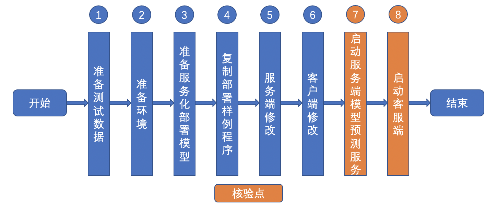

# Linux GPU/CPU PYTHON 服务化部署开发文档

# 目录

- [1. 简介](#1)
- [2. 服务化部署功能开发与规范](#2)
    - [2.1 开发流程](#2.1)
    - [2.2 核验点](#2.2)
- [3. 服务化部署测试开发与规范](#3)
    - [3.1 开发流程](#3.1)
    - [3.2 核验点](#3.2)

## 1. 简介

该系列文档主要介绍 Linux GPU/CPU PYTHON 服务化部署开发过程，主要包含2个步骤。

- 步骤一：参考[《Linux GPU/CPU PYTHON 服务化部署功能开发文档》](./serving_python.md)，完成Linux GPU/CPU PYTHON 服务化部署功能开发。

- 步骤二：参考[《Linux GPU/CPU PYTHON 服务化部署功能测试开发文档》](./test_serving_python.md)，完成Linux GPU/CPU PYTHON 服务化部署功能测试开发。

## 2. 服务化部署开发规范

### 2.1 开发流程

Linux GPU/CPU PYTHON 服务化部署功能开发过程以分为下面8个步骤。

    

更多内容请参考：[Linux GPU/CPU PYTHON 服务化部署功能开发文档](./serving_python.md)。

### 2.2 核验点

在开发过程中，至少需要产出下面的内容。

#### 2.2.1 模型服务部署成功

* 成功启动模型预测服务，并在客户端完成访问，返回结果。

#### 2.2.2 服务化部署结果正确性

* 返回结果与基于Paddle Inference的模型推理结果完全一致。

## 3. 服务化部署测试开发规范

coming soon!
