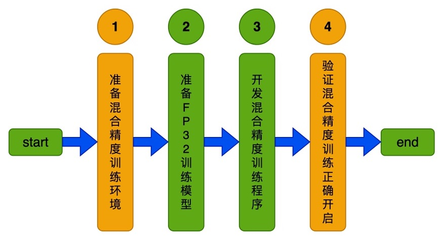

# Linux GPU 混合精度训练开发文档

# 目录

- [1. 简介](#1)
- [2. Linux GPU 混合精度训练功能与规范](#2)
    - [2.1 开发流程](#2.1)
    - [2.2 核验点](#2.2)
- [3. Linux GPU 混合精度训练功能测试与规范](#3)
    - [3.1 开发流程](#3.1)
    - [3.2 核验点](#3.2)


## 1. 简介

该系列文档主要介绍 Linux GPU 混合精度训练功能开发过程，主要包含2个步骤。


- 步骤一：参考[《Linux GPU 混合精度训练功能开发文档》](./train_amp_infer_python.md)，完成Linux GPU 混合精度训练功能开发。

- 步骤二：参考[《Linux GPU 混合精度训练功能测试开发文档》](./test_train_amp_infer_python.md)，完成Linux GPU 混合精度训练功能测试开发。


<a name="2"></a>

## 2. Linux GPU 混合精度训练功能与规范

<a name="2.1"></a>

### 2.1 开发流程

Paddle 混合精度训练开发可以分为4个步骤，如下图所示。

<div align="center">
    
</div>


更多的介绍可以参考：[Linux GPU 混合精度训练功能开发文档](./train_amp_infer_python.md)。

<a name="2.2"></a>

### 2.2 核验点

#### 2.2.1 准备混合精度训练环境

* 混合精度训练的加速依赖于NVIDIA显卡的Tensor Core，目前Tensor Core仅支持Compute Capability在7.0及其以上的显卡，因此在开发混合精度训练之前，需要首先检查显卡是否支持混合精度训练。具体地，进入python环境，执行如下命令：

```
>>> import paddle
>>> paddle.device.cuda.get_device_capability()
```

打印出`(7, 0)`或者以上版本的内容，即可认为该环境满足混合精度训练的环境要求。


#### 2.2.2 验证混合精度训练正确开启

* 开启混合精度后，可以通过开启`GLOG_v=5`查看Op的执行是否满足预期，默认情况下`matmul`、`conv2d`均应执行在FP16下。可以查看日志，确保上述op执行了FP16 kernel。

<a name="3"></a>


## 3. Linux GPU 混合精度训练功能测试与规范

<a name="3.1"></a>

### 3.1 开发流程

混合精度训练推理测试开发的流程如下所示。

<div align="center">
    
</div>

更多的介绍可以参考：[Linux GPU/CPU 混合精度训练推理测试开发规范](./test_train_amp_infer_python.md)。

<a name="3.2"></a>

### 3.2 核验点

#### 3.2.1 目录结构

如果您已经完成了[基础训练推理功能开发](../train_infer_python/README.md)，那么只需要在原`test_tipc`目录的基础上，增加混合精度训练推理测试的配置文件和使用说明文档。
否则，需要在repo根目录下面新建`test_tipc`文件夹，目录结构如下所示。

```
test_tipc
    |--configs                                  # 配置目录
    |    |--model_name                          # 您的模型名称
    |           |--train_infer_python.txt       # 基础训练推理测试配置文件
    |           |--train_amp_infer_python.txt   # 混合精度训练推理测试配置文件
    |--docs                                     # 文档目录
    |   |--test_train_inference_python.md       # 基础训练推理测试说明文档
    |   |--test_train_amp_inference_python.md   # 混合精度训练推理测试说明文档
    |----README.md                              # TIPC说明文档
    |----test_train_inference_python.sh         # TIPC基础训练、混合精度训练推理测试解析脚本，无需改动
    |----common_func.sh                         # TIPC基础训练、混合精度训练推理测试常用函数，无需改动
```

#### 3.2.2 配置文件和测试文档

* `test_tipc/README.md` 文档中对该模型支持的的功能进行总体介绍。
* `test_tipc/docs/test_train_amp_inference_python.md` 文档中对**Linux GPU/CPU 混合精度训练推理**的功能支持情况进行介绍。
* 根据测试文档，基于配置文件，跑通训练推理全流程测试。
