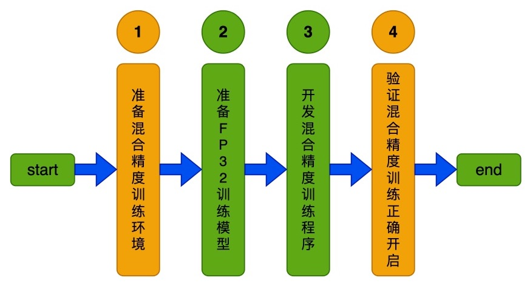

# Linux GPU 混合精度训练功能开发文档

# 目录

- [1. 简介](#1)
- [2. 混合精度训练功能开发](#2)
    - [2.1 准备混合精度训练环境](#2.1)
    - [2.2 准备FP32训练模型](#2.2)
    - [2.3 开发混合精度训练程序](#2.3)
    - [2.4 验证混合精度训练正确开启](#2.4)
- [3. FAQ](#3)
    - [3.1 通用问题](#3.1)

<a name="1"></a>

## 1. 简介

Paddle 混合精度训练（Auto Mixed Precision, AMP）是指在训练过程中同时使用单精度（FP32）和半精度（FP16），基于NVIDIA GPU提供的Tensor Cores技术，混合精度训练使用FP16和FP32即可达到与使用纯FP32训练相同的准确率，并可加速模型的训练速度。

更多关于Paddle AMP的介绍，可以参考[Paddle AMP官网教程](https://www.paddlepaddle.org.cn/documentation/docs/zh/guides/01_paddle2.0_introduction/basic_concept/amp_cn.html)。

本文档主要介绍飞桨模型在 Linux GPU/CPU 下混合精度训练功能开发。

<a name="2"></a>

## 2. 混合精度训练功能开发

Paddle 混合精度训练开发可以分为4个步骤，如下图所示。

<div align="center">
    
</div>

其中设置了2个核验点，分别为：

* 准备混合精度训练环境
* 验证混合精度训练正确开启

<a name="2.1"></a>

### 2.1 准备混合精度训练环境

混合精度训练的加速依赖于NVIDIA显卡的Tensor Core，目前Tensor Core仅支持Compute Capability在7.0及其以上的显卡，因此在开发混合精度训练之前，首先检查显卡是否支持混合精度训练，检查方法如下：

- 确定已安装paddle，通过pip安装linux版本paddle命令如下，更多的版本安装方法可查看飞桨[官网](https://www.paddlepaddle.org.cn/)

```
pip install paddlepaddle-gpu==2.2.1.post112 -f https://www.paddlepaddle.org.cn/whl/linux/mkl/avx/stable.html
```

- 进入python环境，执行如下命令：

```
>>> import paddle
>>> paddle.device.cuda.get_device_capability()
```

以Tesla V100显卡为例，执行上述命令后将打印出如下形式的结果：

```
(7, 0)
```

结果显示该显卡Compute Capability为7.0，因此符合混合精度训练所要求的环境。

此外，若不预先执行上述检查，混合精度训练依旧可以执行，但无法达到性能提升的效果，且在代码执行混合精度训练前会打印UserWarning，以Tesla K40显卡为例：

```
UserWarning: AMP only support NVIDIA GPU with Compute Capability 7.0 or higher, current GPU is: Tesla K40m, with Compute Capability: 3.5.
```

<a name="2.2"></a>

### 2.2 准备FP32训练模型

Paddle 神经网络训练默认采用FP32数据类型，混合精度训练是在FP32训练网络上添加必要的策略，因此，准备好可以正确完成训练的FP32网络即可。


<a name="2.3"></a>

### 2.3 开发混合精度训练程序

使用飞桨框架提供的API，能够在原始训练代码基础上快速开启自动混合精度训练，即在相关OP的计算中，根据一定的规则，自动选择FP16或FP32计算。

依据FP16在模型中的使用程度划分，飞桨的AMP分为两个等级：

- level = O1：采用黑白名单策略进行混合精度训练，黑名单中的OP将采用FP32计算，白名单中的OP将采用FP16计算，训练过程中框架会自动将白名单OP的输入参数数据类型从FP32 cast FP16，使用FP16与FP32进行计算的OP列表可见该文档。

- level = O2：该模式采用了比O1更为激进的策略，除了框架不支持FP16计算的OP，其他全部采用FP16计算，框架会预先将网络参数从FP32转换为FP16，相比O1，训练过程中无需做FP32 cast FP16的操作，训练速度会有更明显的提升，但可能会存在精度问题，为此，框架提供了自定义黑名单，用户可通过该名单指定一些存在精度问题的OP执行FP32运算。

通常情况下，O2相比O1训练速度会更快，但是训练精度可能会有所降低，您可以首先尝试开启O2模式，如果精度损失严重，您可以再尝试开启O1模式。下面详细介绍如何使用飞桨框架实现混合精度训练。

该小节以MobileNetv3模型为例，该模型混合精度训练的应用代码位于：[train.py](https://github.com/PaddlePaddle/models/blob/release/2.2/tutorials/mobilenetv3_prod/Step6/train.py)

#### 2.3.1 开发AMP-O1训练代码

**【基本流程】**

在飞桨框架中，使用AMP-O1训练训练，需要在FP32代码的基础上改动三处：

- Step1：定义`paddle.amp.GradScaler`，用于缩放loss比例，避免浮点数下溢

- Step2：使用`paddle.amp.auto_cast`创建AMP训练的上下文环境，在该上下文内，框架会根据框架预设的黑白名单，自动确定每个OP的输入数据类型（FP16或FP32）

- Step3：在训练代码中使用Step1中定义的`GradScaler`完成loss的缩放，用缩放后的loss进行反向传播，完成训练

**【实战】**

MobileNetv3中添加O1混合精度训练如下所示，参考链接：[train.py](https://github.com/PaddlePaddle/models/blob/release/2.2/tutorials/mobilenetv3_prod/Step6/train.py)。

1）在执行训练前，初始化`paddle.amp.GradScaler`类：

```python
if args.amp_level is not None:
    scaler = paddle.amp.GradScaler(init_loss_scaling=1024)
```

其中：```amp_level = 'O1'```

- ``paddle.amp.GradScaler``使用介绍见[API文档](https://www.paddlepaddle.org.cn/documentation/docs/zh/api/paddle/amp/GradScaler_cn.html)

2）在训练代码中使用`paddle.amp.auto_cast`创建AMP-O1训练的上下文环境，并利用`GradScaler`完成loss的缩放：

```python
if amp_level is not None:
    with paddle.amp.auto_cast(level=amp_level):
        output = model(image)
        loss = criterion(output, target)
    scaled = scaler.scale(loss)
    scaled.backward()
    scaler.minimize(optimizer, scaled)
```

其中：```amp_level = 'O1'```

- ``paddle.amp.auto_cast``使用介绍见[API文档](https://www.paddlepaddle.org.cn/documentation/docs/zh/api/paddle/amp/auto_cast_cn.html)

#### 2.3.2 开发AMP-O2训练代码

**【基本流程】**

O2模式采用了比O1更为激进的策略，除了框架不支持FP16计算的OP，其他全部采用FP16计算，需要在训练前将网络参数从FP32转为FP16，在FP32代码的基础上改动四处：

- Step1： 定义`paddle.amp.GradScaler`，用于缩放loss，避免浮点数下溢

- Step2： 使用`paddle.amp.decorate`将网络参数从FP32转换为FP16

- Step3： 使用`paddle.amp.auto_cast`创建AMP上下文环境，在该上下文内，框架会将所有支持FP16的OP都采用FP16进行计算（自定义的黑名单除外），其他OP采用FP32进行计算

- Step4： 在训练代码中使用Step1中定义的`GradScaler`完成loss的缩放，用缩放后的loss进行反向传播，完成训练

**【实战】**

MobileNetv3中添加O2混合精度训练如下所示，参考链接：[train.py](https://github.com/PaddlePaddle/models/blob/release/2.2/tutorials/mobilenetv3_prod/Step6/train.py)。

1）Step1定义`GradScaler`与O1模式一致，Step2通过`decorate`进行参数类型转换的方法如下：

```python
if args.amp_level is not None:
    scaler = paddle.amp.GradScaler(init_loss_scaling=1024)
    if args.amp_level == 'O2':
        model = paddle.amp.decorate(models=model, level='O2')
```

- ``paddle.amp.decorate``使用介绍见[API文档](https://www.paddlepaddle.org.cn/documentation/docs/zh/api/paddle/amp/decorate_cn.html)

2）Step3通过`auto_cast`创建AMP-O2训练的上下文环境与O1模式一致，Step4利用`GradScaler`完成loss的缩放与O1模式一致：

```python
if amp_level is not None:
    with paddle.amp.auto_cast(level=amp_level):
        output = model(image)
        loss = criterion(output, target)
    scaled = scaler.scale(loss)
    scaled.backward()
    scaler.minimize(optimizer, scaled)
```

其中：```amp_level = 'O2'```


<a name="2.4"></a>

### 2.4 验证混合精度训练正确开启

**【基本流程】**

开启混合精度后，可以通过开启`GLOG_v=5`查看Op的执行是否满足预期，默认情况下`matmul`、`conv2d`均应执行在FP16下。

1）AMP-O1模式下，训练执行过程中打印的日志包括如下内容：

- `Auto mixed precision run operator: xxx`：表示名字为xxx的op执行在混合精度训练O1模式下
- `expected_kernel_key:data_type[::paddle::platform::float16]`：在`Auto mixed precision run operator: xxx`的log后，会打印该log，表明op实际执行了FP16 kernel

2）AMP-O2模式下，训练执行过程中打印的日志包括如下内容：

- `Pure fp16 run operator: xxx`：表示名字为xxx的op执行在混合精度训练O2模式下
- `expected_kernel_key:data_type[::paddle::platform::float16]`：在`Auto mixed precision run operator: xxx`的log后，会打印该log，表明op实际执行了FP16 kernel

**【实战】**

MobileNetv3中添加O2混合精度训练如下所示，参考链接：[train.py](https://github.com/PaddlePaddle/models/blob/release/2.2/tutorials/mobilenetv3_prod/Step6/train.py)。

1）AMP-O1：

训练代码执行脚本如下：

```
GLOG_v=5 python3 train.py --data-path=./ILSVRC2012 --lr=0.1 --batch-size=256 --amp_level=O1
```

以`conv2d`op为例，打印的部分混合精度训练日志示例如下：

```
[1] I1228 11:56:41.567701  5904 tracer.cc:162] Trace Op: conv2d
[2] I1228 11:56:41.567713  5904 tracer.cc:190] Auto mixed precision run operator: conv2d
[3] I1228 11:56:41.567716  5904 amp_auto_cast.cc:202] Op(conv2d): Cast Filter from float to float16
[4] I1228 11:56:41.567724  5904 tracer.h:112] set amp_level to 0
[5] I1228 11:56:41.567728  5904 tracer.cc:162] Trace Op: cast
[6] I1228 11:56:41.567735  5904 layer.cc:451] Op(cast): Inputs: X{conv2d_33.w_0[LoDTensor<float, CUDAPlace(0), (40, 144, 1, 1)>]},   Outputs: Out{dygraph_tmp_67[LoDTensor<NOT_INITED>]}
[7] I1228 11:56:41.567746  5904 prepared_operator.cc:161] expected_kernel_key:data_type[float]:data_layout[ANY_LAYOUT]:place[CUDAPlace(0)]:library_type[PLAIN]
[8] I1228 11:56:41.567770  5904 layer.cc:481] Op(cast): Inputs: X{conv2d_33.w_0[LoDTensor<float, CUDAPlace(0), (40, 144, 1, 1)>]},   Outputs: Out{dygraph_tmp_67[LoDTensor<::paddle::platform::float16, CUDAPlace(0), (40, 144, 1, 1)>]}
[9] I1228 11:56:41.567786  5904 tracer.h:112] set amp_level to 1
[10] I1228 11:56:41.567790  5904 amp_auto_cast.cc:202] Op(conv2d): Cast Input from float to float16
[11] I1228 11:56:41.567797  5904 tracer.h:112] set amp_level to 0
[12] I1228 11:56:41.567801  5904 tracer.cc:162] Trace Op: cast
[13] I1228 11:56:41.567806  5904 layer.cc:451] Op(cast): Inputs: X{auto_228_[LoDTensor<float, CUDAPlace(0), (16, 144, 1, 1)>]},   Outputs: Out{dygraph_tmp_68[LoDTensor<NOT_INITED>]}
[14] I1228 11:56:41.567814  5904 prepared_operator.cc:161] expected_kernel_key:data_type[float]:data_layout[ANY_LAYOUT]:place[CUDAPlace(0)]:library_type[PLAIN]
[15] I1228 11:56:41.567828  5904 layer.cc:481] Op(cast): Inputs: X{auto_228_[LoDTensor<float, CUDAPlace(0), (16, 144, 1, 1)>]},   Outputs: Out{dygraph_tmp_68[LoDTensor<::paddle::platform::float16, CUDAPlace(0), (16, 144, 1, 1)>]}
[16] I1228 11:56:41.567842  5904 tracer.h:112] set amp_level to 1
[17] I1228 11:56:41.567847  5904 layer.cc:451] Op(conv2d): Inputs: Filter{dygraph_tmp_67[LoDTensor<::paddle::platform::float16, CUDAPlace(0), (40, 144, 1, 1)>]}, Input{dygraph_tmp_68[LoDTensor<::paddle::platform::float16, CUDAPlace(0), (16, 144, 1, 1)>]},   Outputs: Output{auto_229_[LoDTensor<NOT_INITED>]}
[18] I1228 11:56:41.567858  5904 prepared_operator.cc:161] expected_kernel_key:data_type[::paddle::platform::float16]:data_layout[ANY_LAYOUT]:place[CUDAPlace(0)]:library_type[CUDNN]
[19] I1228 11:56:41.567873  5904 conv_cudnn_op.cu:96] Compute ConvOp with cuDNN: data_format=NCHW compute_format=NCHW
```

- 第1行：表明即将执行`conv2d`

- 第2行：表明以混合精度训练O1模式执行`conv2d`

- 第5、12行：调用`cast` op将conv2d的输入参数转为FP16

- 第17行：打印了`conv2d`的输入、输出数据类型、维度等信息

- 第18行：表明`conv2d`实际执行的kernel类型为FP16


2）AMP-O2：

训练代码执行脚本如下：

```
GLOG_v=5 python3 train.py --data-path=./ILSVRC2012 --lr=0.1 --batch-size=256 --amp_level=O2
```

以`conv2d`op为例，打印的部分混合精度训练日志示例如下：

```
[1] I1228 12:00:45.373405  7576 tracer.cc:162] Trace Op: conv2d
[2] I1228 12:00:45.373430  7576 tracer.cc:193] Pure fp16 run operator: conv2d
[3] I1228 12:00:45.373438  7576 amp_auto_cast.cc:283] Op(conv2d): Cast Filter from ::paddle::platform::float16 to ::paddle::platform::float16
[4] I1228 12:00:45.373447  7576 amp_auto_cast.cc:283] Op(conv2d): Cast Input from ::paddle::platform::float16 to ::paddle::platform::float16
[5] I1228 12:00:45.373461  7576 layer.cc:451] Op(conv2d): Inputs: Filter{conv2d_5.w_0[LoDTensor<::paddle::platform::float16, CUDAPlace(0), (72, 16, 1, 1)>]}, Input{auto_1196_[LoDTensor<::paddle::platform::float16, CUDAPlace(0), (16, 16, 56, 56)>]},   Outputs: Output{auto_1200_[LoDTensor<NOT_INITED>]}
[6] I1228 12:00:45.373487  7576 prepared_operator.cc:161] expected_kernel_key:data_type[::paddle::platform::float16]:data_layout[ANY_LAYOUT]:place[CUDAPlace(0)]:library_type[CUDNN]
[7] I1228 12:00:45.373535  7576 conv_cudnn_op.cu:96] Compute ConvOp with cuDNN: data_format=NCHW compute_format=NCHW
```

- 第1行：表明即将执行`conv2d`

- 第2行：表明以混合精度训练O2模式执行`conv2d`

- 第5行：打印了`conv2d`的输入、输出数据类型、维度等信息

- 第6行：表明`conv2d`实际执行的kernel类型为FP16

<a name="3"></a>

## 3. FAQ

如果您在使用该文档完成混合精度训练的过程中遇到问题，可以给在[这里](https://github.com/PaddlePaddle/Paddle/issues/new/choose)提一个ISSUE，我们会高优跟进。

<a name="3.1"></a>

### 3.1 通用问题

* 混合精度训练存在如下报错：某个op期望输入数据为FP32，但输入的输入为FP16

该问题出现的原因可能是您在组网过程中手动调用了`paddle.cast()`或者`astype()`接口将参数强制进行了数据类型转换，使得混合精度训练失去了对该参数数据类型的管理。建议由框架自动对参数类型进行管理。

* 训练结果存在nan/inf：

由于FP16可表示的数据动态范围较小（最大65504），首先需要确定组网过程中不要出现将参数乘较大系数情况。如果没有上述问题，可通过官网提供的[check_nan_inf](https://www.paddlepaddle.org.cn/documentation/docs/zh/guides/flags/check_nan_inf_cn.html)工具进行初步检查，确定出现nan/inf的op，而后可以尝试将上述op添加到`paddle.amp.autocast()`的自定义黑名单中，使该op使用FP32 kernel进行计算。
`paddle.amp.auto_cast`使用介绍见[API文档](https://www.paddlepaddle.org.cn/documentation/docs/zh/api/paddle/amp/auto_cast_cn.html)。

