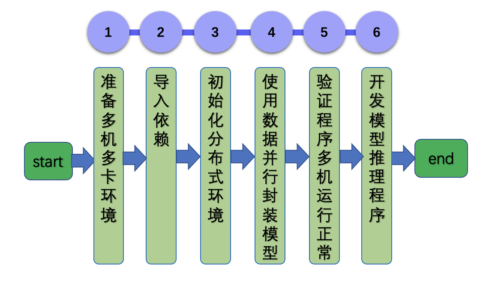

# Linux GPU 多机多卡训练推理开发文档

# 目录

- [1. 简介](#1)
- [2. 多机多卡训练功能开发与规范](#2)
    - [2.1 开发流程](#2.1)
    - [2.2 核验点](#2.2)
- [3. 多机多卡训练推理测试开发与规范](#3)
    - [3.1 开发流程](#3.1)
    - [3.2 核验点](#3.2)

## 1. 简介

该系列文档主要介绍 Linux GPU 多机多卡训练推理开发过程，主要包含2个步骤。

- 步骤一：参考[《Linux GPU 多机多卡训练开发文档》](./train_fleet_infer_python.md)，完成Linux GPU 多机多卡训练功能开发。

- 步骤二：参考[《Linux GPU 多机多卡推理测试开发文档》](./test_train_pact_infer_python.md)，完成Linux GPU 多机多卡推理测试开发。

# 2. 多机多卡训练功能开发与规范

### 2.1 开发流程

与单机单卡的普通模型训练相比，使用飞桨分布式训练主要包括以下步骤：

    

更多的介绍可以参考：[Linux GPU 多机多卡训练开发文档](./train_fleet_infer_python.md)。

### 2.2 核验点

#### 2.2.1 准备训练脚本

参考[Linux GPU 多机多卡训练开发文档](./train_fleet_infer_python.md)准备可在分布式环境运行的训练任务。

#### 2.2.2 验证结果正确性

参考[Linux GPU 多机多卡训练开发文档](./train_fleet_infer_python.md)启动训练任务并验证收敛正确性。

# 3. 多机多卡训练推理测试开发与规范
参考[Linux GPU 多机多卡训练推理测试开发文档](./test_train_fleet_infer_python.md)增加配置文件并撰写测试说明文档。
