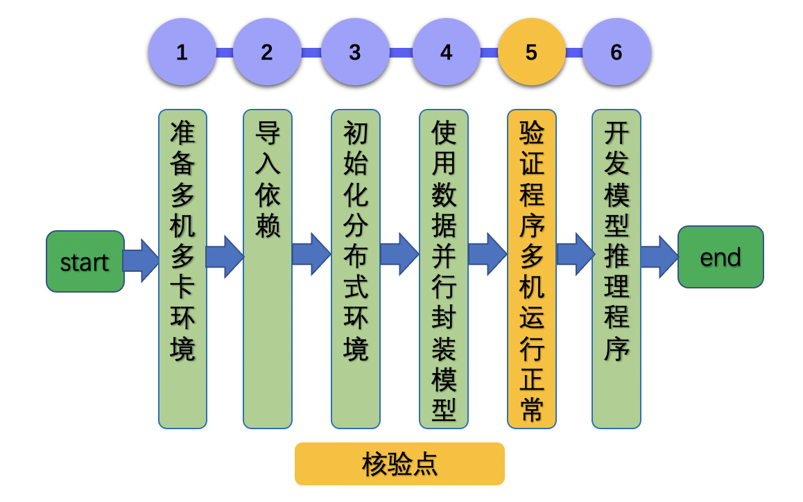

# Linux GPU 多机多卡训练推理测试开发文档

# 

# 目录

- [1. 简介](#1)

- [2. 多机多卡训练功能开发](#2)

- [3. FAQ](#3)

## [1. 简介](#1)

  近十年来，深度学习技术不断刷新视觉、自然语言处理、语音、搜索和推荐等领域任务的记录。这其中的原因，用一个关键词描述就是“大规模”。大规模的数据使得模型有足够的知识可以记忆，大规模参数量的模型使得模型本身有能力记忆更多的数据，大规模高性能的算力（以GPU为典型代表）使得模型的训练速度有百倍甚至千倍的提升。大规模的数据、模型和算力作为深度学习技术的基石，在推动深度学习技术发展的同时，也给深度学习训练带来了新的挑战：大规模数据和大规模模型的发展使得深度学习模型的能力不断增强，要求我们更加合理地利用大规模集群算力进行高效地训练，这是分布式训练面临的主要挑战。

  飞桨分布式从产业实践出发，提供包括数据并行、模型并行和流水线并行等在内的完备的并行能力，提供简单易用地分布式训练接口和丰富的底层通信原语，赋能用户业务发展。

  本文，我们以最常用的数据并行为例，介绍Linux GPU多机多卡从训练到推理的使用。

## [2. 多机多卡训练功能开发](#2)

  数据并行(data parallelism)主要逻辑遵循[Single Program Multiple Data](https://en.wikipedia.org/wiki/SPMD)的原则，即在数据并行的模型训练中，训练任务被切分到多个进程(设备)上,每个进程维护相同的模型参数和相同的计算任务，但是处理不同的数据(batch data)。通过这种方式，同一全局数据(global batch)下的数据和计算被切分到了不同的进程，从而减轻了单个设备上的计算和存储压力。

  在深度学习模型训练中，数据并行可作为通过增加并行训练设备来提高训练吞吐量(global batch size per second) 的方法。以常见的ResNet50 模型使用32GB V100卡训练为例。假设训练时单卡最大能支持的local batch size为256，训练一个step的耗时为1秒。则单卡训练时的吞吐为256 imgs/s。如果我们使用32 张V100 做数据并行训练，假设没有损耗，那么理论上的训练吞吐可达到 32 x 256 = 8192 imgs/。实际上由于数据并行时多机多卡的通信消耗等，实际加速效率会有折扣，但在加速效率为0.8时，训练吞吐也可达到32 x 256 x 0.8 = 6554 imgs/s。如果使用更多的GPU，并行训练的速度将会更高，大大减少训练需要的时间。



如上图所示，与单机单卡的普通模型训练相比，使用飞桨分布式训练的代码都只需要补充三个部分代码：

1. 准备多机多卡环境

2. 导入依赖

3. 初始化分布式环境

4. 使用数据并行算子封装模型

5. 验证多机多卡程序运行正确

6. 开发模型推理程序  

下面将逐一讲解每一步骤。

### 2.1 准备多机多卡环境

准备两台机器，每台机器包含至少两张GPU卡。假设两台机器的IP地址分别为192.168.0.1和192.168.0.2。那么，通过ping命令验证两台机器的网络是否是连通的：

```shell
# 在ip地址为192.168.0.1的机器上
ping 192.168.0.2
```

如果控制台输出类似如下的信息，则表示两台机器的网络是连通的。

```shell
PING 192.168.0.2 (192.168.0.2): 56 data bytes
64 bytes from 192.168.0.1: icmp_seq=0 ttl=64 time=0.090 ms
64 bytes from 192.168.0.1: icmp_seq=1 ttl=64 time=0.111 ms
64 bytes from 192.168.0.1: icmp_seq=2 ttl=64 time=0.094 ms
64 bytes from 192.168.0.1: icmp_seq=3 ttl=64 time=0.089 ms
```

反之，如果输出如下的信息，则表示两台机器间的网络是不可连通的，请咨询您的网络管理员。

```shell
PING 192.168.0.2 (192.168.0.2): 56 data bytes
Request timeout for icmp_seq 0
Request timeout for icmp_seq 1
```

### 2.2 导入依赖

```python
import paddle
from paddle.distributed as dist
```

### 2.3 初始化分布式环境

```python
dist.init_parallel_env()
```

### 2.4 使用数据并行算子封装模型

```python
model = paddle.DataParallel(model)
```

### 2.5 验证多机多卡程序运行正确

假设用户训练脚本文件名为train.py，下面我们说明如何启动分布式训练任务，并验证程序的正确性。

我们分别在两台机器上启动分布式任务：

```shell
# 在ip地址为192.168.0.1的机器上
python -m paddle.distributed.launch --ips="192.168.0.1,192.168.0.2" --gpus="0,1" train.py
```

```shell
# 在ip地址为192.168.0.2的机器上
python -m paddle.distributed.launch --ips="192.168.0.1,192.168.0.2" --gpus="0,1" train.py
```

启动上述命令后，将在控制台上输出类似如下所示的信息：

```shell
WARNING 2021-01-04 17:59:08,725 launch.py:314] Not found distinct arguments and compiled with cuda. Default use collective mode
launch train in GPU mode
INFO 2021-01-04 17:59:08,727 launch_utils.py:472] Local start 4 processes. First process distributed environment info (Only For Debug):
    +=======================================================================================+
    |                        Distributed Envs                      Value                    |
    +---------------------------------------------------------------------------------------+
    |                 PADDLE_CURRENT_ENDPOINT                 192.168.0.1:17901               |
    |                     PADDLE_TRAINERS_NUM                        2                      |
    |                PADDLE_TRAINER_ENDPOINTS         192.168.0.1:17901,192.168.0.0.1:18846...       |
    |                     FLAGS_selected_gpus                        0                      |
    |                       PADDLE_TRAINER_ID                        0                      |
    +=======================================================================================+

...
W0104 17:59:19.018365 43338 device_context.cc:342] Please NOTE: device: 0, GPU Compute Capability: 7.0, Driver API Version: 10.2, Runtime API Version: 9.2
W0104 17:59:19.022523 43338 device_context.cc:352] device: 0, cuDNN Version: 7.4.
W0104 17:59:23.193490 43338 fuse_all_reduce_op_pass.cc:78] Find all_reduce operators: 161. To make the speed faster, some all_reduce ops are fused during training, after fusion, the number of all_reduce ops is 
```

当使用paddle.distributed.launch模块启动分布式任务时，所有日志将保存在./log目录下，日志文件名为workerlog.xx，其中xx为整数；每个卡训练进程对应一个日志文件。

用户也可以通过--log_dir选项指定日志的保存目录，比如下面的例子中将日志保存在./my_log目录下：

```shell
python -m paddle.distributed.launch --ips="192.168.0.1,192.168.0.2" --gpus="0,1" --log_dir=./my_log train.py
```

### 2.6 开发模型推理程序

由于数据并行训练各个卡上包含完整的模型副本，因此只需要保存某张卡上的模型用于推理即可。通常，可以选择保存第一张卡上的模型用于推理。

```python
if paddle.distributed.get_rank() == 0:
    # save inference model
```

更多关于推理的信息，请参考[Linux GPU/CPU 模型推理开发文档](../train_infer_python/infer_python.md)

## 3. [FAQ](#3)

- 问：当程序报错时，如何排查错误？

- 答：首先查看日志，是否可以可以定位错误的信息，如显存不够OOM等。

- 问：如果程序hang，如何排查出错原因？

- 答：一般引起程序hang的问题，都是通信问题。比如，两个进程同步不一致：一个进程等待同步A数据，而另一个进程却在等待同步B数据，从而导致程序hang。一般排查步骤是定位进程hang的位置，然后具体分析导致hang的原因。可以通过设置如下环境变量查看程序hang时执行的算子：`export GLOG_v=3; export FLAGS_benchmark=1`。

- 问：程序中报错，显示NCCL相关错误，怎么排查原因？

- 答：可以通过设置如下环境变量查看程序错误信息：`export NCCL_DEBUG=INFO`。并重点关注NCCL WARN相关信息。
