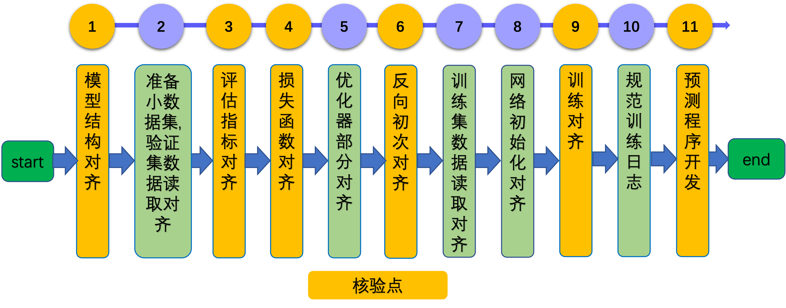

# Linux GPU/CPU 基础训练推理开发文档

# 目录

- [1. 简介](#1)
- [2. 模型复现流程与规范](#2)
    - [2.1 复现流程](#2.1)
    - [2.2 核验点](#2.2)
- [3. 模型推理开发与规范](#3)
    - [3.1 开发流程](#3.1)
    - [3.2 核验点](#3.2)
- [4. 基础训练推理测试开发与规范](#4)
    - [4.1 开发流程](#4.1)
    - [4.2 核验点](#4.2)

<a name="1"></a>

## 1. 简介

该系列文档主要介绍飞桨模型基于 Linux GPU/CPU 基础训练推理开发过程，主要包含3个步骤。

- 步骤一：参考 [《模型复现指南》](../../article-implementation/ArticleReproduction_CV.md)，完成模型的训练与基于训练引擎的预测程序开发。

- 步骤二：参考[《Linux GPU/CPU 模型推理开发文档》](./infer_python.md)，在基于训练引擎预测的基础上，完成基于Paddle Inference的推理程序开发。

- 步骤三：参考[《Linux GPU/CPU 基础训练推理测试开发文档》](./test_train_infer_python.md)，完成Linux GPU/CPU 训练、推理测试功能开发。

<a name="2"></a>

## 2. 模型复现流程与规范

<a name="2.1"></a>

### 2.1 复现流程

如果您对于模型复现过程已经非常熟悉，在复现过程中可以按照自己的复现方法进行复现。但是需要注意训练日志与文档内容符合规范。可以参考`2.2章节`。

如果您在模型复现方面经验较少，或者复现过程中遇到问题，希望快速排查问题，强烈建议您按照模型复现指南进行操作。以CV任务为例，复现指南将模型复现分为13个步骤，如下所示。

<div align="center">
    
</div>

更多内容请参考：[模型复现指南](../../article-implementation/ArticleReproduction_CV.md)。

<a name="2.2"></a>

### 2.2 核验点

在模型复现过程中，至少需要产出下面的内容。

#### 2.2.1 小数据集

**【参考】**

* [模型复现指南](../../article-implementation/ArticleReproduction_CV.md)中`3.2`章节。

**【要求】**

repo中包含`lite_data`小数据集压缩包，解压之后可以获取`lite_data`小数据集文件夹。该数据集可以便于快速验证训练过程的能否跑通，其中包含的数据也可以用于验证推理部署过程。


#### 2.2.2 代码与精度

**【参考】**

* [模型复现指南](../../article-implementation/ArticleReproduction_CV.md)中第`3`章节。

**【要求】**

* 代码中包含训练(`train.py`)、评估(`eval.py`)、预测(`predict.py`)的脚本，分别作为模型训练、评估、预测的入口。

* 模型结构、数据预处理/后处理、优化器、预训练模型与参考代码保持一致。

#### 2.2.3 训练日志

**【参考】**

[模型复现指南](../../article-implementation/ArticleReproduction_CV.md)中`3.12`章节。

**【要求】**

* 日志文件中，每个迭代过程的输出信息至少包含`loss`, `avg_reader_cost`, `avg_batch_cost`, `avg_ips`关键字段。含义如下所示。
    * `loss`: 过去若干个iter的loss值
    * `avg_reader_cost`: 过去若干个iter的平均reader耗时 (单位: sec)
    * `avg_batch_cost`: 过去若干个iter的平均训练耗时 (单位: sec)
    * `avg_ips`: 过段若干个iter个训练速度（单位: images/sec）

#### 2.2.4 基于训练引擎的预测程序

**【参考】**

* [模型复现指南](../../article-implementation/ArticleReproduction_CV.md)中`3.13`章节。

**【要求】**

提供基于训练引擎的预测脚本与命令，文档需要提供示例图片，并根据示例图片，可视化出使用提供的预测命令运行得到的结果。

#### 2.2.5 文档

**【参考】**

* [repo模板首页文档](../../../community/repo_template/README.md)。

**【要求】**

* 按照参考`repo模板首页文档`的内容，添加对应的信息。

<a name="3"></a>

## 3. 模型推理开发规范

<a name="3.1"></a>

### 3.1 开发流程

基于Paddle Inference的预测过程分为下面9个步骤。

<div align="center">
    
</div>

更多的介绍可以参考：[模型推理开发文档](./infer_python.md)。

<a name="3.2"></a>

### 3.2 核验点

#### 3.2.1 代码与预测结果

* 项目中需要包含`模型动转静`脚本(`export_model.py`)以及`模型基于 Paddle Inference 的`预测脚本(`infer.py`)。

#### 3.2.2 文档

* 说明文档中，需要包含`模型动转静`和`模型基于预测引擎`的使用命令说明。

<a name="4"></a>

## 4. 基础训练推理测试开发规范

<a name="4.1"></a>

### 4.1 开发流程

基础训练推理测试开发的流程如下所示。

<div align="center">
    
</div>

更多的介绍可以参考：[Linux GPU/CPU 基础训练推理测试开发规范](./test_train_infer_python.md)。


<a name="4.2"></a>

### 4.2 核验点

#### 4.2.1 目录结构

在repo根目录下面新建`test_tipc`文件夹，目录结构如下所示。

```
test_tipc
    |--configs                              # 配置目录
    |    |--model_name                      # 您的模型名称
    |           |--train_infer_python.txt   # 基础训练推理测试配置文件
    |--docs                                 # 文档目录
    |   |--test_train_inference_python.md   # 基础训练推理测试说明文档
    |----README.md                          # TIPC说明文档
    |----test_train_inference_python.sh     # TIPC基础训练推理测试解析脚本，无需改动
    |----common_func.sh                     # TIPC基础训练推理测试常用函数，无需改动
```


#### 4.2.2 配置文件和测试文档

* `test_tipc/README.md` 文档中对该模型支持的的功能进行总体介绍。
* `test_tipc/docs/test_train_inference_python.md` 文档中对**Linux GPU/CPU 基础训练推理**的功能支持情况进行介绍。
* 根据测试文档，基于配置文件，跑通训练推理全流程测试。
