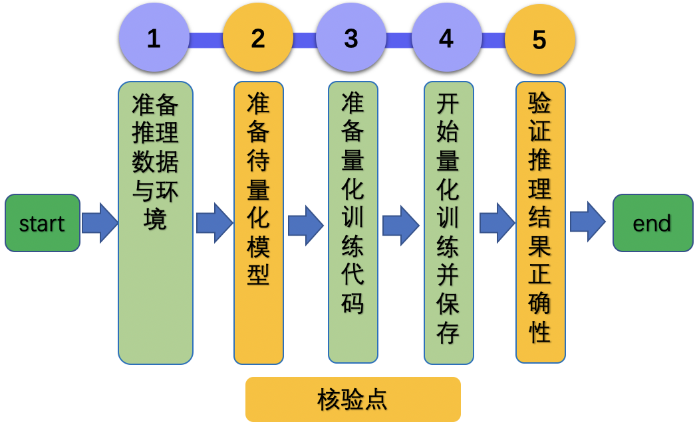

# Linux GPU/CPU PACT量化训练开发文档

# 目录

- [1. 简介](#1)
- [2. Linux GPU/CPU PACT量化训练功能开发规范](#2)
    - [2.1 开发流程](#2.1)
    - [2.2 核验点](#2.2)
- [3. Linux GPU/CPU PACT量化训练测试开发与规范](#3)
    - [3.1 开发流程](#3.1)
    - [3.2 核验点](#3.2)


<a name="1"></a>

## 1. 简介

该系列文档主要介绍 Linux GPU/CPU PACT量化训练开发过程，主要包含2个步骤。


- 步骤一：参考[《Linux GPU/CPU PACT量化训练功能开发文档》](./train_pact_infer_python.md)，完成Linux GPU/CPU PACT量化训练功能开发。

- 步骤二：参考[《Linux GPU/CPU PACT量化训练测试开发文档》](./test_train_pact_infer_python.md)，完成Linux GPU/CPU PACT量化训练测试开发。


<a name="2"></a>

# 2. Linux GPU/CPU PACT量化训练功能开发规范

<a name="2.1"></a>

### 2.1 开发流程

Linux GPU/CPU PACT量化训练功能开发过程可以分为下面5个步骤。

<div align="center">
    
</div>


更多的介绍可以参考：[Linux GPU/CPU PACT量化训练功能开发文档](./train_pact_infer_python.md)。

<a name="2.2"></a>

### 2.2 核验点

#### 2.2.1 准备待量化模型

* 需要定义继承自`paddle.nn.Layer`的网络模型，该模型与Linux GPU/CPU基础训练过程一致。定义完成之后，建议加载预训练模型权重，加速量化收敛。

#### 2.2.2 验证推理结果正确性

* 使用Paddle Inference库测试离线量化模型，确保模型精度符合预期。对于CV任务来说，PACT在线量化之后的精度基本无损。

<a name="3"></a>

# 3. Linux GPU/CPU PACT量化训练测试开发与规范

## 3.1 开发流程


量化训练推理测试开发的流程如下所示：
<div align="center">
    
</div>

更多的介绍可以参考：[Linux GPU/CPU PACT量化训练推理测试开发规范](./test_train_pact_infer_python.md)。


### 3.2 核验点

#### 3.2.1 目录结构

如果您已经完成了[基础训练推理功能开发](../train_infer_python/README.md)，那么只需要在原`test_tipc`目录的基础上，增加PACT量化训练推理测试的配置文件和使用说明文档。
否则，需要在repo根目录下面新建`test_tipc`文件夹，目录结构如下所示。

```
test_tipc
    |--configs                                  # 配置目录
    |    |--model_name                          # 您的模型名称
    |           |--train_infer_python.txt       # 基础训练推理测试配置文件
    |           |--train_pact_infer_python.txt  # PACT量化训练推理测试配置文件
    |--docs                                     # 文档目录
    |   |--test_train_inference_python.md       # 基础训练推理测试说明文档
    |   |--test_train_pact_inference_python.md  # PACT量化训练推理测试说明文档
    |----README.md                              # TIPC说明文档
    |----test_train_inference_python.sh         # TIPC基础训练、PACT量化训练推理测试解析脚本，无需改动
    |----common_func.sh                         # TIPC基础训练、PACT量化训练推理测试常用函数，无需改动
```

#### 3.2.2 配置文件和测试文档

* `test_tipc/README.md` 文档中对该模型支持的的功能进行总体介绍。
* `test_tipc/docs/test_train_pact_inference_python.md` 文档中对**Linux GPU/CPU PACT量化训练推理**的功能支持情况进行介绍。
* 根据测试文档，基于配置文件，跑通训练推理全流程测试。


