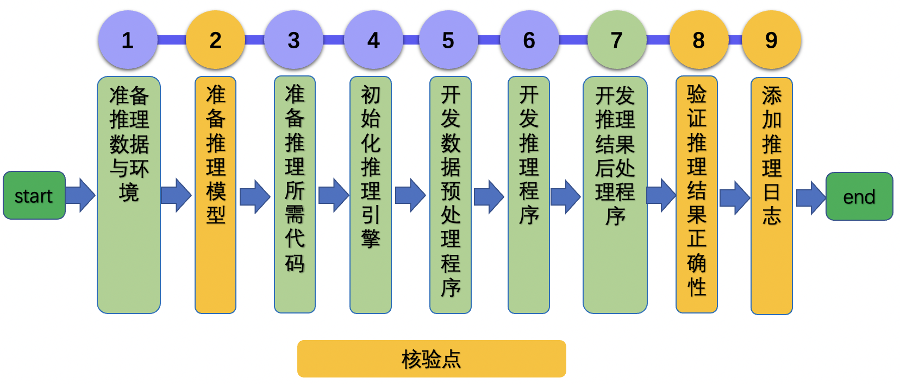

# Windows GPU/CPU 模型推理开发文档

# 目录

- [1. 简介](#1)
- [2. 推理过程开发](#2)
    - [2.1 准备推理数据与环境](#2.1)
    - [2.2 准备推理模型](#2.2)
    - [2.3 准备推理所需代码](#2.3)
    - [2.4 初始化推理引擎](#2.4)
    - [2.5 开发数据预处理程序](#2.5)
    - [2.6 开发推理程序](#2.6)
    - [2.7 开发推理结果后处理程序](#2.7)
    - [2.8 验证推理结果正确性](#2.8)
    - [2.9 添加推理日志](#2.9)
- [3. FAQ](#3)
    - [3.1 准备推理数据与环境](#3.1)
    - [3.2 准备推理模型](#3.2)
    - [3.3 准备推理所需代码](#3.3)
    - [3.4 初始化推理引擎](#3.4)
    - [3.5 开发数据预处理程序](#3.5)
    - [3.6 开发推理程序](#3.6)
    - [3.7 开发推理结果后处理程序](#3.7)
    - [3.8 验证推理结果正确性](#3.8)
    - [3.9 添加推理日志](#3.9)

<a name="1"></a>

## 1. 简介

Paddle Inference 是飞桨的原生推理库， 作用于服务器端和云端，提供高性能的推理能力。相比于直接基于预训练模型进行预测，Paddle Inference可使用MKLDNN、CUDNN、TensorRT进行预测加速，从而实现更优的推理性能。

更多关于Paddle Inference推理引擎的介绍，可以参考[Paddle Inference官网教程](https://www.paddlepaddle.org.cn/documentation/docs/zh/guides/05_inference_deployment/inference/inference_cn.html)。


本文档主要介绍飞桨模型在 Linux GPU/CPU 下基于预测引擎的推理过程开发。


<a name="2"></a>

## 2. 推理过程开发

基于Paddle Inference的推理过程可以分为9个步骤，如下图所示。

<div align="center">
    
</div>

其中设置了3个核验点，分别为

* 准备推理模型
* 验证推理结果正确性
* 添加推理日志

<a name="2.1"></a>

### 2.1 准备推理数据与环境

**【数据】**

从验证集或者测试集中抽出至少一张图像，用于后续推理过程验证。

**【环境】**

* 安装好PaddlePaddle的whl包之后，便可以直接体验Paddle的Inference推理功能。

<a name="2.2"></a>

### 2.2 准备推理模型

`模型动转静`方法可以将训练得到的动态图模型转化为用于推理的静态图模型，下面详细介绍`模型动转静`流程。

该小节的代码模板位于[export_model.py](./template/code/export_model.py)，您可以基于这段代码进行修改。

具体地，关于mobilenet_v3_small的导出代码可以参考：[export_model.py](https://github.com/PaddlePaddle/models/blob/release/2.2/tutorials/mobilenetv3_prod/Step6/tools/export_model.py)。

#### 2.2.1 定义模型

**【基本流程】**

在模型导出之前，首先需要定义好模型结构，模型结构与训练时的模型结构相同。

**【注意事项】**

* 图像分类任务中，训练组网时，在输出层一般没有加上`softmax`激活函数，在预测推理时，为了得到模型预测推理结果的概率值，可以在网络后面添加`softmax`激活函数。

**【实战】**

mobilenet_v3_small中模型定义与组网如下所示，参考链接：[export_model.py](https://github.com/PaddlePaddle/models/blob/release/2.2/tutorials/mobilenetv3_prod/Step6/tools/export_model.py)。

```python
    model = paddlevision.models.__dict__[args.model](
        pretrained=args.pretrained, num_classes=args.num_classes)
    model = nn.Sequential(model, nn.Softmax())
    model.eval()
```

#### 2.2.2 模型动转静(`jit.to_static`)

**【基本流程】**

`paddle.jit.to_static`接口是完成模型动转静的唯一接口，需要使用该接口对模型进行装饰。

**【注意事项】**

* 如果有多个输入，则在`input_spec`接口中定义多个`InputSpec`对象即可。
* `batch_size`维度建议使用`None`。

**【实战】**

mobilenet_v3_small中模型动转静代码如下所示，参考链接：[export_model.py](https://github.com/PaddlePaddle/models/blob/release/2.2/tutorials/mobilenetv3_prod/Step6/tools/export_model.py)。


```python
    model = paddle.jit.to_static(
        model,
        input_spec=[
            InputSpec(
                shape=[None, 3, args.img_size, args.img_size], dtype='float32')
        ])
```

#### 2.2.3 保存模型(`jit.save`)

**【基本流程】**

对于装饰后的模型，可以使用`paddle.jit.save` API完成模型保存。

**【注意事项】**

* 保存过程中遇到的问题可以参考[动转静报错调试教程](https://www.paddlepaddle.org.cn/documentation/docs/zh/guides/04_dygraph_to_static/debugging_cn.html)。

**【实战】**

mobilenet_v3_small中模型保存代码如下所示，参考链接：[export_model.py](https://github.com/PaddlePaddle/models/blob/release/2.2/tutorials/mobilenetv3_prod/Step6/tools/export_model.py)。

```python
    paddle.jit.save(model, os.path.join(args.save_inference_dir, "inference"))
```

**【验收】**

保存路径下面会生成3个文件，如下所示，其中在Inference推理中用到的为`inference.pdiparams`与`inference.pdmodel`。

```
inference.pdiparams     : 模型参数文件
inference.pdmodel       : 模型结构文件
inference.pdiparams.info: 模型参数信息文件
```

<a name="2.3"></a>

### 2.3 准备推理所需代码

**【基本流程】**

基于预测引擎的推理过程包含4个步骤：初始化预测引擎、预处理、推理、后处理。文件`template/code/infer.py`中提供了一个模板类，您可以将这个文件拷贝到自己的项目中，修改对应的部分。

```py
class InferenceEngine(object):
    def __init__(self, args):
        super().__init__()
        pass

    def load_predictor(self, model_file_path, params_file_path):
        pass

    def preprocess(self, img_path):
        pass

    def postprocess(self, x):
        pass

    def run(self, x):
        pass
```

**【实战】**

该模板类对应mobilenet_v3_small的实现位于：[infer.py](https://github.com/PaddlePaddle/models/blob/release/2.2/tutorials/mobilenetv3_prod/Step6/deploy/inference_python/infer.py)。

其中每个子模块的操作在下面详细介绍。

<a name="2.4"></a>

### 2.4 初始化推理引擎

**【基本流程】**

传入配置，如模型参数和结构文件路径、GPU、MKLDNN等配置，初始化推理引擎。

**【实战】**

针对mobilenet_v3_small模型，推理引擎初始化函数实现如下，其中模型结构和参数文件路径、是否使用GPU、是否开启MKLDNN等内容都是可以配置的。

```py
    # https://github.com/PaddlePaddle/models/blob/release/2.2/tutorials/mobilenetv3_prod/Step6/deploy/inference_python/infer.py
    def load_predictor(self, model_file_path, params_file_path):
        args = self.args
        config = Config(model_file_path, params_file_path)
        config.enable_memory_optim()
        if args.use_gpu:
            config.enable_use_gpu(100, 0)
            config.enable_tensorrt_engine(workspace_size=1 << 30,
                                      max_batch_size=10,
                                      min_subgraph_size=5,
                                      precision_mode=PrecisionType.Float32,
                                      use_static=False,
                                      use_calib_mode=False)
            config.set_trt_dynamic_shape_info(
                                      min_input_shape={"input": [1, 3, 1, 1]},
                                      max_input_shape={"input": [10, 3, 1200, 1200]},
                                      optim_input_shape={"input": [1, 3, 224, 224]})
        else:
            # If not specific mkldnn, you can set the blas thread.
            # The thread num should not be greater than the number of cores in the CPU.
            config.set_cpu_math_library_num_threads(4)
            config.enable_mkldnn()
        # creat predictor
        predictor = create_predictor(config)
        # get input and output tensor property
        input_names = predictor.get_input_names()
        input_tensor = predictor.get_input_handle(input_names[0])

        output_names = predictor.get_output_names()
        output_tensor = predictor.get_output_handle(output_names[0])

        return predictor, config, input_tensor, output_tensor
```

<a name="2.5"></a>

### 2.5 开发数据预处理程序

**【基本流程】**

读取指定图像，对其进行数据变换，转化为符合模型推理所需要的输入格式。

**【注意事项】**

* 在模型评估过程中，为了保证数据可以组batch，我们一般会使用resize/crop/padding等方法去保持尺度的一致性，在预测推理过程中，需要注意crop是否合适，比如OCR识别任务中，crop的操作会导致识别结果不全。

**【实战】**

图像分类mobilenet_v3_small为例，预处理包含`Resize`, `CenterCrop`, `Normalize`, `ToCHW` 4个步骤，预处理实现如下所示。

```py
    # https://github.com/PaddlePaddle/models/blob/release/2.2/tutorials/mobilenetv3_prod/Step6/deploy/inference_python/infer.py
    def preprocess(self, img_path):
        with open(img_path, "rb") as f:
            img = Image.open(f)
            img = img.convert("RGB")
        img = self.transforms(img)
        img = np.expand_dims(img, axis=0)
        return img
```

<a name="2.6"></a>

### 2.6 开发推理程序

**【基本流程】**

将数据从CPU拷贝到推理引擎中，推理引擎自动完成推理过程，将结果拷贝回CPU。

**【实战】**

mobilenet_v3_small的推理引擎运行代码如下所示。

```py
    def run(self, x):
        # inference using inference engine
        self.input_tensor.copy_from_cpu(x)
        self.predictor.run()
        output = self.output_tensor.copy_to_cpu()
        return output
```

<a name="2.7"></a>

### 2.7 开发推理结果后处理程序

**【基本流程】**

对于模型的推理输出，对其进行后处理，得到最终有实际含义的输出。

**【实战】**

mobilenet_v3_small的后处理代码如下所示。

```py
    def postprocess(self, x):
        x = x.flatten()
        class_id = x.argmax()
        prob = x[class_id]
        return class_id, prob
```

<a name="2.8"></a>

### 2.8 验证推理结果正确性

**【基本流程】**

与基于训练引擎的预测结果进行对比，确保结果二者结果一致。

**【实战】**


mobilenet_v3_smalll中，基于训练引擎的预测方法可以参考：[mobilenet_v3 模型预测](https://github.com/PaddlePaddle/models/blob/release/2.2/tutorials/mobilenetv3_prod/Step6/deploy/inference_python/README.md)。结果保存逻辑如下。

```python
if __name__ == "__main__":
    args = get_args()
    class_id, prob = infer_main(args)
```

<a name="2.9"></a>

### 2.9 添加推理日志

**【背景】**

推理过程一般包含预处理、预测引擎运行、后处理三个步骤，对这三个步骤的预测耗时进行记录，可以帮助我们更好地分析模型推理的耗时瓶颈，有助于后续的模型性能优化。

AutoLog是一个自动日志记录工具，包含自动计时，统计CPU内存、GPU显存等信息，自动生成日志等功能。本文档中主要基于AutoLog完成推理日志的规范化，更多关于使用方法可以参考[AutoLog](https://github.com/LDOUBLEV/AutoLog)。

**【基本流程】**

在训练代码中添加日志统计信息，对推理中的信息进行统计。

基于`AutoLog`工具规范化推理日志的过程包括：初始化、在每个节点的记录、输出日志。

**【实战】**

可以参考molinet_v3_small推理脚本，打开`benchmark`选项，即可输出规范化的推理日志，可以参考：[infer.py](https://github.com/PaddlePaddle/models/blob/release/2.2/tutorials/mobilenetv3_prod/Step6/deploy/inference_python/infer.py)。

```py
    # init benchmark
    if args.benchmark:
        import auto_log
        autolog = auto_log.AutoLogger(
            model_name="classification",
            batch_size=args.batch_size,
            inference_config=inference_engine.config,
            gpu_ids="auto" if args.use_gpu else None)

    # enable benchmark
    if args.benchmark:
        autolog.times.start()

    # preprocess
    img = inference_engine.preprocess(args.img_path)

    if args.benchmark:
        autolog.times.stamp()
    # run
    output = inference_engine.run(img)

    if args.benchmark:
        autolog.times.stamp()

    # postprocess
    class_id, prob = inference_engine.postprocess(output)

    if args.benchmark:
        autolog.times.stamp()
        autolog.times.end(stamp=True)
        autolog.report()
```


使用AutoLog打印出的日志demo如下所示。

```
[2021/12/31 04:12:11] root INFO: ---------------------- Env info ----------------------
[2021/12/31 04:12:11] root INFO:  OS_version: CentOS Linux 7
[2021/12/31 04:12:11] root INFO:  CUDA_version: 11.1.105
Build cuda_11.1.TC455_06.29190527_0
[2021/12/31 04:12:11] root INFO:  CUDNN_version: None.None.None
[2021/12/31 04:12:11] root INFO:  drivier_version: 460.32.03
[2021/12/31 04:12:11] root INFO: ---------------------- Paddle info ----------------------
[2021/12/31 04:12:11] root INFO:  paddle_version: 2.2.1
[2021/12/31 04:12:11] root INFO:  paddle_commit: a5cf2e305b744e3ebd2f2210341f88d349d4ec5e
[2021/12/31 04:12:11] root INFO:  log_api_version: 1.0
[2021/12/31 04:12:11] root INFO: ----------------------- Conf info -----------------------
[2021/12/31 04:12:11] root INFO:  runtime_device: cpu
[2021/12/31 04:12:11] root INFO:  ir_optim: True
[2021/12/31 04:12:11] root INFO:  enable_memory_optim: True
[2021/12/31 04:12:11] root INFO:  enable_tensorrt: False
[2021/12/31 04:12:11] root INFO:  enable_mkldnn: False
[2021/12/31 04:12:11] root INFO:  cpu_math_library_num_threads: 1
[2021/12/31 04:12:11] root INFO: ----------------------- Model info ----------------------
[2021/12/31 04:12:11] root INFO:  model_name: classification
[2021/12/31 04:12:11] root INFO:  precision: fp32
[2021/12/31 04:12:11] root INFO: ----------------------- Data info -----------------------
[2021/12/31 04:12:11] root INFO:  batch_size: 1
[2021/12/31 04:12:11] root INFO:  input_shape: dynamic
[2021/12/31 04:12:11] root INFO:  data_num: 1
[2021/12/31 04:12:11] root INFO: ----------------------- Perf info -----------------------
[2021/12/31 04:12:11] root INFO:  cpu_rss(MB): 303.7695, gpu_rss(MB): None, gpu_util: None%
[2021/12/31 04:12:11] root INFO:  total time spent(s): 0.0682
[2021/12/31 04:12:11] root INFO:  preprocess_time(ms): 18.0321, inference_time(ms): 50.0889, postprocess_time(ms): 0.0579
```

<a name="3"></a>

## 3. FAQ

<a name="3.1"></a>

### 3.1 通用问题

* 如果您在使用该文档完成模型推理的过程中遇到问题，可以给在[这里](https://github.com/PaddlePaddle/Paddle/issues/new/choose)提一个ISSUE，我们会高优跟进。


<a name="3.2"></a>

### 3.2 准备推理数据与环境


<a name="3.3"></a>

### 3.3 准备推理模型

* 如果希望使用TensorRT进行预测，需要保证导出时设置的尺度与最终实际预测时的尺度保持一致。


<a name="3.4"></a>

### 3.4 准备推理所需代码

<a name="3.5"></a>

### 3.5 初始化推理引擎

* 如果希望体验基于Paddle Inference的TensorRT推理，可以参考：[Paddle Inference TensorRT推理教程](https://paddle-inference.readthedocs.io/en/latest/optimize/paddle_trt.html)。

<a name="3.6"></a>

### 3.6 开发数据预处理程序


<a name="3.7"></a>

### 3.7 开发推理程序


<a name="3.8"></a>

### 3.8 开发推理结果后处理程序


<a name="3.9"></a>

### 3.9 验证推理结果正确性


<a name="3.10"></a>

### 3.10 添加推理日志

