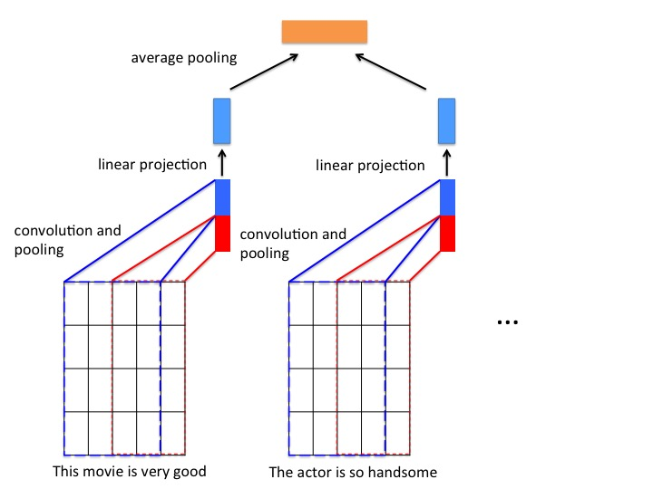

运行本目录下的程序示例需要使用PaddlePaddle v0.11.0 版本。如果您的PaddlePaddle安装版本低于此要求，请按照[安装文档](http://www.paddlepaddle.org/docs/develop/documentation/zh/build_and_install/pip_install_cn.html)中的说明更新PaddlePaddle安装版本。

---

# 基于双层序列的文本分类

## 简介
本例将演示如何在 PaddlePaddle 中将长文本输入（通常能达到段落或者篇章基本）组织为双层序列，完成对长文本的分类任务。

## 模型介绍
我们将一段文本看成句子的序列，而每个句子又是词语的序列。

我们首先用卷积神经网络编码段落中的每一句话；然后，将每句话的表示向量经过池化层得到段落的编码向量；最后将段落的编码向量作为分类器（以softmax层的全连接层）输入，得到最终的分类结果。

**模型结构如下图所示**
<p align="center">
<br/>
图1. 基于双层序列的文本分类模型
</p>

PaddlePaddle 实现该网络结构的代码见 `network_conf.py`。

对双层时间序列的处理，需要先将双层时间序列数据变换成单层时间序列数据，再对每一个单层时间序列进行处理。 在 PaddlePaddle 中 ，`recurrent_group` 是帮助我们构建处理双层序列的层次化模型的主要工具。这里，我们使用两个嵌套的 `recurrent_group` 。外层的 `recurrent_group` 将段落拆解为句子，`step` 函数中拿到的输入是句子序列；内层的 `recurrent_group` 将句子拆解为词语，`step` 函数中拿到的输入是非序列的词语。

在词语级别，我们运用 CNN 网络，以词向量为输入，输出学习到的句子表示；在段落级别，我们通过池化作用，从若干句子的表示中得到段落的表示。

``` python
nest_group = paddle.layer.recurrent_group(input=[paddle.layer.SubsequenceInput(emb),
                                                 hidden_size],
                                          step=cnn_cov_group)
```


拆解后的单层序列数据经过一个CNN网络学习对应的向量表示，CNN的网络结构包含以下部分：

- **卷积层**： 文本分类中的卷积在时间序列上进行，卷积核的宽度和词向量层产出的矩阵一致，卷积后得到的结果为“特征图”， 使用多个不同高度的卷积核，可以得到多个特征图。本例代码默认使用了大小为 3（图1红色框）和 4（图1蓝色框）的卷积核。
- **最大池化层**： 对卷积得到的各个特征图分别进行最大池化操作。由于特征图本身已经是向量，因此最大池化实际上就是选出各个向量中的最大元素。将所有最大元素又被拼接在一起，组成新的向量。
- **线性投影层**： 将不同卷积得到的结果经过最大池化层之后拼接为一个长向量， 然后经过一个线性投影得到对应单层序列的表示向量。

CNN网络具体代码实现如下：
```python
def cnn_cov_group(group_input, hidden_size):
    """
    Convolution group definition.
    :param group_input: The input of this layer.
    :type group_input: LayerOutput
    :params hidden_size: The size of the fully connected layer.
    :type hidden_size: int
    """
    conv3 = paddle.networks.sequence_conv_pool(
        input=group_input, context_len=3, hidden_size=hidden_size)
    conv4 = paddle.networks.sequence_conv_pool(
        input=group_input, context_len=4, hidden_size=hidden_size)

    linear_proj = paddle.layer.fc(input=[conv3, conv4],
                                  size=hidden_size,
                                  param_attr=paddle.attr.ParamAttr(name='_cov_value_weight'),
                                  bias_attr=paddle.attr.ParamAttr(name='_cov_value_bias'),
                                  act=paddle.activation.Linear())

    return linear_proj
```
PaddlePaddle 中已经封装好的带有池化的文本序列卷积模块：`paddle.networks.sequence_conv_pool`，可直接调用。

在得到每个句子的表示向量之后， 将所有句子表示向量经过一个平均池化层， 得到一个样本的向量表示， 向量经过一个全连接层输出最终的预测结果。 代码如下：
```python
avg_pool = paddle.layer.pooling(input=nest_group,
                                pooling_type=paddle.pooling.Avg(),
                                agg_level=paddle.layer.AggregateLevel.TO_NO_SEQUENCE)

prob = paddle.layer.mixed(size=class_num,
                          input=[paddle.layer.full_matrix_projection(input=avg_pool)],
                          act=paddle.activation.Softmax())
```
## 安装依赖包
```bash
pip install -r requirements.txt
```

## 指定训练配置参数

通过 `config.py` 脚本修改训练和模型配置参数，脚本中有对可配置参数的详细解释，示例如下：
```python
class TrainerConfig(object):

    # whether to use GPU for training
    use_gpu = False
    # the number of threads used in one machine
    trainer_count = 1

    # train batch size
    batch_size = 32

    ...


class ModelConfig(object):

    # embedding vector dimension
    emb_size = 28

    ...
```
修改 `config.py` 对参数进行调整。例如，通过修改 `use_gpu` 参数来指定是否使用 GPU 进行训练。

## 使用 PaddlePaddle 内置数据运行

### 训练
在终端执行：
```bash
python train.py
```
将以 PaddlePaddle 内置的情感分类数据集: `imdb` 运行本例。
### 预测
训练结束后，模型将被存储在指定目录当中（默认models目录），在终端执行：
```bash
python infer.py --model_path 'models/params_pass_00000.tar.gz'
```
预测脚本将加载、训练一个pass的模型，并用这个模型对 `imdb的测试集` 进行测试。

## 使用自定义数据训练和预测

### 训练
1.数据组织

每一行为一条样本，以 `\t` 分隔，第一列是类别标签，第二列是输入文本的内容。

```
positive        This movie is very good. The actor is so handsome.
negative        What a terrible movie. I waste so much time.
```

2.编写数据读取接口

自定义数据读取接口只需编写一个 Python 生成器，实现**解析输入文本**的逻辑。以下代码片段实现了读取原始数据返回类型为： `paddle.data_type.integer_value_sub_sequence` 和 `paddle.data_type.integer_value`
```python
def train_reader(data_dir, word_dict, label_dict):
    """
    Reader interface for training data

    :param data_dir: data directory
    :type data_dir: str
    :param word_dict: path of word dictionary,
        the dictionary must has a "UNK" in it.
    :type word_dict: Python dict
    :param label_dict: path of label dictionary.
    :type label_dict: Python dict
    """

    def reader():
        UNK_ID = word_dict['<unk>']
        word_col = 1
        lbl_col = 0

        for file_name in os.listdir(data_dir):
            file_path = os.path.join(data_dir, file_name)
            if not os.path.isfile(file_path):
                continue
            with open(file_path, "r") as f:
                for line in f:
                    line_split = line.strip().split("\t")
                    doc = line_split[word_col]
                    doc_ids = []
                    for sent in doc.strip().split("."):
                        sent_ids = [
                            word_dict.get(w, UNK_ID)
                            for w in sent.split()]
                        if sent_ids:
                            doc_ids.append(sent_ids)

                    yield doc_ids, label_dict[line_split[lbl_col]]

    return reader
```
需要注意的是， 本例中以英文句号`'.'`作为分隔符， 将一段文本分隔为一定数量的句子， 且每个句子表示为对应词表的索引数组（`sent_ids`）。 由于当前样本的表示(`doc_ids`)中包含了该段文本的所有句子， 因此，它的类型为：`paddle.data_type.integer_value_sub_sequence`。


3.指定命令行参数进行训练

`train.py`训练脚本中包含以下参数：
```
Options:
  --train_data_dir TEXT   The path of training dataset (default: None). If
                          this parameter is not set, imdb dataset will be
                          used.
  --test_data_dir TEXT    The path of testing dataset (default: None). If this
                          parameter is not set, imdb dataset will be used.
  --word_dict_path TEXT   The path of word dictionary (default: None). If this
                          parameter is not set, imdb dataset will be used. If
                          this parameter is set, but the file does not exist,
                          word dictionay will be built from the training data
                          automatically.
  --label_dict_path TEXT  The path of label dictionary (default: None).If this
                          parameter is not set, imdb dataset will be used. If
                          this parameter is set, but the file does not exist,
                          label dictionay will be built from the training data
                          automatically.
  --model_save_dir TEXT   The path to save the trained models (default:
                          'models').
  --help                  Show this message and exit.
```

修改`train.py`脚本中的启动参数，可以直接运行本例。 以`data`目录下的示例数据为例，在终端执行：
```bash
python train.py \
  --train_data_dir 'data/train_data'  \
  --test_data_dir 'data/test_data' \
  --word_dict_path 'word_dict.txt' \
  --label_dict_path 'label_dict.txt'
```
即可对样例数据进行训练。

### 预测

1.指定命令行参数

`infer.py`训练脚本中包含以下参数：

```
Options:
  --data_path TEXT        The path of data for inference (default: None). If
                          this parameter is not set, imdb test dataset will be
                          used.
  --model_path TEXT       The path of saved model.  [required]
  --word_dict_path TEXT   The path of word dictionary (default: None). If this
                          parameter is not set, imdb dataset will be used.
  --label_dict_path TEXT  The path of label dictionary (default: None).If this
                          parameter is not set, imdb dataset will be used.
  --batch_size INTEGER    The number of examples in one batch (default: 32).
  --help                  Show this message and exit.
```

2.以`data`目录下的示例数据为例，在终端执行：
```bash
python infer.py \
  --data_path 'data/infer.txt' \
  --word_dict_path 'word_dict.txt' \
  --label_dict_path 'label_dict.txt' \
  --model_path 'models/params_pass_00000.tar.gz'
```

即可对样例数据进行预测。
