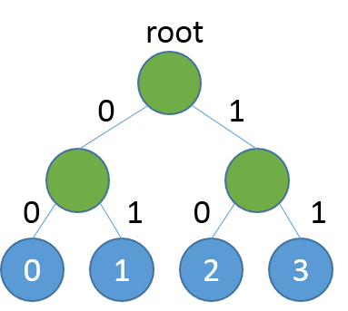
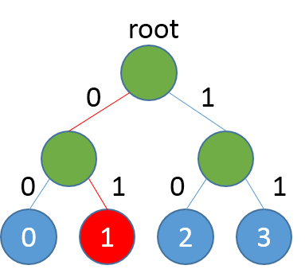
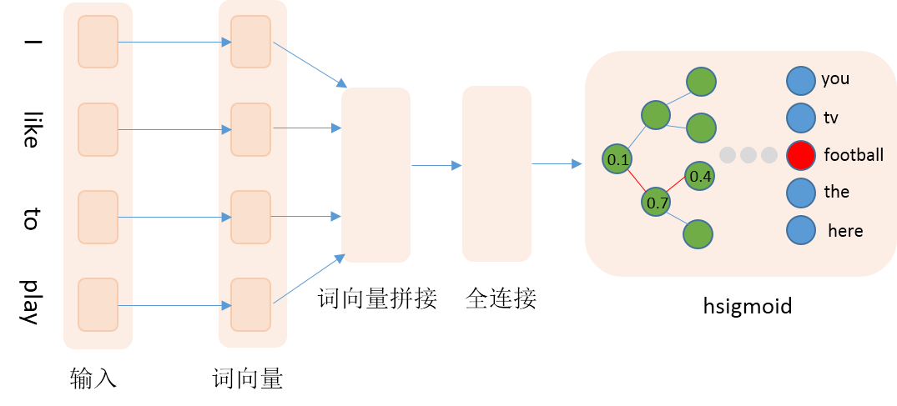

# Hsigmoid加速Word Embedding训练
## 背景介绍
在自然语言处理领域中，传统做法通常使用one-hot向量来表示词，比如词典为['我', '你', '喜欢']，可以用[1,0,0]、[0,1,0]和[0,0,1]这三个向量分别表示'我'、'你'和'喜欢'。这种表示方式比较简洁，但是当词表很大时，容易产生维度爆炸问题，而且任意两个词的向量是正交的，向量包含的信息有限。为了避免或减轻one-hot表示的缺点，目前通常使用词嵌入向量来取代one-hot表示，词嵌入向量也就是word embedding，具体地，使用一个低维稠密的实向量取代高维稀疏的one-hot向量。训练embedding词表的方法有很多种，神经网络模型是其中之一，包括CBOW等，这些模型本质上是一个分类模型，当词表较大也即类别较多时，传统的softmax将非常消耗时间，针对这类场景，PaddlePaddle提供了hsigmoid等层，来加速模型的训练过程。
## Hsigmoid Layer
Hsigmoid Layer引用自论文\[[1](#参考文献)\]，原理是通过构建一个分类二叉树来降低计算复杂度，二叉树中每个叶子节点代表一个类别，每个非叶子节点代表一个二类别分类器。例如我们一共有4个类别分别是0,1,2,3，softmax会分别计算4个类别的得分，然后归一化得到概率，当类别数很多时，计算每个类别的概率将非常耗时，Hsigmoid Layer会根据类别数构建一个平衡二叉树，如下：

<p align="center">
  <br/>
左图为平衡分类二叉树，右图展示了从根节点到类别1的路径
</p>

二叉树中每个非叶子节点是一个二类别分类器（例如sigmoid），如果类别是0，则取左子节点继续分类判断，反之取右子节点，直至达到叶节点。按照这种方式，每个类别均对应一条路径，例如从root到类别1的路径编码为0,1。训练阶段我们按照真实类别对应的路径，依次计算对应分类器的损失，然后综合所有损失得到最终损失，详细理论细节可参照论文。预测阶段，模型会输出各个非叶节点分类器的概率，我们可以根据概率获取路径编码，然后遍历路径编码就可以得到最终预测类别，具体实现细节见下文。

# 数据准备
本文采用Penn Treebank (PTB)数据集（Tomas Mikolov预处理版本），共包含train、valid和test三个文件。其中使用train作为训练数据，valid作为测试数据。本文训练的是5-gram模型，每条数据的前4个词用来预测第5个词。PaddlePaddle提供了对应PTB数据集的python包paddle.dataset.imikolov，自动做数据的下载与预处理。预处理会把数据集中的每一句话前后加上开始符号\<s>以及结束符号\<e>。然后依据窗口大小（本文为5），从头到尾每次向右滑动窗口并生成一条数据。如"I have a dream that one day"可以生成\<s> I have a dream、I have a dream that、have a dream that one、a dream that one day、dream that one day \<e>，PaddlePaddle会把词转换成id数据作为最终输入。
# 编程实现
## 网络结构
本文通过训练N-gram语言模型来获得词向量，具体地使用前4个词来预测当前词。网络输入为词的id，然后查询embedding词表获取embedding向量，接着拼接4个词的embedding向量，然后接入一个全连接隐层，最后是hsigmoid层。详细网络结构见下图：

<p align="center">
<br/>
网络配置结构
</p>

代码实现如下：

```python
import math
import paddle.v2 as paddle


def network_conf(hidden_size, embed_size, dict_size, is_train=True):
    first_word = paddle.layer.data(
        name='firstw', type=paddle.data_type.integer_value(dict_size))
    second_word = paddle.layer.data(
        name='secondw', type=paddle.data_type.integer_value(dict_size))
    third_word = paddle.layer.data(
        name='thirdw', type=paddle.data_type.integer_value(dict_size))
    fourth_word = paddle.layer.data(
        name='fourthw', type=paddle.data_type.integer_value(dict_size))
    target_word = paddle.layer.data(
        name='fifthw', type=paddle.data_type.integer_value(dict_size))

    embed_param_attr = paddle.attr.Param(
        name="_proj", initial_std=0.001, learning_rate=1, l2_rate=0)
    embed_first_word = paddle.layer.embedding(
        input=first_word, size=embed_size, param_attr=embed_param_attr)
    embed_second_word = paddle.layer.embedding(
        input=second_word, size=embed_size, param_attr=embed_param_attr)
    embed_third_word = paddle.layer.embedding(
        input=third_word, size=embed_size, param_attr=embed_param_attr)
    embed_fourth_word = paddle.layer.embedding(
        input=fourth_word, size=embed_size, param_attr=embed_param_attr)

    embed_context = paddle.layer.concat(input=[
        embed_first_word, embed_second_word, embed_third_word, embed_fourth_word
    ])

    hidden_layer = paddle.layer.fc(
        input=embed_context,
        size=hidden_size,
                act=paddle.activation.Sigmoid(),
        layer_attr=paddle.attr.Extra(drop_rate=0.5),
        bias_attr=paddle.attr.Param(learning_rate=2),
        param_attr=paddle.attr.Param(
            initial_std=1. / math.sqrt(embed_size * 8), learning_rate=1))

    if is_train == True:
        cost = paddle.layer.hsigmoid(
            input=hidden_layer,
            label=target_word,
            num_classes=dict_size,
            param_attr=paddle.attr.Param(name='sigmoid_w'),
            bias_attr=paddle.attr.Param(name='sigmoid_b'))
        return cost
    else:
        with paddle.layer.mixed(
                size=dict_size - 1,
                act=paddle.activation.Sigmoid(),
                bias_attr=paddle.attr.Param(name='sigmoid_b')) as prediction:
            prediction += paddle.layer.trans_full_matrix_projection(
                input=hidden_layer,
                param_attr=paddle.attr.Param(name='sigmoid_w'))
        return prediction
```

需要注意，在预测阶段，我们需要对hsigmoid参数做一次转置，这里输出的类别数为词典大小减1，对应非叶节点的数量。

## 预测阶段
预测阶段最重要的就是根据概率得到编码路径，然后遍历路径获取最终的预测类别，这部分逻辑如下：

```python
def decode_res(infer_res, dict_size):
    """
    Inferring probabilities are orginized as a complete binary tree.
    The actual labels are leaves (indices are counted from class number).
    This function travels paths decoded from inferring results.
    If the probability >0.5 then go to right child, otherwise go to left child.

    param infer_res: inferring result
    param dict_size: class number
    return predict_lbls: actual class
    """
    predict_lbls = []
    infer_res = infer_res > 0.5
    for i, probs in enumerate(infer_res):
        idx = 0
        result = 1
        while idx < len(probs):
            result <<= 1
            if probs[idx]:
                result |= 1
            if probs[idx]:
                idx = idx * 2 + 2  # right child
            else:
                idx = idx * 2 + 1  # left child

        predict_lbl = result - dict_size
        predict_lbls.append(predict_lbl)
    return predict_lbls
```

函数的输入是一个batch样本的预测概率以及词表的大小，里面的循环是对每条样本的输出概率进行解码，解码方式就是按照左0右1的准则，不断遍历路径，直至到达叶子节点。需要注意的是，本文选用的数据集需要较长的时间训练才能得到较好的结果，预测程序选用第一轮的模型，仅为展示方便，不保证效果。
# 参考文献
1. Morin, F., & Bengio, Y. (2005, January). [Hierarchical Probabilistic Neural Network Language Model](http://www.iro.umontreal.ca/~lisa/pointeurs/hierarchical-nnlm-aistats05.pdf). In Aistats (Vol. 5, pp. 246-252).
