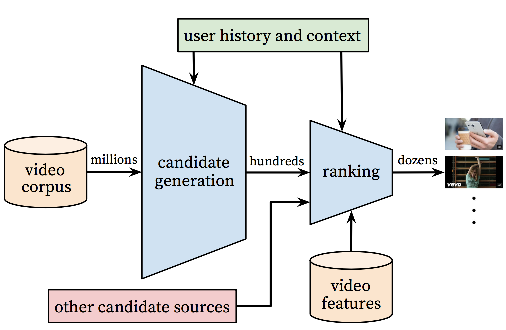
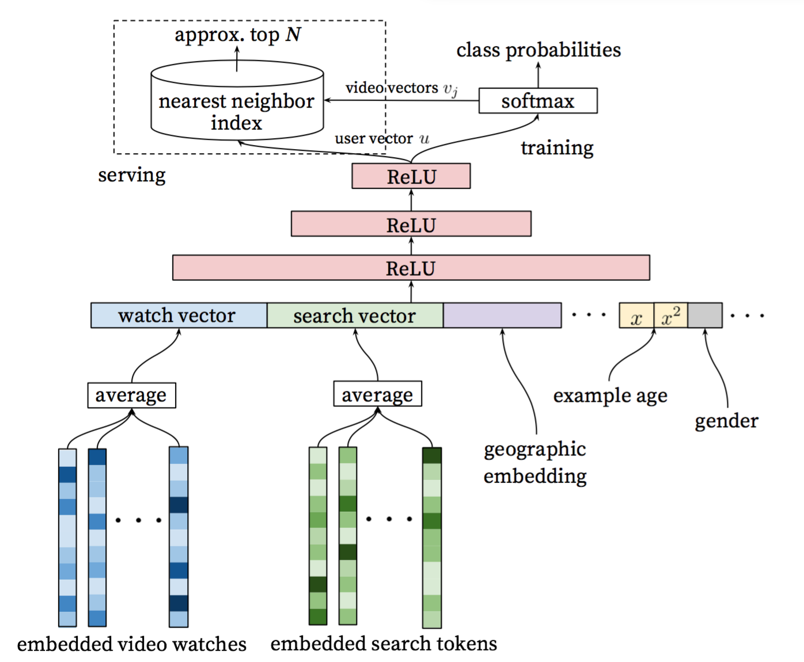

运行本目录下的程序示例需要使用PaddlePaddle v0.10.0 版本。如果您的PaddlePaddle安装版本低于此要求，请按照[安装文档](http://www.paddlepaddle.org/docs/develop/documentation/zh/build_and_install/pip_install_cn.html)中的说明更新PaddlePaddle安装版本。

---

# Youtube DNN推荐模型

以下是本例目录包含的文件以及对应说明:

```
├── README.md               # 文档
├── README.cn.md            # 中文文档
├── data                    # 示例数据
│   ├── data.tar            # 示例数据
├── infer.py                # 预测脚本
├── network_conf.py         # 模型网络配置
├── reader.py               # data reader
├── train.py                # 训练脚本
└── utils.py                # 工具
└── data_processer.py       # 数据预处理脚本
└── user_vector.py          # 获取用户向量脚本
└── item_vector.py          # 获取视频向量脚本
├── infer_user.py           # 获取用户个性化脚本
```

## 背景介绍\[[1](#参考文献)\]
Youtube是世界最大的视频网站之一，其推荐系统帮助10亿以上的用户，从海量视频中，发现个性化的内容。该推荐系统主要面临以下三个挑战:
- 规模: 许多现有的推荐算法证明在小数据量下运行良好，但不能满足YouTube这样庞大的用户群和内容库的场景，因此需要高度专业化的分布式学习算法和高效的线上服务。
- 新鲜度: YouTube内容库更新频率极高，每秒上传大量视频。系统应及时追踪新上传的视频和用户的实时行为，并且模型在推荐新/旧视频上有良好平衡能力。
- 噪音: 噪音来自于两方面，其一，用户历史行为稀疏，且有各种不可观测的外部因素，以及用户满意度不明确。其二，内容本身的数据是非结构化的。因此算法应更具有鲁棒性。

下图展示了整个推荐系统框图:
<p align="center">
 <br/>
Figure 1. 推荐系统框图（出自论文[1]）
</p>

整个推荐系统有两部分组成: 召回(candidate generation/recall)和排序(ranking)。
- 召回模型: 输入用户的历史行为，从大规模的内容库中获得一个小集合(百级别)。召回出的视频与用户高度相关。一个用户是用其历史点击过的视频，搜索过的关键词，和人口统计相关的特征来表征。
- 排序模型: 采用更精细的特征计算得到排序分，对召回得到的候选集合中的视频进行排序。

本文主要详细介绍了召回模型的原理与使用。

## 召回模型简介
该推荐问题可以被建模成一个"超大规模多分类"问题。即在时刻，为用户(已知上下文信息)在视频库中预测出观看视频的类别，

%3D%5Cfrac%7Be%5E%7B%5Cmathbf%7Bv_i%7D%5Cmathbf%7Bu%7D%7D%7D%7B%5Csum_%7Bj%5Cin%20V%7D%5E%7B%20%7De%5E%7B%5Cmathbf%7Bv_j%7D%5Cmathbf%7Bu%7D%7D%7D)

其中，是<用户，上下文信息>的高维向量表示。是视频的高维向量表示。DNN模型的目标是以用户信息和上下文信息为输入条件下，学习用户的高维向量表示，以此输入softmax分类器，来预测视频库中各个视频(类别)的观看概率。

下图展示了召回模型的网络结构:
<p align="center">
 <br/>
Figure 2. 召回模型网络结构（出自论文[1]）
</p>

- 输入层:用户的浏览序列、搜索序列、人口统计学特征、和其他上下文信息等
- embedding层:将用户浏览视频序列接embedding层，再做时间序列上的平均。对于搜索序列同样处理。
- 隐层:包含三个隐层，用RELU激活函数，最后一层隐层的输出即为高维向量表示。
- 输出层: softmax层，输出视频库中各个视频(类别)的观看概率。在线上预测时，提取模型训练得到的softmax层内部的参数，作为视频的高维向量表示。可利用类似局部敏感哈希(Locality Sensitive Hashing)用查询最相关的N个视频。

## 数据预处理
本例模拟了用户的视频点击日志，作为样本数据。格式如下:
```
用户Id \t 所在省份 \t 所在城市 \t 历史点击的视频序列信息 \t 手机型号
历史点击的视频序列信息的格式为 视频信息1;视频信息2;...;视频信息K
视频信息的格式为 视频id:视频类目:视频标签1_视频标签2_视频标签3_...视频标签M
例如:
USER_ID_15  上海市  上海市    VIDEO_42:CATEGORY_9:TAG115;VIDEO_43:CATEGORY_9:TAG116_TAG115;VIDEO_44:CATEGORY_2:TAG117_TAG71  GO T5
```
在youtube_recall目录下运行以下命令（下同），可以解压样本数据。
```
cd data
tar -zxvf data.tar
```

然后，脚本`data_preprocess.py`将对训练数据做预处理。具体使用方法参考如下说明：
```
usage: data_processor.py [-h] --train_set_path TRAIN_SET_PATH --output_dir
                         OUTPUT_DIR [--feat_appear_limit FEAT_APPEAR_LIMIT]

PaddlePaddle Youtube Recall Model Example

optional arguments:
  -h， --help            show this help message and exit
  --train_set_path TRAIN_SET_PATH
                        path of the train set
  --output_dir OUTPUT_DIR
                        directory to output
  --feat_appear_limit FEAT_APPEAR_LIMIT
                        the minimum number of feature values appears (default:
                        20)
```
该脚本的作用如下:
- 借鉴\[[2](#参考文献)\]中对特征的处理，过滤低频特征(样本中出现次数低于`feat_appear_limit`)。
- 对特征进行编码，生成字典`feature_dict.pkl`。
- 统计每个视频出现的概率，保存至`item_freq.pkl`，提供给nce层使用。

例如可执行下列命令，完成数据预处理:
```shell
mkdir output
python data_processor.py --train_set_path=./data/train.txt \
                                     --output_dir=./output \
                                     --feat_appear_limit=20
```

## 模型实现
下面是网络中各个部分的具体实现，相关代码均包含在 `./network_conf.py` 中。

### 输入层
```python
def _build_input_layer(self):
    """
    build input layer
    """
    self._history_clicked_items = paddle.layer.data(
        name="history_clicked_items", type=paddle.data_type.integer_value_sequence(
            len(self._feature_dict['history_clicked_items'])))
    self._history_clicked_categories = paddle.layer.data(
        name="history_clicked_categories", type=paddle.data_type.integer_value_sequence(
            len(self._feature_dict['history_clicked_categories'])))
    self._history_clicked_tags = paddle.layer.data(
        name="history_clicked_tags", type=paddle.data_type.integer_value_sequence(
            len(self._feature_dict['history_clicked_tags'])))
    self._user_id = paddle.layer.data(
        name="user_id", type=paddle.data_type.integer_value(
            len(self._feature_dict['user_id'])))
    self._province = paddle.layer.data(
        name="province", type=paddle.data_type.integer_value(
            len(self._feature_dict['province'])))
    self._city = paddle.layer.data(
        name="city", type=paddle.data_type.integer_value(len(self._feature_dict['city'])))
    self._phone = paddle.layer.data(
        name="phone", type=paddle.data_type.integer_value(len(self._feature_dict['phone'])))
    self._target_item = paddle.layer.data(
        name="target_item", type=paddle.data_type.integer_value(
            len(self._feature_dict['history_clicked_items'])))
```

### Embedding层
每个输入特征通过embedding到固定维度的向量中。
```python
def _create_emb_attr(self, name):
    """
    create embedding parameter
    """
    return paddle.attr.Param(
        name=name, initial_std=0.001, learning_rate=1, l2_rate=0, sparse_update=False)

def _build_embedding_layer(self):
    """
    build embedding layer
    """
    self._user_id_emb = paddle.layer.embedding(input=self._user_id,
                                               size=64,
                                               param_attr=self._create_emb_attr(
                                                   '_proj_user_id'))
    self._province_emb = paddle.layer.embedding(input=self._province,
                                                size=8,
                                                param_attr=self._create_emb_attr(
                                                    '_proj_province'))
    self._city_emb = paddle.layer.embedding(input=self._city,
                                            size=16,
                                            param_attr=self._create_emb_attr('_proj_city'))
    self._phone_emb = paddle.layer.embedding(input=self._phone,
                                             size=16,
                                             param_attr=self._create_emb_attr('_proj_phone'))
    self._history_clicked_items_emb = paddle.layer.embedding(
        input=self._history_clicked_items,
        size=64,
        param_attr=self._create_emb_attr('_proj_history_clicked_items'))
    self._history_clicked_categories_emb = paddle.layer.embedding(
        input=self._history_clicked_categories,
        size=8,
        param_attr=self._create_emb_attr('_proj_history_clicked_categories'))
    self._history_clicked_tags_emb = paddle.layer.embedding(
        input=self._history_clicked_tags,
        size=64,
        param_attr=self._create_emb_attr('_proj_history_clicked_tags'))
```

### 隐层
本文对\[[原论文](#参考文献)\](Covington, Paul, Jay Adams, and Emre Sargin. "Deep neural networks for youtube recommendations." Proceedings of the 10th ACM Conference on Recommender Systems. ACM, 2016.)中的模型做了如下改进：
- 历史用户点击的视频序列，经过embedding之后，不再使用加权求平均，而是使用lstm序列模型。本文将用户点击的先后次序纳入模型中，然后在时间序列上做最大池化，得到定长向量表示，从而使模型学习到与点击时序相关的隐藏信息。
- 考虑到数据规模与训练性能，本文只用了两个Relu层，也有很不错的效果。

```python
self._rnn_cell = paddle.networks.simple_lstm(
            input=self._history_clicked_items_emb, size=64)
        self._lstm_last = paddle.layer.pooling(
            input=self._rnn_cell, pooling_type=paddle.pooling.Max())
        self._avg_emb_cats = paddle.layer.pooling(
            input=self._history_clicked_categories_emb,
            pooling_type=paddle.pooling.Avg())
        self._avg_emb_tags = paddle.layer.pooling(
            input=self._history_clicked_tags_emb,
            pooling_type=paddle.pooling.Avg())
        self._fc_0 = paddle.layer.fc(
            name="Relu1",
            input=[
                self._lstm_last, self._user_id_emb, self._province_emb,
                self._city_emb, self._avg_emb_cats, self._avg_emb_tags,
                self._phone_emb
            ],
            size=self._dnn_layer_dims[0],
            act=paddle.activation.Relu())

        self._fc_1 = paddle.layer.fc(
            name="Relu2",
            input=self._fc_0,
            size=self._dnn_layer_dims[1],
            act=paddle.activation.Relu())
```

### 输出层
为了提高模型训练速度，使用噪声对比估计（Noise-contrastive estimation， NCE）\[[3](#参考文献)\]。将[数据预处理](#数据预处理)中产出的item_freq.pkl，也就是负样例的分布，作为nce层的参数。
```python
return paddle.layer.nce(
                input=self._fc_1,
                label=self._target_item,
                num_classes=len(self._feature_dict['history_clicked_items']),
                param_attr=paddle.attr.Param(name="nce_w"),
                bias_attr=paddle.attr.Param(name="nce_b"),
                act=paddle.activation.Sigmoid(),
                num_neg_samples=5,
                neg_distribution=self._item_freq)
```

## 训练
首先，准备`reader.py`，负责将输入原始数据中的特征，转为编码后的特征id。对一条训练数据，根据`window_size`产出多条训练样本给trainer，例如:
```
window_size=2
原始数据:
用户Id \t 所在省份 \t 所在城市 \t 视频信息1;视频信息2;...;视频信息K \t 手机型号
多条训练样本:
用户Id，所在省份，所在城市，[<unk>，历史点击视频1]，[<unk>，历史点击视频类目1]，[<unk>，历史点击视频标签1]，手机型号，历史点击视频2
用户Id，所在省份，所在城市，[历史点击视频1，历史点击视频2]，[历史点击视频类目1，历史点击视频类目2]，[历史点击视频标签1，历史点击视频标签2]，手机型号，历史点击视频3
用户Id，所在省份，所在城市，[历史点击视频2，历史点击视频3]，[历史点击视频类目2，历史点击视频类目3]，[历史点击视频标签2，历史点击视频标签3]，手机型号，历史点击视频4
......
```
相关代码如下:
```python
for i in range(1, len(history_clicked_items_all)):
    start = max(0, i - self._window_size)
    history_clicked_items = history_clicked_items_all[start:i]
    history_clicked_categories = history_clicked_categories_all[start:i]
    history_clicked_tags_str = history_clicked_tags_all[start:i]
    history_clicked_tags = []
    for tags_a in history_clicked_tags_str:
        for tag in tags_a.split("_"):
            history_clicked_tags.append(int(tag))
    target_item = history_clicked_items_all[i]
    yield user_id, province, city, \
          history_clicked_items, history_clicked_categories, \
          history_clicked_tags, phone, target_item
```
```python
reader = Reader(feature_dict, args.window_size)
    trainer.train(
        paddle.batch(
            paddle.reader.shuffle(
                lambda: reader.train(args.train_set_path),
                buf_size=7000), args.batch_size),
        num_passes=args.num_passes,
        feeding=feeding,
        event_handler=event_handler)
```
接下去就可以开始训练了，可执行以下命令:
```shell
mkdir output/model
python train.py --train_set_path='./data/train.txt' \
    --test_set_path='./data/test.txt' \
    --model_output_dir='./output/model/' \
    --feature_dict='./output/feature_dict.pkl' \
    --item_freq='./output/item_freq.pkl'
```

## 离线预测
输入用户相关的特征，输出topN个最可能观看的视频，可执行以下命令:
```shell
python infer.py --infer_set_path='./data/infer.txt' \
    --model_path='./output/model/model_pass_00000.tar.gz' \
    --feature_dict='./output/feature_dict.pkl' \
    --batch_size=50
```

## 在线预测
在线预测的时候，采用近似最近邻（approximate nearest neighbor-ANN）算法直接用用户向量查询最相关的topN个视频向量，将对应的视频内容推荐给用户。下面介绍如何获得用户向量和视频向量。

### 用户向量
用最后一个RELU层的输出，前拼一个常数项1，作为用户向量。这边最后一个RELU层的大小是31维，拼接后的用户向量就是32维，即


### 视频向量
视频向量从模型训练得到的softmax层的参数中提取。假设共有M个不同的视频，那么softmax层输出的是这M个视频各自用户点击的概率，即


从最后一个RELU层输出的用户向量，到softmax层输出的M个视频的概率，中间则是通过乘以了softmax层的参数w,b构成的一个矩阵，其中的每一列为一个32维的视频向量，按照字典顺序一一对应。


### SIMPLE-LSH变换
很多ann算法只支持cosine距离，而模型是根据内积排序的，两者效果差异较大。为此，这边的解决方案是，对前面得到的用户和视频向量，作SIMPLE-LSH变换\[[4](#参考文献)\]，使内积排序与cosin排序等价。

具体如下：
- 对于视频向量，有，变换后的，。

- 对于用户向量，变换后的，，其中是模长归一化后的。

线上对于一个用内积召回，作上述变换后，不改变内积排序的顺序。又因为 和都为1，因此%20%3D%20%5Ctilde%7B%5Cmathbf%7Bu%7D%7D%5Ccdot%20%5Ctilde%7B%5Cmathbf%7Bv%7D%7D)，就可以兼容ANN用cosin的方式召回了，结果等价。

线上使用时，为保留精度，可以不除以，也就变成，排序依然等价。

### 实现
可使用`user_vector.py`获取用户向量， 输入用户特征经过网络预测，probs[1]中存储的是最后一个RELU层的输出，先前拼接一个1，再做SIMPLE-LSH变换（后接一个0，归一化）：
```python
probs = inferer.infer(
        input=test_batch,
        feeding=feeding,
        field=["value"],
        flatten_result=False)
for i, res in enumerate(zip(probs[1])):
    # do simple lsh conversion
    user_vector = [1.000]
    for i in res[0]:
        user_vector.append(i)
    user_vector.append(0.000)
    norm = np.linalg.norm(user_vector)
    user_vector_norm = [str(_ / norm) for _ in user_vector]
    print ",".join(user_vector_norm)
```

可使用`item_vector.py`分别获视频向量。加载模型，提取参数nce_w和nce_b，拼接M个视频向量，第i个视频向量的第一维是对应的nce_b[0][i]，后面是nce_w[i][1:31]。再做SIMPLE-LSH变换，找到所有向量最大的模，按照处理。
```python
# load the trained model.
    with gzip.open(args.model_path) as f:
        parameters = paddle.parameters.Parameters.from_tar(f)

    nce_w = parameters.get("nce_w")
    nce_b = parameters.get("nce_b")
    item_vector = convt_simple_lsh(get_item_vec_from_softmax(nce_w, nce_b))

def get_item_vec_from_softmax(nce_w, nce_b):
    """
    get item vectors from softmax parameter
    """
    if nce_w is None or nce_b is None:
        return None
    vector = []
    total_items_num = nce_w.shape[0]
    if total_items_num != nce_b.shape[1]:
        return None
    dim_vector = nce_w.shape[1] + 1
    for i in range(0, total_items_num):
        vector.append([])
        vector[i].append(nce_b[0][i])
        for j in range(1, dim_vector):
            vector[i].append(nce_w[i][j - 1])
    return vector


def convt_simple_lsh(vector):
    """
    do simple lsh conversion
    """
    max_norm = 0
    num_of_vec = len(vector)
    for i in range(0, num_of_vec):
        norm = np.linalg.norm(vector[i])
        if norm > max_norm:
            max_norm = norm
    for i in range(0, num_of_vec):
        vector[i].append(
            math.sqrt(
                math.pow(max_norm, 2) - math.pow(np.linalg.norm(vector[i]), 2)))
    return vector
```

可执行下列命令运行脚本：
```shell
python user_vector.py --infer_set_path='./data/infer.txt' \
        --model_path='./output/model/model_pass_00000.tar.gz' \
            --feature_dict='./output/feature_dict.pkl' \
                --batch_size=50
python item_vector.py --model_path='./output/model/model_pass_00000.tar.gz' \
            --feature_dict='./output/feature_dict.pkl'
```
## 离线挖掘
因为实时召回需要大量机器资源，这边也可以离线挖掘产出数据，线上召回使用挖掘好的数据。可以产出最热，用户个性化，视频相关等数据。下面的示例产出了用户个性化数据。
```
python infer_user.py --model_path='./output/model/model_pass_00000.tar.gz' \
            --feature_dict='./output/feature_dict.pkl'
```

## 参考文献
1. Covington, Paul, Jay Adams, and Emre Sargin. "Deep neural networks for youtube recommendations." Proceedings of the 10th ACM Conference on Recommender Systems. ACM, 2016.
2. https://code.google.com/archive/p/word2vec/
3. http://paddlepaddle.org/docs/develop/models/nce_cost/README.html
4. Neyshabur, Behnam, and Nathan Srebro. "On symmetric and asymmetric LSHs for inner product search." arXiv preprint arXiv:1410.5518 (2014).
